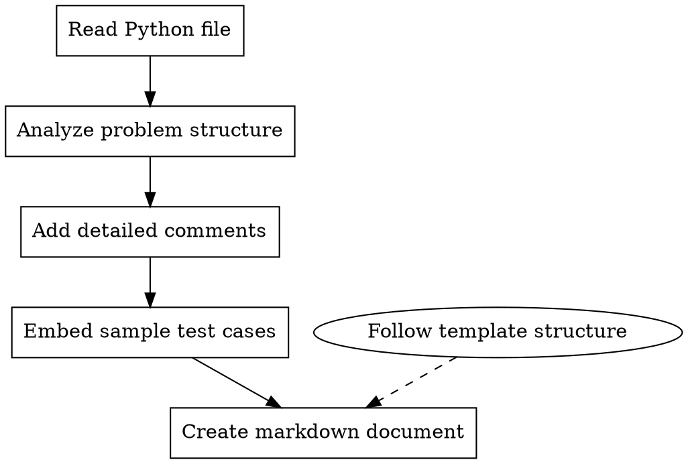

# ACM Processor

## Overview

A workflow for processing ACM-style Python solution files (stdin/stdout, competition/online judge format) to add comprehensive comments, embedded test cases, and generate structured markdown documentation following consistent patterns.

## When to Use

- After solving an ACM-style problem (NowCoder, Codeforces, local competition, etc.) and wanting to document it properly
- When preparing algorithm solutions for code training/review where stdin/stdout is required
- Before adding a new ACM problem to a documentation repository
- When standardizing existing ACM solutions with consistent formatting

## Core Workflow



## Step-by-Step Process

### 1. Read and Analyze

First, read the Python file to understand:

- Platform and problem ID (from comments like `# @nc app=nowcoder id=...` or custom comments)
- Input format (stdin reading method)
- Output format (print statements)
- Multiple test case handling (EOF, T test cases, etc.)
- Current implementation state
- Existing comments or docstrings
- Whether test cases already exist

**Key differences from LeetCode:**
- No class/method definition requirement (can be functions or inline code)
- Input comes from `sys.stdin`, `input()`, or `sys.stdin.read()`
- Output goes to `print()` or `sys.stdout.write()`
- May handle multiple test cases per run
- May use fast I/O (`sys.stdin.buffer.read()`, `sys.setrecursionlimit()`, etc.)

### 2. Add Comprehensive Comments

**For the solution function, add:**

- Problem description summary
- Input/output format explanation
- Core algorithm/approach explanation
- Time and space complexity
- Key insights or tricks used
- Handling of edge cases

**For complex logic, add inline comments:**

- Why this approach was chosen
- What each variable represents
- Edge cases being handled
- Optimization techniques
- Why fast I/O is needed (if applicable)

**Example structure:**

```python
"""
[Problem Name] - [Algorithm Type]

输入格式：
- 第1行：...
- 第2~N行：...

输出格式：
- 输出一个整数/字符串...

核心思路：
1. ...
2. ...

时间复杂度：O(...)
空间复杂度：O(...)
"""

def solve():
    """主求解函数：读取输入、处理数据、输出结果"""
    # 实现代码...

```

### 3. Embed Sample Test Cases

**Standard test structure:**

Use comment blocks to embed sample input/output, then test in `if __name__ == "__main__":`.

```python
# @sample-start
"""
样例输入 1:
3 1 500
0 0 10 100 50
1 0 20 100 50
0 1 30 100 50

样例输出 1:
0
"""
# @sample-end

# @sample-start
"""
样例输入 2:
4 1 150
0 0 10 100 10
1 0 20 100 10
5 5 10 200 100
5 6 30 200 100

样例输出 2:
200
"""
# @sample-end

def solve():
    """主求解函数"""
    import sys
    data = sys.stdin.read().strip().split()
    # ... implementation ...

def run_tests():
    """运行嵌入的样例测试"""
    import io
    test_cases = [
        ("3 1 500\n0 0 10 100 50\n1 0 20 100 50\n0 1 30 100 50\n", 0),
        ("4 1 150\n0 0 10 100 10\n1 0 20 100 10\n5 5 10 200 100\n5 6 30 200 100\n", 200),
    ]

    for i, (inp, expected) in enumerate(test_cases, 1):
        sys.stdin = io.StringIO(inp)
        old_stdout = sys.stdout
        sys.stdout = io.StringIO()
        try:
            solve()
            output = sys.stdout.getvalue().strip()
            actual = int(output) if output else 0
        finally:
            sys.stdout = old_stdout

        status = "✓" if actual == expected else "✗"
        print(f"样例 {i}: 期望={expected}, 实际={actual} {status}")

if __name__ == "__main__":
    import sys
    # 判断是否有测试参数
    if len(sys.argv) > 1 and sys.argv[1] == "--test":
        run_tests()
    else:
        solve()
```

**Include test cases for:**

- All sample inputs from problem statement
- Edge cases (empty input, single element, boundaries)
- Multiple test case handling (if applicable)
- Large input cases (if relevant, to test fast I/O)

### 4. Create Markdown Documentation

ACM 题解文档位于 `docs/problems/<platform>/<path>/`，路径映射规则：
- 源文件：`code-training/nowcoder/华为机试/HJ1.字符串最后一个单词的长度.py`
- 文档：`code-training/docs/problems/nowcoder/华为机试/HJ1.字符串最后一个单词的长度.md`
- 源文件：`code-training/misc/max_propagation_chain.py`
- 文档：`code-training/docs/problems/misc/max_propagation_chain.md`

**Document structure (follow exactly):**

```markdown
---
title: [Problem Title]
platform: [NowCoder/Codeforces/洛谷/etc.]
difficulty: [入门/简单/中等/困难/暂无评级]
id: [Problem ID if available]
url: [Problem URL]
tags:
  - [Tag1]
  - [Tag2]
topics:
  - ../../topics/[topic].md
patterns:
  - ../../patterns/[pattern].md
date_added: [YYYY-MM-DD]
date_reviewed: []
---

# [Problem ID]. [Problem Title]

## 题目描述

[Problem description in Chinese]

## 输入格式

[Input format description]

## 输出格式

[Output format description]

## 示例

### 示例 1

**输入：**
```
[Sample input]
```

**输出：**
```
[Sample output]
```

**说明：**
[Explanation of sample 1]

### 示例 2

**输入：**
```
[Sample input]
```

**输出：**
```
[Sample output]
```

**说明：**
[Explanation of sample 2]

---

## 解题思路

### 第一步：理解问题本质
[Core concept explanation]

### 第二步：暴力解法
[Naive approach with code]

### 第三步：优化解法
[Improved approach]

### 第四步：最优解法
[Optimal solution explanation]

---

## 完整代码实现

```python
[Complete code with comments, including embedded test cases]
```

---

## 示例推演

[Step-by-step walkthrough with specific numbers]

---

## 复杂度分析

| 解法 | 时间复杂度 | 空间复杂度 | 说明 |
| ---- | ---------- | ---------- | ---- |
| 暴力 | O(...)     | O(...)     | ...  |
| 优化 | O(...)     | O(...)     | ...  |
| 最优 | O(...)     | O(...)     | ...  |

---

## 易错点总结

### 1. [Common mistake 1]

[Explanation and fix]

### 2. [Common mistake 2]

[Explanation and fix]

---

## 扩展思考

[Related problems, variations, deeper insights]

---

## 相关题目

- [Problem Name](URL)

```

## Key Principles

### Preserve Original Code (CRITICAL)
**绝对禁止删除用户原有的代码和注释。**
- 用户亲手写的代码是宝贵的学习记录，必须完整保留
- 可以添加新注释、改进表达、补充说明，但不能删除原有内容
- 可以重构代码结构（如提取函数），但要保留原代码作为注释或备用实现
- 已有的测试用例要保留并补充，不能替换

**正确的做法：**
- 在原有代码基础上添加文档字符串和注释
- 在代码上方或旁边补充更详细的说明
- 为已有的实现添加复杂度分析注释
- 保留所有原有注释，即使表达不够完美

### Progressive Teaching
Always present solutions in order:
1. **Naive/Brute force** - establishes baseline understanding
2. **Optimized approach** - shows how to improve using problem constraints
3. **Optimal solution** - achieves best complexity with detailed explanation

### No Thinking Traces
- Never include phrases like "让我重新推演", "等等", "实际上这个判断有误"
- Present only correct, verified content
- If explanation needs correction, rewrite completely without showing errors

### Beginner-Friendly
- Explain WHY before HOW
- Use analogies and clear explanations
- Show complete step-by-step examples without skipping
- Include boundary conditions and edge cases

### Clean Code
- Use fast I/O when necessary (`sys.stdin.buffer.read()`, `input = sys.stdin.readline`)
- Set recursion limit for DFS problems (`sys.setrecursionlimit(10**6)`)
- Avoid interactive prompts or debug prints in competition code
- Keep code runnable and complete

## ACM Competition Requirements

### stdin/stdout Pattern
**ACM 题目统一使用标准输入输出，不使用类定义或函数签名约束。**

**标准输入读取方式：**

```python
# 方式 1：一次性读取所有数据（推荐用于小数据量）
import sys
data = sys.stdin.read().strip().split()

# 方式 2：逐行读取（适合大数据量或逐行处理）
import sys
for line in sys.stdin:
    line = line.strip()
    # 处理每一行

# 方式 3：快速读取（大数据量推荐）
import sys
data = sys.stdin.buffer.read().split()
it = iter(data)
n = int(next(it))

# 方式 4：单行多变量
import sys
n, m = map(int, sys.stdin.readline().split())

# 方式 5：读取 T 个测试用例
import sys
input = sys.stdin.readline
T = int(input())
for _ in range(T):
    n = int(input())
    # 处理单个测试用例
```

**标准输出方式：**

```python
# 单个结果
print(result)

# 多个结果（同一行空格分隔）
print(*results)

# 快速输出（大数据量）
import sys
sys.stdout.write(str(result) + "\n")
```

### Multiple Test Cases Handling
**处理多组测试用例的标准模式：**

```python
import sys

def solve():
    """处理单个测试用例"""
    n = int(input())
    # ... 处理逻辑 ...

if __name__ == "__main__":
    import sys
    input = sys.stdin.readline

    # 方式 1：已知测试用例数量 T
    T = int(input())
    for _ in range(T):
        solve()

    # 方式 2：读到 EOF 为止
    # for line in sys.stdin:
    #     solve()

    # 方式 3：读到特定结束标记
    # while True:
    #     line = input().strip()
    #     if line == "0":
    #         break
    #     solve()
```

### Fast I/O Template
**大数据量题目必须使用快速 I/O：**

```python
import sys
from functools import lru_cache

def solve():
    data = sys.stdin.buffer.read().split()
    it = iter(data)
    n = int(next(it))
    # ... 处理逻辑 ...
    print(result)

if __name__ == "__main__":
    # 如果使用递归，设置递归深度
    sys.setrecursionlimit(10**6)
    solve()
```

### Test Code Placement
**测试代码必须放在文件末尾，不影响线上评测：**

- 使用 `# @sample-start` 和 `# @sample-end` 标记样例区块
- 在 `if __name__ == "__main__":` 中判断 `--test` 参数运行测试
- 线上评测时直接调用 `solve()`，不执行测试代码
- 测试代码可包含多个样例的输入输出对

**标准模板：**

```python
import sys

# @sample-start
"""
样例输入 1:
[input data]

样例输出 1:
[expected output]
"""
# @sample-end

def solve():
    """主求解函数"""
    # 实现代码...

def run_tests():
    """运行嵌入的样例测试"""
    import io
    test_cases = [
        ("input1", "expected1"),
        ("input2", "expected2"),
    ]
    for i, (inp, expected) in enumerate(test_cases, 1):
        sys.stdin = io.StringIO(inp)
        old_stdout = sys.stdout
        sys.stdout = io.StringIO()
        try:
            solve()
            output = sys.stdout.getvalue().strip()
        finally:
            sys.stdout = old_stdout
        status = "✓" if output == expected else "✗"
        print(f"样例 {i}: {status} (期望={expected}, 实际={output})")

if __name__ == "__main__":
    if len(sys.argv) > 1 and sys.argv[1] == "--test":
        run_tests()
    else:
        solve()
```

## Common Patterns by Problem Type

### Input/Output Parsing
- Show how to handle multi-line, multi-value inputs
- Explain EOF handling for unknown number of test cases
- Include edge case handling for empty lines or whitespace

### Graph Problems
- Use adjacency list with `defaultdict(list)` or `[]` list of lists
- Show BFS/DFS template with recursion limit
- Include visited marking strategy

### Dynamic Programming
- Define dp state clearly
- Show state transition with examples
- Include space optimization techniques

### Math/Number Theory
- Use modular arithmetic for large numbers
- Show gcd/lcm/prime factorization patterns
- Include common formulas and their derivations

### String Processing
- Show efficient string manipulation techniques
- Use `strip()`, `split()`, and slicing appropriately
- Include common patterns (reverse, substring, palindrome)

### Greedy/Sorting
- Explain sorting strategy and why it works
- Show how to handle ties or multiple criteria
- Include proof of correctness or counterexamples

## File Naming Conventions

- Python file: `[platform-id].[problem-name].py` (e.g., `HJ1.字符串最后一个单词的长度.py`, `max_propagation_chain.py`)
- Markdown file: Same as Python file but with `.md` extension
- Path mapping: `code-training/<platform>/<path>/<name>.py` → `docs/problems/<platform>/<path>/<name>.md`

## Red Flags - Check Before Finishing

- [ ] **Original code is preserved** - user's handwritten code/comments are not deleted
- [ ] **Test code is at file end** - `if __name__ == "__main__":` 位于文件末尾，不影响评测
- [ ] **stdin/stdout pattern is correct** - 不使用 `input()` 提示字符串，不使用类定义
- [ ] **Fast I/O is used when needed** - 大数据量题目使用 `sys.stdin.buffer.read()` 或 `sys.stdin.readline`
- [ ] **Multiple test cases handled correctly** - 处理 EOF 或 T 个测试用例
- [ ] **Comments explain WHY, not just WHAT**
- [ ] **Test cases include edge cases** (original tests preserved + new ones added)
- [ ] **Markdown follows exact template structure**
- [ ] **Complexity analysis uses table format**
- [ ] **No "thinking traces" in final content**
- [ ] **Code is runnable with `python filename.py`** and `python filename.py --test`
- [ ] **Progressive approach (naive → optimal) is shown**
- [ ] **Sample input/output are embedded in comments** using `# @sample-start` / `# @sample-end`