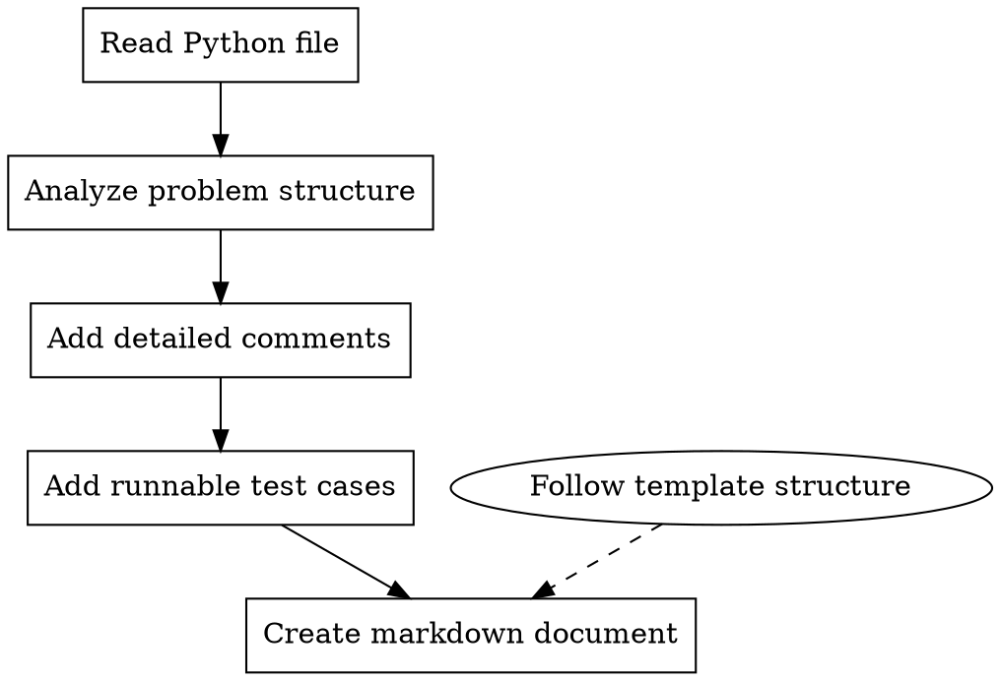

# LeetCode Processor

## Overview

A workflow for processing LeetCode Python solution files to add comprehensive comments, runnable test cases, and generate structured markdown documentation following consistent patterns.

## When to Use

- After solving a LeetCode problem and wanting to document it properly
- When preparing algorithm solutions for code training/review
- Before adding a new problem to a documentation repository
- When standardizing existing LeetCode solutions with consistent formatting

## Core Workflow



## Step-by-Step Process

### 1. Read and Analyze

First, read the Python file to understand:

- Problem ID and title (from comments)
- Current implementation state
- Existing comments or docstrings
- Whether test cases already exist

### 2. Add Comprehensive Comments

**For the solution class/method, add:**

- Problem description summary
- Core algorithm/approach explanation
- Time and space complexity
- Key insights or tricks used

**For complex logic, add inline comments:**

- Why this approach was chosen
- What each variable represents
- Edge cases being handled
- Optimization techniques

**Example structure:**

```python
class Solution:
    """
    [Problem Name] - [Algorithm Type]

    Core idea:
    - Key insight 1
    - Key insight 2

    Why this works:
    [Explanation of correctness]

    Time Complexity: O(...)
    Space Complexity: O(...)
    """
```

### 3. Add Runnable Test Cases

**Standard test structure:**

```python
if __name__ == "__main__":
    sol = Solution()

    tests = [
        # (input1, input2, ..., expected_output),
        (param1, param2, expected),
        # Add more test cases including edge cases
    ]

    for args in tests:
        result = sol.method(*args[:-1])
        expected = args[-1]
        print(f"method({args[:-1]}) = {result}, expected = {expected}")
```

**Include test cases for:**

- Basic examples from problem statement
- Edge cases (empty input, single element, etc.)
- Boundary conditions
- Large input cases (if relevant)

### 4. Create Markdown Documentation
一般的leetcode题解文档位于项目根目录/docs/problems/leetcode/*.md，建议参考已有文档

> **`## 示例` 小节必须用 `输入：` / `输出：` 前缀**，这是**硬要求**，不是风格偏好。
> 页面上那个「▶ 跑样例」按钮与逐帧可视化都靠它抽样例（`plugins/py-samples`
> 与 `visualizer/recorder` 都是按这两个前缀正则匹配的）。写成散文、表格或
> `Input:`/`Output:` 英文前缀，样例**一条都抽不出来** ——
> 而页面**不会报错**，只会静默退化成「手动填参数」，功能悄悄消失。
> 多个样例就重复这两行；牛客题同理（`输入格式`/`输出格式` 讲的是题意，
> `## 示例` 里仍要写 `输入：`/`输出：`）。
>
> ```
> ## 示例
>
> ### 示例 1
>
> **输入：** nums = [2,7,11,15], target = 9
> **输出：** [0,1]
> **解释：** nums[0] + nums[1] == target
> ```

**Document structure (follow exactly):**

```markdown
---
title: [Problem Title]
platform: LeetCode
difficulty: [Easy/Medium/Hard]
id: [Problem Number]
url: https://leetcode.cn/problems/[problem-slug]/
tags:
  - [归一化后的 Tag1]
  - [归一化后的 Tag2]
patterns:
  - ../../patterns/[pattern-slug].md
topics: []
date_added: [YYYY-MM-DD]
date_reviewed: []
---

# [Problem Number]. [Problem Title]

## 题目描述

[Problem description in Chinese]

## 示例

[Example inputs and outputs]

---

## 解题思路

### 第一步：理解问题本质
[Core concept explanation]

### 第二步：暴力解法
[Naive approach with code]

### 第三步：优化解法
[Improved approach]

### 第四步：最优解法
[Optimal solution explanation]

---

## 完整代码实现

```python
[Complete code with comments]
```

---

## 示例推演

[Step-by-step walkthrough with specific numbers]

---

## 复杂度分析

| 解法 | 时间复杂度 | 空间复杂度 | 说明 |
| ---- | ---------- | ---------- | ---- |
| 暴力 | O(...)     | O(...)     | ...  |
| 优化 | O(...)     | O(...)     | ...  |
| 最优 | O(...)     | O(...)     | ...  |

---

## 易错点总结

### 1. [Common mistake 1]

[Explanation and fix]

### 2. [Common mistake 2]

[Explanation and fix]

---

## 扩展思考

[Related problems, variations, deeper insights]

---

## 相关题目

- [Problem Name](URL)

```

## Frontmatter 规范

### tags：必须使用归一化词表

`tags` 会被复习系统的「薄弱标签」面板统计，**同义分裂会让同一个知识点被拆成多行，导致统计失效**。写入前先按下表归一化：

| 禁止使用 | 必须写成 | 说明 |
|---|---|---|
| `BFS` | `广度优先搜索` | |
| `DFS` | `深度优先搜索` | |
| `堆（优先队列）` | `堆` | 全角/半角括号不统一 |
| `哈希查找` / `HashMap` | `哈希表` | |
| `dp` / `DP` | `动态规划` | |
| `双指针法` | `双指针` | |
| `滑动窗` | `滑动窗口` | |

**标签词表（完整、闭合，优先复用而非新造）**

```
数组 字符串 链表 栈 队列 堆 哈希表 树 二叉树 二叉搜索树 图 矩阵
双指针 滑动窗口 前缀和 单调栈 单调队列 并查集 字典树
动态规划 记忆化搜索 0/1背包 完全背包 区间DP 树形DP
二分查找 排序 归并排序 桶排序 快速选择 回溯 分治 递归 迭代
广度优先搜索 深度优先搜索 拓扑排序
贪心 数学 位运算 设计 模拟 计数 找规律 原地算法
```

无法归入上表的新标签，允许新增，但**必须同时确认现有标签里没有同义项**。

### patterns：指向真实存在的文件

`patterns` 的每个值必须是 `../../patterns/<slug>.md`，且该文件**必须真实存在**。

> ⚠️ 历史坑：旧模板写的是 `topics: ../../topics/xxx.md`，但 `code-training/docs/topics/` 目录**不存在**，导致该字段长期为空。不要再使用 `topics` 填路径，语义上它应指「知识点主题」，目前留空 `[]`。

**tag → patterns 映射表**（`code-training/docs/patterns/` 下共 11 个文件）

| patterns slug | 对应 tag |
|---|---|
| `two_pointers` | 双指针 |
| `sliding_window` | 滑动窗口 |
| `hash_map` | 哈希表 原地哈希 |
| `dynamic_programming` | 动态规划 0/1背包 完全背包 区间DP 树形DP 记忆化搜索 背包问题 |
| `backtracking` | 回溯 组合 |
| `bfs` | 广度优先搜索 矩阵 图 拓扑排序 |
| `dfs` | 深度优先搜索 |
| `greedy` | 贪心 Boyer-Moore 投票算法 |
| `search` | 二分查找 快速选择 |
| `sorting` | 排序 归并排序 桶排序 链表 |
| `recursion` | 递归 迭代 分治 记忆化搜索 |

**无对应 pattern 文件的 tag**（字典树、单调栈、单调队列、前缀和、位运算、数学、设计、模拟、并查集、回文等）**不要硬塞**，`patterns` 留空即可，或只填真正匹配的项。一题可以映射到多个 pattern。

**批量补全 `patterns` 的流程**（用于历史题解）

1. 按上表从 `tags` 推断候选 pattern
2. **打开题解正文确认**：主体解法才是 pattern，`tags` 里顺带提到的标签不算
3. 无法确定的**留空，不要猜**——空数组是合法状态，错误的映射会污染知识图谱
4. 写回后跑校验：`node -e` 遍历所有 md，确认每个 `patterns` 路径 `fs.existsSync` 为真

## Key Principles

### Preserve Original Code (CRITICAL)
**绝对禁止删除用户原有的代码和注释。**
- 用户亲手写的代码是宝贵的学习记录，必须完整保留
- 可以添加新注释、改进表达、补充说明，但不能删除原有内容
- 可以重构代码结构（如提取函数），但要保留原代码作为注释或备用实现
- 已有的测试用例要保留并补充，不能替换

**正确的做法：**
- 在原有代码基础上添加文档字符串和注释
- 在代码上方或旁边补充更详细的说明
- 为已有的实现添加复杂度分析注释
- 保留所有原有注释，即使表达不够完美

### Progressive Teaching
Always present solutions in order:
1. **Naive/Brute force** - establishes baseline understanding
2. **Optimized approach** - shows how to improve using problem constraints
3. **Optimal solution** - achieves best complexity with detailed explanation

### No Thinking Traces
- Never include phrases like "让我重新推演", "等等", "实际上这个判断有误"
- Present only correct, verified content
- If explanation needs correction, rewrite completely without showing errors

### Beginner-Friendly
- Explain WHY before HOW
- Use analogies and clear explanations
- Show complete step-by-step examples without skipping
- Include boundary conditions and edge cases

### Clean Code
- Use tricks like `±inf` for boundary handling
- Avoid verbose if-else chains for edge cases
- Include type hints where helpful
- Keep code runnable and complete

## LeetCode Submission Requirements

### Class Definition Placement (CRITICAL)
**除 Solution 以外的类（如 TreeNode、ListNode 等）绝对不能放在 `@lc code=start` 和 `@lc code=end` 之间。**

LeetCode 平台会自动提供这些数据结构类的定义，如果在提交代码区域重复定义会导致提交错误。

**正确的文件结构：**
```python
#
# @lc app=leetcode.cn id=xxx lang=python3
# ...

# @lcpr-template-start
from typing import List, Optional


# Definition for a binary tree node.
# TreeNode 定义在这里（模板区域，不会提交到 LeetCode）
class TreeNode:
    def __init__(self, val=0, left=None, right=None):
        self.val = val
        self.left = left
        self.right = right


# @lcpr-template-end
# @lc code=start
# Solution 类必须在这里（提交区域）
class Solution:
    def method(self, root: Optional[TreeNode]) -> ...:
        ...


# @lc code=end

#
# @lcpr case=start
# ...
# @lcpr case=end


# main 代码段必须位于文件最后面
if __name__ == "__main__":
    sol = Solution()
    # 测试代码
```

**常见错误：**
- ❌ 将 `TreeNode`、`ListNode` 等类定义在 `@lc code=start` 和 `@lc code=end` 之间
- ❌ 将 `import` 语句放在 `@lc code=start` 之后（应该放在模板区域）

### Test Code Placement
**`if __name__ == "__main__":` 测试代码段必须位于文件最后面。**

- 测试代码放在所有 LeetCode 注释标记之后
- 确保测试代码不会影响 LeetCode 的提交和执行
- 测试代码可以包含辅助函数（如 build_tree、链表转换等）

## Common Patterns by Problem Type

### Array/Two Pointers
- Explain pointer movement logic
- Show why O(n) is possible vs O(n²)

### Dynamic Programming
- Define dp[i] state clearly
- Show state transition with examples
- Include space optimization techniques

### Backtracking
- Provide backtracking template
- Explain pruning conditions
- Show decision tree visualization

### Graph/BFS/DFS
- Explain traversal order
- Show visited marking strategy
- Include path reconstruction if applicable

### Binary Search
- Explain why monotonicity matters
- Show boundary handling
- Include common variants

### Linked List
- Use dummy node pattern
- Explain pointer manipulation
- Show before/after state

## File Naming Conventions

- Python file: `[id].[problem-name].py` (e.g., `72.edit-distance.py`)
- Markdown file: `[id]_[snake_case_name].md` (e.g., `0072_edit_distance.md`)

## Red Flags - Check Before Finishing

- [ ] **`## 示例` 每组样例都有 `输入：` / `输出：` 前缀** - 页面「跑样例」与逐帧可视化都靠它抽样例；写不成这两个前缀，功能会**静默消失**（不报错）
- [ ] **新题跑过 `pnpm trace:record <题号>`** - 逐帧可视化是从代码录制出来的，不跑就没有
- [ ] **新题跑过 `pnpm quiz:gen && pnpm quiz:merge`** - 自测题库只认 `bank.json` 里有的 `docId`
- [ ] **Original code is preserved** - user's handwritten code/comments are not deleted
- [ ] **TreeNode/ListNode 不在提交区域** - 辅助类定义在 `@lcpr-template-start` 和 `@lcpr-template-end` 之间，不在 `@lc code=start` 和 `@lc code=end` 之间
- [ ] **main 测试代码在文件最后** - `if __name__ == "__main__":` 位于文件末尾，在所有 LeetCode 注释之后
- [ ] Comments explain WHY, not just WHAT
- [ ] Test cases include edge cases (original tests preserved + new ones added)
- [ ] Markdown follows exact template structure
- [ ] Complexity analysis uses table format
- [ ] No "thinking traces" in final content
- [ ] Code is runnable with `python filename.py`
- [ ] Progressive approach (naive → optimal) is shown

### Frontmatter 完整性

- [ ] `tags` 已按上方**归一化词表**处理（无 `BFS`/`DFS`/`堆（优先队列）`等同义分裂）
- [ ] `patterns` 每一项都是 `../../patterns/<真实存在>.md`
- [ ] `patterns` 与正文主体解法一致（不是 tags 里顺带提到的）
- [ ] 无法确定的 pattern **留空**，没有猜测
- [ ] `topics: []`（该字段目前无语义，不要填路径）

### 新增题解的收尾命令（**新题必跑，改既有题不必**）

写完一篇**新**题解，页面上有三个功能是从文档里**派生**出来的，
它们不会自己出现 —— 必须各跑一条命令，否则那一节就是空的：

```bash
pnpm trace:record 0042      # 逐帧可视化：用 Pyodide 真跑这份代码取执行轨迹
pnpm quiz:gen && pnpm quiz:merge   # 自测题：从「## 复杂度分析」的表格抽单选题
node scripts/check-docs.ts  # 体检：运行条样例数 / 轨迹 / 自测题 / frontmatter
```

三条都**不报错**地静默生效，所以「以为做完了」是这里最容易犯的错：

- **可视化**：录制器需要一个能对上题面样例的入口，且跑出来的结果必须与期望值一致
  （结果不符就整篇丢弃）。需要先 `pnpm sync:pyodide`（12.9MB，已 gitignore）；
  没下运行时脚本会打印提示后以 0 退出 —— **别把那个退出码当成「可视化已生成」**。
  跑完顺手看一眼 `pnpm test:adapters`：它会校验「轨迹里的代码 == 题解
  `## 完整代码实现`」，所以**改动既有题解的代码后必须重录**，否则单测会红。
- **自测题**：`quiz:gen` 从 `## 复杂度分析` 的表格机械抽题，产出候选到
  `bank.generated.json`；`quiz:merge` 合进 `bank.json`（人工题保留）。
  `plugins/self-test` 只认 `bank.json` 里有的 `docId`，所以新题不进 bank 就没自测小节。
- **运行条**：`plugins/py-samples` 自动扫 `problems/**/*.md`，没有额外命令 ——
  但它抽不出样例时同样**不报错**，所以要以 `check-docs.ts` 的报告为准。

> `patterns` / `templates` / `data-structures` 那三页若也要播放器，放置表
> `src/components/training/visualizer/inlinePlacement.ts` 要手动加一行 ——
> 那是代码不是文档，`check-docs.ts` 管不到。

### 题库同步

写完或改动题解后，若该题在 `static/quiz/bank.json` 里已有题目：

- [ ] 复杂度变了 → 同步改 `static/quiz/bank.generated.json`（或直接改 bank.json 的人工题）并跑 `pnpm quiz:merge`
- [ ] 易错点变了 → 同步更新对应的 judge/single 题
- [ ] 跑了 `pnpm quiz:validate` 且 0 error

详见 `.agents/skills/quiz-bank-processor/SKILL.md`。

### 增量维护既有题解

批量补 `patterns` 时：

- [ ] 按 tag → pattern 映射表推断后，**打开正文确认主体解法**
- [ ] 映射不确定的**留空** —— 错误的映射会污染知识图谱，而知识图谱是「薄弱标签」统计的依据
