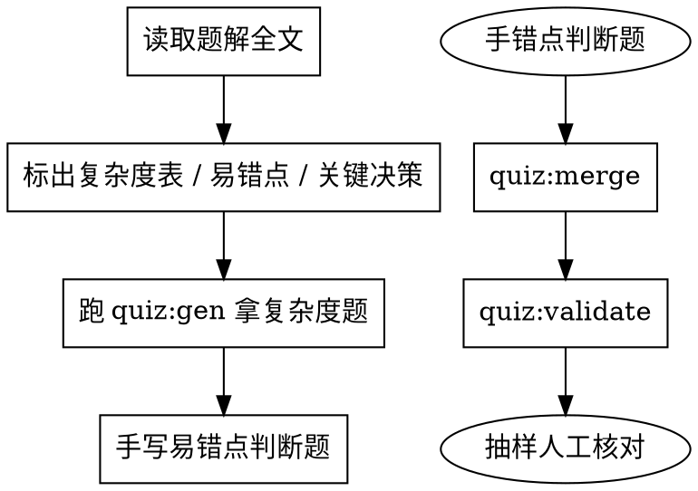

# 自测题库处理器

## Overview

为 `code-training/docs/problems/**/*.md` 的题解**生成、审阅、修复**自测题，
写入 `static/quiz/bank.json`。

题库的唯一目的是**逼出主动回忆**。一份读起来舒服但答起来轻松的自测题
没有价值 —— 它测的是「认得出来」，不是「想得起来」。这两件事的差距，
正是刷题时最该被反复戳破的地方。

## When to Use

- 新增题解后，为它补充自测题
- 定期批量审阅已有题目，修正错误答案 / 含糊题干 / 无效干扰项
- 题解正文改动（尤其是复杂度、易错点）后同步题目
- 想要给某批题解补齐到 3 道题

## 文件位置与职责

| 文件 | 谁写 | 是否进 git |
|------|------|-----------|
| `static/quiz/bank.generated.json` | `pnpm quiz:gen` 自动产出 | **否**（每次重跑覆盖） |
| `static/quiz/bank.json` | 本 skill 的产出，人工题也在里面 | **是** |

合并用 `pnpm quiz:merge`：复杂度题永远来自 generated（保证与表格同步），
人工题保留在 bank.json。

## 命令

```bash
pnpm quiz:gen                  # 从「复杂度分析」表格自动生成候选题
pnpm quiz:gen 1 3 15           # 只处理指定题号
pnpm quiz:merge --dry          # 预览合并差异
pnpm quiz:merge                # 合并进 bank.json
pnpm quiz:validate             # 校验（题量不足只警告）
pnpm quiz:validate --strict    # 有 error 就退出非 0，CI 用
```

## 核心原则

### 1. 只从题解里已有的内容取事实（红线）

每道题的答案**必须能在题解的对应小节里字面找到**。
`pnpm quiz:validate` 会做交叉校验：凡 `source` 指向某个小节的题，
都会去那道小节里核对答案文本，找不到就报错。

```markdown
❌ stem: 本题最优解的时间复杂度是 O(n)      // 题解表里写的是「一次遍历」
✅ stem: 本题最优解「哈希表」的时间复杂度是？  // 答案 O(n) 在表里
```

**绝对禁止**：凭印象写复杂度、根据题号猜难度、编造题解里没有的知识点。

### 2. 题型必须服务主动回忆

| 素材来源 | 推荐题型 | 反例（不要做） |
|---|---|---|
| `## 复杂度分析` 表格 | 单选（干扰项取**同表其他解法**）| 把所有 O(…) 罗列成选项 |
| `## 易错点总结` 的「错误写法/正确写法」| 判断题：把错误陈述作为题干，答案 false | 原样复述正确写法当题干 |
| `## 易错点总结` 的具体代码 | 单选：给代码问行为/问差在哪一行 | 让读者背代码 |
| `## 解题思路` 的关键决策 | 多选：哪几步是本题必需的 | 全选/单选都无区分度 |
| `patterns` frontmatter | 单选：本题属于哪个算法模式 | 无 |

**判断题必须是「陈述一个错误做法，问对不对」**。这是易错点小节最自然的
用法 —— 题解里已经写明「先存后查会匹配到自己」，题干就该是
「先存入当前数，再查表即可」，答案 `false`。

### 3. 干扰项必须有区分度

好干扰项 = **读者真的会选错的那个东西**。

```markdown
✅ 干扰项 = 同表其他解法的复杂度
   「本题最优解「二分划分」的时间复杂度是？」O(log min(m,n)) / O((m+n)log(m+n)) / O(m+n)
   —— 选错说明没分清「二分划分」和「双指针」各自慢在哪

❌ 干扰项 = 编造的复杂度
   O(n) / O(n log n) / O(n log log n)
   —— 读者一眼看出都不对，等于送分
```

**禁止**编造出逻辑上同样成立的选项 —— 那样答案就有争议，
读者答对了会被告知错，长期会不信任整个自测功能。

### 4. 解析是复习时唯一的学习价值（红线）

`explain` 不少于 15 字，且要回答「**为什么**」，不是复述答案。

```markdown
❌ explain: 答案 O(n)，哈希表解法是 O(n)。     // 零信息量
✅ explain: 哈希表解法只需一次遍历，查找是 O(1)，所以是 O(n)。暴力双重循环是
           O(n²) —— 答错说明还没记住各自为什么慢。
```

### 5. 题干不得泄漏答案

「本题最优解（哈希表）的时间复杂度是？」里已经说出了解法名，
对懂行的人等于提示；但如果题干写「本题最优解（滑动窗口）的时间复杂度是？」
而正确答案是 O(n)²（其实解法是 dp），就属于**题干与答案矛盾**，必须改。

自检：题干里不能出现答案本身。

## 每篇题解的目标：3 道题

按优先级凑够 3 道（不是凑数，不够就少放）：

1. **复杂度单选**（几乎每篇都有，`quiz:gen` 已自动生成）
2. **易错点判断题**（最有价值，优先手写）
3. **易错点单选 / 模式归属单选** / **解题关键决策多选**

## JSON 结构

```json
{
  "version": 1,
  "items": [
    {
      "id": "leetcode-1-pitfall-order",
      "docId": "problems/leetcode/0001_two_sum.md",
      "type": "judge",
      "stem": "哈希表解法里，先把当前数字存进表、再查表即可，这样一遍遍历就够。",
      "answer": false,
      "explain": "必须先查表、再存数。如果先存，可能会把同一个元素当成答案 —— 例如 target = 6、num = 3，先存后查会命中刚存入的自己。",
      "source": "易错点总结 · 先查表再存数"
    },
    {
      "id": "leetcode-1-return-type",
      "docId": "problems/leetcode/0001_two_sum.md",
      "type": "single",
      "stem": "本题要求返回的是什么？",
      "options": ["两个元素的值", "数组下标", "元素的出现次数", "两个元素的和"],
      "answer": 1,
      "explain": "题目要求返回的是数组下标，不是数值本身。另外题目允许按任意顺序返回答案，所以 [0,1] 和 [1,0] 都算对。",
      "source": "易错点总结 · 返回的是索引，不是数值"
    }
  ]
}
```

### 字段说明

| 字段 | 说明 |
|------|------|
| `id` | 全局唯一。约定 `<平台>-<题号>-<语义>`，如 `leetcode-1-complexity` |
| `docId` | **md 相对 `code-training/docs` 的路径**，含 `.md` |
| `type` | `single` / `multi` / `judge` / `blank` |
| `stem` | 题干。不得泄漏答案 |
| `explain` | 解析，**不少于 15 字**，回答「为什么」 |
| `source` | 出处小节，如 `复杂度分析`、`易错点总结 · 先查表再存数` |
| `options` | `single`/`multi` 必填，不得有重复 |
| `answer` | `single`:下标；`multi`:下标数组；`judge`:布尔；`blank`:字符串 |
| `accept` | `blank` 专用，其他可接受答案（已做归一化比较） |

### docId 为什么用路径而不是 docId

不是 docId，是**文件相对路径**。Docusaurus 的 numberPrefixParser 会改写 id：
`0001_two_sum.md` → `1`，`HJ48_从单向链表….md` → `HJ48`，规则不统一。
路径是唯一稳定的标识。

### `source` 必须能对上小节名

`source` 的第一段会拿去题解里找 `## <该段>`。
写成「易错点总结 · 先查表再存数」能对上，写「根据上述分析」就对不上（只警告不报错）。

## 工作流程



### 批量处理

1. 逐篇读题解，重点看 `## 复杂度分析`、`## 易错点总结`
2. `pnpm quiz:gen <题号...>` 生成复杂度题
3. 手写易错点题（judge 优先）
4. `pnpm quiz:merge`
5. `pnpm quiz:validate` —— 必须 0 error
6. **抽样人工核对至少 5 篇**：打开题解，逐题核对答案与解析

## Red Flags — 完成前必查

- [ ] `pnpm quiz:validate` 0 error
- [ ] 每道题的答案能在题解对应小节里**字面找到**（validate 已自动核对）
- [ ] 复杂度题与「复杂度分析」表格完全一致（从表格抄，不要手打）
- [ ] 判断题的题干是**错误做法**，答案是 `false`
- [ ] 单选题的干扰项来自同表其他解法，不是编造的
- [ ] 没有逻辑上同样成立的干扰项（答案无争议）
- [ ] `explain` ≥ 15 字，且解释了「为什么」
- [ ] 题干不泄漏答案
- [ ] `source` 指向真实存在的小节
- [ ] `docId` 路径真实存在（validate 已核对）
- [ ] 每篇至少 1 道**非**复杂度题（否则自测退化成纯记忆题库）
- [ ] `id` 无重复

## 常见错误

### ❌ 把正确写法当判断题题干

```json
{"stem": "哈希表解法要先查表再存数", "answer": true}
```
读者点头就行，测不出任何东西。

### ✅ 陈述错误做法

```json
{"stem": "哈希表解法里，先把当前数字存进表、再查表即可，这样一遍遍历就够。", "answer": false}
```

### ❌ 题干泄漏答案

```json
{"stem": "本题哈希表解法的时间复杂度是？", "options": ["O(n)", "O(n²)"]}
```
「哈希表解法」配合 O(n) 几乎等于明示。

### ❌ 全部选对就是送分

一道好的判断题，读者第一反应应该是「嗯？好像是这样吧？」然后去查。
如果读完就 100% 确定，这题就没有复习价值 —— 换一道。

### ❌ 为了凑 3 道而降低质量

宁缺毋滥。一篇只放 1 道好题，好过放 3 道送分题 ——
后者会让读者对整个自测功能脱敏。