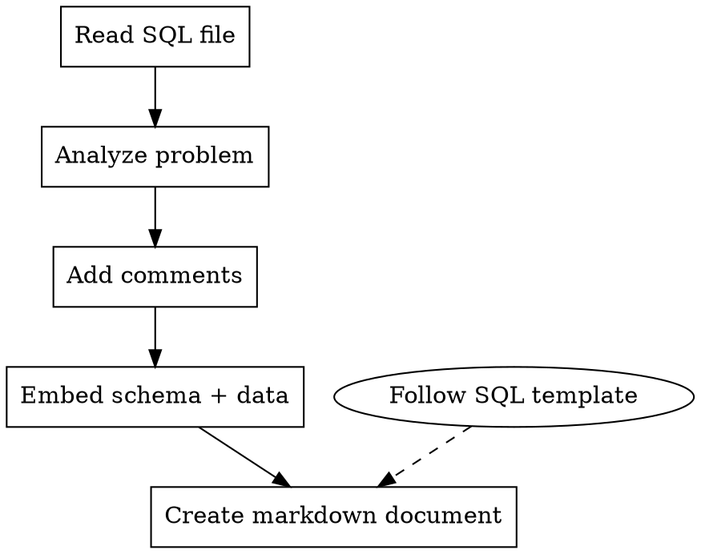

# SQL Processor

## Overview

A workflow for processing SQL solution files from online judges (NowCoder, LeetCode SQL, HackerRank, etc.) to add comprehensive comments, embedded table schemas with example data, and generate structured markdown documentation following consistent patterns.

## When to Use

- After solving an SQL problem on an online judge and wanting to document it properly
- When preparing SQL solutions for review/training
- Before adding a new SQL problem to a documentation repository
- When standardizing existing SQL solutions with consistent formatting

## Core Differences from ACM/Python Problems

| Aspect | ACM/Python | SQL |
|--------|-----------|-----|
| Code type | Python script | SQL query |
| Input/Output | `sys.stdin` / `print()` | Database tables / result set |
| Test cases | Embedded Python test functions | Example data in comments |
| Documentation | Algorithm focus | Schema + query focus |
| Execution | `python file.py --test` | Cannot run standalone |

## Core Workflow



## Step-by-Step Process

### 1. Read and Analyze

First, read the SQL file to understand:

- Platform and problem ID (from comments like `@nc app=nowcoder id=...`)
- Whether the SQL query is already written or empty
- Existing comments or annotations
- Problem name and URL

**Note:** Many platforms (NowCoder) require login to view full problem details including table schemas. The user may need to provide this information, or it can be inferred from the filename and common platform patterns.

### 2. Add Comprehensive Comments

**For the SQL file, add above the query:**

- Problem description summary
- Table schema(s) involved
- Key SQL concepts used (JOIN, GROUP BY, window functions, etc.)
- Why this approach was chosen

**Example structure:**

```sql
/**
 * [Problem Name] - [SQL Concept]
 *
 * 题目描述：
 * ...
 *
 * 涉及表：
 * - table_name (column1, column2, ...)
 *
 * 核心思路：
 * 1. ...
 * 2. ...
 *
 * 使用到的SQL语法：
 * - DISTINCT / GROUP BY
 * - JOIN / LEFT JOIN
 * - 聚合函数 (COUNT, SUM, AVG, MAX, MIN)
 * - 窗口函数 (ROW_NUMBER, RANK, DENSE_RANK, LEAD, LAG)
 * - 子查询 / CTE (WITH)
 */

-- @schema-start
/*
-- 建表语句
CREATE TABLE table_name (
    id INT PRIMARY KEY,
    name VARCHAR(100),
    ...
);

-- 示例数据
INSERT INTO table_name VALUES (...);

-- 预期输出
SELECT ...;
*/
-- @schema-end

-- 查询语句
SELECT ...;
```

### 3. Embed Schema and Example Data

**Standard structure:**

Use comment blocks to embed table creation statements, sample data, and expected output.

```sql
-- @schema-start
/*
-- 表结构
table_name:
- id INT
- name VARCHAR(100)
- created_at DATETIME

-- 示例数据
| id | name  | created_at          |
|----|-------|---------------------|
| 1  | Alice | 2024-01-01 10:00:00 |
| 2  | Bob   | 2024-01-02 11:00:00 |

-- 预期输出
| id | name  |
|----|-------|
| 1  | Alice |
*/
-- @schema-end
```

**Include example data for:**
- All sample inputs from problem statement
- Edge cases (empty table, single row, NULL values)
- Multiple tables if JOINs are involved

### 4. Create Markdown Documentation

SQL 题解文档位于 `docs/problems/<platform>/<path>/`，路径映射规则：
- 源文件：`code-training/nowcoder/SQL基础进阶/SQL1.查询所有投递用户user_id并去重.sql`
- 文档：`code-training/docs/problems/nowcoder/SQL基础进阶/SQL1.查询所有投递用户user_id并去重.md`

**Document structure (follow exactly):**

```markdown
---
title: [Problem Title]
platform: [NowCoder/LeetCode/HackerRank/etc.]
difficulty: [入门/简单/中等/困难/暂无评级]
id: [Problem ID if available]
url: [Problem URL]
tags:
  - [Tag1]
  - [Tag2]
topics:
  - ../../topics/[topic].md
patterns:
  - ../../patterns/[pattern].md
date_added: [YYYY-MM-DD]
date_reviewed: []
---

# [Problem ID]. [Problem Title]

## 题目描述

[Problem description in Chinese]

## 表结构

### 表1：table_name

```sql
CREATE TABLE table_name (
    column1 DATA_TYPE COMMENT '描述',
    column2 DATA_TYPE COMMENT '描述',
    ...
);
```

| 字段名 | 类型 | 说明 |
|--------|------|------|
| column1 | INT | ... |
| column2 | VARCHAR | ... |

### 表2：another_table (if applicable)

...

## 示例数据

### table_name

| column1 | column2 | ... |
|---------|---------|-----|
| ... | ... | ... |

## 预期输出

| result_col1 | result_col2 |
|-------------|-------------|
| ... | ... |

---

## 解题思路

### 第一步：理解需求
[What the query needs to accomplish]

### 第二步：分析表结构
[Which tables/columns are relevant]

### 第三步：确定SQL方案
[Which SQL features to use: DISTINCT, GROUP BY, JOIN, subquery, window function, etc.]

### 第四步：编写并验证SQL
[Final query with explanation]

---

## 完整SQL实现

```sql
[Complete SQL query with comments]
```

---

## 解法详解

### 方法一：基本解法
[Simple approach with SQL]

### 方法二：优化解法
[More efficient or elegant approach]

### 方法三：替代写法
[Different SQL dialects or syntax variations]

---

## 知识点总结

### 1. [SQL Concept 1]
[Explanation with examples]

### 2. [SQL Concept 2]
[Explanation with examples]

---

## 易错点总结

### 1. [Common mistake 1]
[Explanation and fix]

### 2. [Common mistake 2]
[Explanation and fix]

---

## 扩展思考

- [Related SQL problems, variations, deeper insights]
- [Performance considerations: indexes, execution plans]

---

## 相关题目

- [Problem Name](URL)

```

## Key Principles

### Preserve Original Code (CRITICAL)
**绝对禁止删除用户原有的SQL代码和注释。**
- 用户亲手写的SQL是宝贵的学习记录，必须完整保留
- 可以添加新注释、改进表达、补充说明，但不能删除原有内容
- 已有的注释要保留并补充，不能替换

### Progressive Teaching
Always present solutions in order:
1. **Basic approach** - simplest SQL that works
2. **Optimized approach** - more efficient or cleaner SQL
3. **Alternative approaches** - different ways to solve the same problem

### No Thinking Traces
- Never include phrases like "让我重新推演", "等等", "实际上这个判断有误"
- Present only correct, verified content
- If explanation needs correction, rewrite completely without showing errors

### Beginner-Friendly
- Explain WHY before HOW
- Explain what each clause does (WHERE, GROUP BY, HAVING, ORDER BY)
- Show complete step-by-step examples without skipping
- Include NULL handling and edge cases

## SQL-Specific Requirements

### Comment Style
**SQL文件统一使用SQL标准注释：**

```sql
-- 单行注释

/*
多行注释
多行注释
*/
```

**注意：**
- MySQL中 `#` 也是合法注释，但标准SQL不支持，避免使用
- 注释中不要包含可能导致解析问题的特殊字符

### Query Formatting Standards

```sql
-- 推荐格式：关键字大写，表名列名小写，适当缩进
SELECT
    t1.column1,
    t2.column2,
    COUNT(*) AS cnt
FROM table1 AS t1
LEFT JOIN table2 AS t2
    ON t1.id = t2.id
WHERE t1.status = 'active'
GROUP BY t1.column1
HAVING COUNT(*) > 1
ORDER BY cnt DESC
LIMIT 10;

-- 简单查询可以写在一行
SELECT DISTINCT user_id FROM deliver_record;
```

### Common SQL Patterns

#### DISTINCT vs GROUP BY
```sql
-- 去重两个等价写法
SELECT DISTINCT user_id FROM table_name;
SELECT user_id FROM table_name GROUP BY user_id;
-- DISTINCT 语义更清晰；GROUP BY 适合后续聚合
```

#### Aggregation with GROUP BY
```sql
SELECT
    department,
    COUNT(*) AS employee_count,
    AVG(salary) AS avg_salary,
    MAX(salary) AS max_salary
FROM employees
GROUP BY department
HAVING COUNT(*) > 5;
```

#### JOIN Types
```sql
-- INNER JOIN：只返回匹配的行
SELECT * FROM A INNER JOIN B ON A.id = B.id;

-- LEFT JOIN：返回A的所有行，B不匹配则为NULL
SELECT * FROM A LEFT JOIN B ON A.id = B.id;

-- 多表连接
SELECT *
FROM A
JOIN B ON A.id = B.a_id
JOIN C ON B.id = C.b_id;
```

#### Window Functions
```sql
-- 行号（无并列跳过）
SELECT *, ROW_NUMBER() OVER (ORDER BY score DESC) AS rn FROM scores;

-- 排名（并列占多名次）
SELECT *, RANK() OVER (ORDER BY score DESC) AS rk FROM scores;

-- 密集排名（并列不占名次）
SELECT *, DENSE_RANK() OVER (ORDER BY score DESC) AS dr FROM scores;

-- 分组窗口
SELECT *,
    ROW_NUMBER() OVER (PARTITION BY dept ORDER BY salary DESC) AS dept_rn
FROM employees;
```

#### Subqueries and CTEs
```sql
-- 子查询
SELECT * FROM employees WHERE salary > (SELECT AVG(salary) FROM employees);

-- CTE (Common Table Expression) - 更清晰的写法
WITH avg_salary AS (
    SELECT AVG(salary) AS avg_val FROM employees
)
SELECT e.*
FROM employees e, avg_salary
WHERE e.salary > avg_salary.avg_val;
```

### Date/Time Functions (MySQL)
```sql
-- 获取日期部分
SELECT DATE('2024-01-15 10:30:00');  -- 2024-01-15

-- 日期格式化
SELECT DATE_FORMAT(created_at, '%Y-%m-%d');

-- 日期差
SELECT DATEDIFF(end_date, start_date);

-- 按月分组
SELECT DATE_FORMAT(created_at, '%Y-%m') AS month, COUNT(*) FROM orders GROUP BY month;
```

### String Functions (MySQL)
```sql
-- 拼接
SELECT CONCAT(first_name, ' ', last_name);

-- 长度
SELECT LENGTH(string_col), CHAR_LENGTH(string_col);

-- 子串
SELECT SUBSTRING(col, 1, 5);

-- 替换
SELECT REPLACE(col, 'old', 'new');
```

## File Naming Conventions

- SQL file: `[platform-id].[problem-name].sql` (e.g., `SQL1.查询所有投递用户user_id并去重.sql`, `175.组合两个表.sql`)
- Markdown file: Same as SQL file but with `.md` extension
- Path mapping: `code-training/<platform>/<path>/<name>.sql` → `docs/problems/<platform>/<path>/<name>.md`

## Red Flags - Check Before Finishing

- [ ] **Original SQL is preserved** - user's handwritten SQL is not deleted
- [ ] **Table schemas are documented** - CREATE TABLE statements or field descriptions included
- [ ] **Example data is included** - sample rows and expected output shown
- [ ] **SQL comments explain WHY, not just WHAT**
- [ ] **Multiple solution approaches shown** (basic → optimized → alternative)
- [ ] **Markdown follows exact template structure**
- [ ] **No "thinking traces" in final content**
- [ ] **SQL syntax is platform-appropriate** (MySQL/PostgreSQL/SQL Server)
- [ ] **Edge cases are covered** (NULL values, empty results, duplicates)
