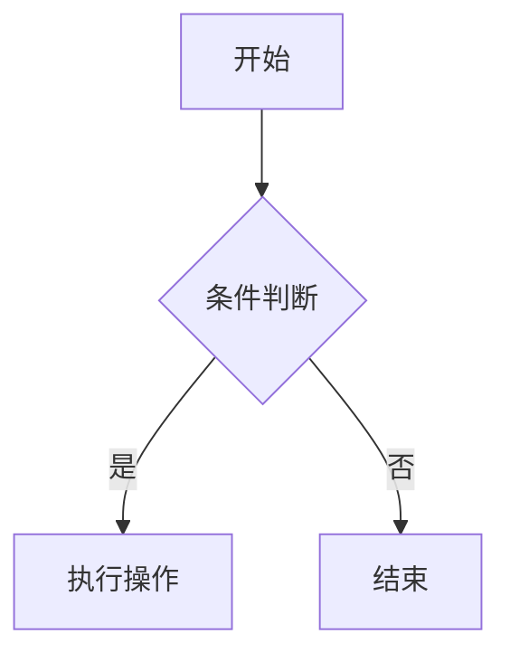

# HanphoneJan.github.io

Hanphone 的 Github 个人主页 - 基于 Docusaurus 构建的技术文档站

## 🚀 快速开始

### 安装依赖

```bash
pnpm install
```

### 本地开发

```bash
pnpm start
```

此命令启动本地开发服务器并打开浏览器窗口。大多数更改会实时反映，无需重启服务器。

### 构建

```bash
pnpm build
```

此命令将静态内容生成到 `build` 目录，可以使用任何静态内容托管服务提供服务。

### 本地预览构建

```bash
pnpm serve
```

## 📝 文档管理指南

### Blog vs Docs 的区别

**Docs（文档）** - 结构化的技术文档
- ✅ 侧边栏导航，层级结构
- ✅ 持续更新和维护的内容
- ✅ 适合：技术教程、API 文档、知识库
- ✅ URL 格式：`/docs/category/page`

**Blog（博客）** - 时间序列的文章
- ✅ 按时间倒序显示
- ✅ 支持作者、标签、RSS 订阅
- ✅ 适合：学习笔记、经验分享、项目总结
- ✅ URL 格式：`/blog/2024/01/15/title`

**使用建议：**
- 主要使用 `docs/` 构建技术知识库
- 使用 `blog/` 记录学习笔记和心得
- 如果只需要文档功能，可以删除 `blog/` 目录

---

### 添加文档（Docs）

1. 在 `docs/` 目录下创建 `.md` 文件（推荐使用 Markdown 而非 MDX）
2. 在文件开头添加 Front Matter：

```markdown
---
sidebar_position: 1
title: 文档标题
---

# 文档标题

文档内容...
```

**示例：**

```bash
# 创建新文档
docs/
├── 前端/
│   └── React基础.md
├── 后端/
│   └── Node.js入门.md
└── intro.md
```

### 添加博客（Blog）

1. 在 `blog/` 目录下创建 `.md` 文件
2. 文件名格式：`YYYY-MM-DD-标题.md`（日期可选）
3. 添加 Front Matter：

```markdown
---
title: 博客标题
authors: hanphonejan
tags: [react, 前端]
date: 2024-01-15
---

博客内容...
```

**示例：**

```bash
# 创建新博客
blog/
├── 2024-01-15-react-hooks-guide.md
├── 2024-02-20-typescript-tips.md
└── authors.yml
```

**配置作者信息：**

编辑 `blog/authors.yml`：

```yaml
hanphonejan:
  name: HanphoneJan
  title: 前后端工程师
  url: https://github.com/hanphonejan
  image_url: https://github.com/hanphonejan.png
```

### 组织文档结构

使用文件夹来组织文档分类：

```
docs/
├── 前端/           # 前端相关文档
├── 后端/           # 后端相关文档
├── 数据库/         # 数据库相关文档
└── intro.md       # 首页文档
```

Docusaurus 会自动根据文件夹结构生成侧边栏。

### 修改文档

直接编辑 `docs/` 或 `blog/` 目录下的 `.md` 文件即可。保存后：
- 开发模式下会自动刷新
- 推送到 GitHub 后会自动重新部署

### 删除文档

直接删除 `docs/` 或 `blog/` 目录下的 `.md` 文件即可。

### Front Matter 常用配置

**Docs 文档：**

```markdown
---
sidebar_position: 1        # 侧边栏排序（数字越小越靠前）
title: 自定义标题          # 页面标题
sidebar_label: 侧边栏标签  # 侧边栏显示的文字
---
```

**Blog 博客：**

```markdown
---
title: 博客标题
authors: hanphonejan      # 作者（在 authors.yml 中定义）
tags: [react, 前端]       # 标签
date: 2024-01-15          # 发布日期
---
```

### Markdown 语法支持

支持标准 Markdown 语法，包括：

- 标题：`# ## ### ####`
- 列表：`- * 1.`
- 代码块：` ```语言 `
- 链接：`[文字](链接)`
- 图片：``
- 表格
- 引用：`>`
- 粗体：`**文字**`
- 斜体：`*文字*`

**代码块示例：**

````markdown
```javascript
function hello() {
  console.log('Hello, World!');
}
```
````

**Mermaid 图表示例：**

````markdown

````

### 添加图片

1. 将图片放到 `static/img/` 目录
2. 在文档中引用：

```markdown

```

## 📦 技术栈

- [Docusaurus 3](https://docusaurus.io/) - 现代化静态网站生成器
- [React 19](https://react.dev/) - UI 框架
- [TypeScript](https://www.typescriptlang.org/) - 类型安全
- [Mermaid](https://mermaid.js.org/) - 图表支持
- [pnpm](https://pnpm.io/) - 包管理器

## 🎨 设计特点

- 科技蓝配色方案（#0066FF）
- 深色模式优先
- Inter + JetBrains Mono 字体
- 极简工程美学设计
- 完整的响应式支持

## 🚀 部署

项目配置了 GitHub Actions 自动部署。推送到 `main` 分支后会自动构建并部署到 GitHub Pages。

**部署步骤：**

1. 推送代码到 GitHub：
```bash
git add .
git commit -m "更新文档"
git push origin main
```

2. 在 GitHub 仓库设置中启用 GitHub Pages：
   - 进入 Settings > Pages
   - Source 选择 "GitHub Actions"

3. 访问：https://hanphonejan.github.io

## 📁 项目结构

```
.
├── blog/                   # 博客文章（时间序列）
│   ├── 2024-01-15-xxx.md
│   └── authors.yml        # 作者信息配置
├── docs/                   # 文档目录（层级结构）- 主要编辑这里
│   ├── 前端/
│   ├── 后端/
│   └── intro.md
├── src/
│   ├── components/        # React 组件
│   ├── css/              # 样式文件
│   └── pages/            # 自定义页面
├── static/               # 静态资源（图片等）
│   └── img/
├── .github/
│   └── workflows/        # GitHub Actions 自动部署
├── docusaurus.config.ts  # 主配置文件
└── package.json
```

> **说明**：`sidebars.ts` 不是必需的。Docusaurus 会根据 `docs/` 文件夹结构**自动生成**侧边栏，每个文件夹成为分类，每个 `.md` 文件成为链接。仅当需要自定义侧边栏顺序或结构时才需要创建该文件。

**目录说明：**

- `docs/` - 技术文档，支持层级结构和侧边栏导航
- `blog/` - 博客文章，按时间排序，支持标签和作者
- `static/` - 静态资源，如图片、文件等
- `src/` - 源代码，包括自定义组件和页面

## ⚙️ 配置说明

### 修改网站标题

编辑 `docusaurus.config.ts`：

```typescript
const config: Config = {
  title: 'HanphoneJan 技术文档',  // 修改这里
  tagline: '技术文档与知识分享',   // 修改这里
  // ...
};
```

### 修改顶部导航栏

顶部导航栏在 `docusaurus.config.ts` 的 `themeConfig.navbar` 中配置，可自定义 Logo、链接、下拉菜单等。文档与博客入口会根据 `docs/` 和 `blog/` 的存在自动展示。

### 修改页脚

编辑 `docusaurus.config.ts` 中的 `footer` 配置。

## 🔧 常见问题

### 1. 文档没有显示在侧边栏

确保文档文件：
- 在 `docs/` 目录下
- 是 `.md` 文件
- 包含正确的 Front Matter

### 2. 博客文章没有显示

确保博客文件：
- 在 `blog/` 目录下
- 文件名格式正确（可选日期前缀）
- 包含 Front Matter（至少有 title）

### 3. 图片无法显示

- 图片应放在 `static/img/` 目录
- 引用路径以 `/` 开头：`/img/xxx.png`

### 4. 代码高亮不正确

在代码块后指定语言：

````markdown
```javascript
// 代码
```
````

支持的语言：`javascript`, `typescript`, `python`, `java`, `go`, `rust`, `sql`, `bash`, `json` 等

### 5. 如何禁用博客功能

如果只需要文档功能，可以：

1. 删除 `blog/` 目录
2. 编辑 `docusaurus.config.ts`，移除导航栏中的博客链接：

```typescript
navbar: {
  items: [
    // 删除或注释这一行
    // {to: '/blog', label: '博客', position: 'left'},
  ],
}
```

### 6. 如何修改侧边栏结构

Docusaurus **默认根据 `docs/` 目录结构自动生成侧边栏**，无需配置。每个文件夹成为分类，每个 `.md` 文件成为链接。通过文档的 Front Matter 控制顺序和标签：

- `sidebar_position`：控制排序（数字越小越靠前）
- `sidebar_label`：自定义侧边栏显示文字
- `_category_.json`：在文件夹内添加，可自定义分类标签和顺序

仅当需要完全自定义侧边栏（如手动指定顺序、添加外部链接）时，才需创建 `sidebars.ts` 并配置 `sidebarPath`。

## 📄 许可证

Copyright © 2026 HanphoneJan

---

## 📖 快速参考

### 常用命令

```bash
# 开发
pnpm start              # 启动开发服务器
pnpm build              # 构建生产版本
pnpm serve              # 预览构建结果
pnpm clear              # 清理缓存

# 部署
git add .
git commit -m "更新内容"
git push origin main    # 推送后自动部署
```

### 文件命名规范

**Docs 文档：**
- ✅ `React基础.md`
- ✅ `Node.js入门.md`
- ✅ `API参考.md`

**Blog 博客：**
- ✅ `2024-01-15-react-hooks.md`（推荐）
- ✅ `react-hooks.md`（也可以）

### Markdown 快速语法

```markdown
# 一级标题
## 二级标题
### 三级标题

**粗体** *斜体* `代码`

- 无序列表
1. 有序列表

[链接文字](https://example.com)


> 引用文字

| 表头1 | 表头2 |
|-------|-------|
| 内容1 | 内容2 |
```

### 代码块示例

````markdown
```javascript
function hello() {
  console.log('Hello, World!');
}
```
````

### Mermaid 图表示例

````markdown

````

### 有用的链接

- [Docusaurus 官方文档](https://docusaurus.io/)
- [Markdown 语法指南](https://www.markdownguide.org/)
- [Mermaid 图表文档](https://mermaid.js.org/)
- [GitHub Pages 文档](https://docs.github.com/pages)
