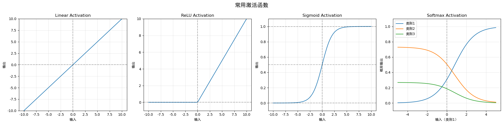

``` python
import numpy as np
import matplotlib.pyplot as plt

# 设置中文显示
plt.rcParams["font.family"] = ["sans-serif","SimHei"]
plt.rcParams['axes.unicode_minus'] = False  # 正确显示负号

# 定义激活函数
def linear(x):
    """线性激活函数"""
    return x

def relu(x):
    """ReLU激活函数"""
    return np.maximum(0, x)

def sigmoid(x):
    """Sigmoid激活函数"""
    return 1 / (1 + np.exp(-x))

def softmax(x):
    """Softmax激活函数"""
    # 为了数值稳定性，减去最大值
    exp_x = np.exp(x - np.max(x))
    return exp_x / np.sum(exp_x, axis=0)

# 创建数据
x_linear = np.linspace(-10, 10, 100)
x_relu = np.linspace(-10, 10, 100)
x_sigmoid = np.linspace(-10, 10, 100)
x_softmax = np.linspace(-5, 5, 100)

# 计算函数值
y_linear = linear(x_linear)
y_relu = relu(x_relu)
y_sigmoid = sigmoid(x_sigmoid)

# 为softmax创建多个输入维度以展示其特性
x1 = np.linspace(-5, 5, 100)
x2 = np.full_like(x1, 0.5)
x3 = np.full_like(x1, -0.5)
softmax_input = np.vstack([x1, x2, x3])
y_softmax = softmax(softmax_input)

# 创建图像
fig, axes = plt.subplots(1, 4, figsize=(20, 5))
fig.suptitle('常用激活函数', fontsize=16)

# 绘制Linear激活函数
axes[0].plot(x_linear, y_linear)
axes[0].axhline(y=0, color='k', linestyle='--', alpha=0.3)
axes[0].axvline(x=0, color='k', linestyle='--', alpha=0.3)
axes[0].set_title('Linear Activation')
axes[0].set_xlabel('输入')
axes[0].set_ylabel('输出')
axes[0].grid(True, alpha=0.3)
axes[0].set_ylim(-10, 10)

# 绘制ReLU激活函数
axes[1].plot(x_relu, y_relu)
axes[1].axhline(y=0, color='k', linestyle='--', alpha=0.3)
axes[1].axvline(x=0, color='k', linestyle='--', alpha=0.3)
axes[1].set_title('ReLU Activation')
axes[1].set_xlabel('输入')
axes[1].set_ylabel('输出')
axes[1].grid(True, alpha=0.3)
axes[1].set_ylim(-1, 10)

# 绘制Sigmoid激活函数
axes[2].plot(x_sigmoid, y_sigmoid)
axes[2].axhline(y=0, color='k', linestyle='--', alpha=0.3)
axes[2].axvline(x=0, color='k', linestyle='--', alpha=0.3)
axes[2].axhline(y=1, color='k', linestyle='--', alpha=0.3)
axes[2].axhline(y=0.5, color='k', linestyle='--', alpha=0.3)
axes[2].set_title('Sigmoid Activation')
axes[2].set_xlabel('输入')
axes[2].set_ylabel('输出')
axes[2].grid(True, alpha=0.3)
axes[2].set_ylim(-0.1, 1.1)

# 绘制Softmax激活函数
axes[3].plot(x_softmax, y_softmax[0], label='类别1')
axes[3].plot(x_softmax, y_softmax[1], label='类别2')
axes[3].plot(x_softmax, y_softmax[2], label='类别3')
axes[3].axvline(x=0, color='k', linestyle='--', alpha=0.3)
axes[3].set_title('Softmax Activation')
axes[3].set_xlabel('输入（类别1）')
axes[3].set_ylabel('概率输出')
axes[3].grid(True, alpha=0.3)
axes[3].legend()
axes[3].set_ylim(-0.1, 1.1)

plt.tight_layout()
plt.subplots_adjust(top=0.85)
plt.show()
```


