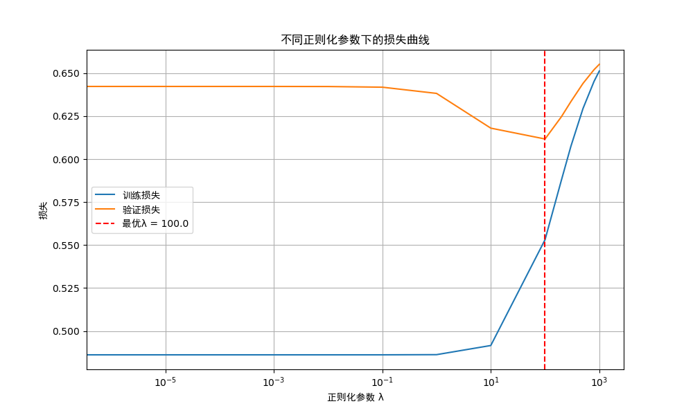

``` python
# 导入numpy库并简写为np，用于数值计算和数组操作
import numpy as np
# 导入matplotlib的交互模式widget，使图表可交互（如缩放、平移）
%matplotlib widget
# 导入matplotlib的pyplot模块并简写为plt，用于绘制图表
import matplotlib.pyplot as plt

# 设置中文字体，解决中文显示问题（SimHei是黑体，支持中文显示）
plt.rcParams["font.family"] = ["sans-serif","SimHei"]
# 设置坐标轴负号显示（避免负号显示为方块等乱码）
plt.rcParams['axes.unicode_minus'] = False

# 定义sigmoid函数，将输入映射到(0,1)区间，用于逻辑回归的激活函数
def sigmoid(z):
    # 限制输入z的范围在[-500, 500]，避免np.exp(-z)因z过大导致溢出（数值稳定处理）
    z = np.clip(z, -500, 500)
    # 计算sigmoid值：g(z) = 1 / (1 + e^(-z))
    g = 1.0 / (1.0 + np.exp(-z))
    return g

# 定义带L2正则化的逻辑回归成本函数
def compute_cost_logistic_reg(X, y, w, b, lambda_=1):
    m, n = X.shape  # m为样本数，n为特征数
    cost = 0.0      # 初始化成本
    
    # 遍历每个样本，计算交叉熵损失
    for i in range(m):
        z_i = np.dot(X[i], w) + b  # 计算线性部分：z = w·X[i] + b
        f_wb_i = sigmoid(z_i)      # 应用sigmoid得到预测概率
        
        # 累加交叉熵损失（逻辑回归的基础损失）
        # 公式：-y[i]·log(f_wb_i) - (1-y[i])·log(1-f_wb_i)
        cost += -y[i] * np.log(f_wb_i) - (1 - y[i]) * np.log(1 - f_wb_i)
    
    cost /= m  # 平均交叉熵损失（除以样本数）
    
    # 计算L2正则化项：(λ/(2m))·Σ(w_j²)，避免过拟合
    reg_cost = (lambda_ / (2 * m)) * np.sum(w **2)
    
    total_cost = cost + reg_cost  # 总成本 = 交叉熵损失 + 正则化项
    return total_cost

# 定义带L2正则化的逻辑回归梯度计算函数
def compute_gradient_logistic_reg(X, y, w, b, lambda_):
    m, n = X.shape          # m为样本数，n为特征数
    dj_dw = np.zeros((n,))  # 初始化权重w的梯度（长度为特征数）
    dj_db = 0.0             # 初始化偏置b的梯度
    
    # 遍历每个样本，计算梯度
    for i in range(m):
        # 计算样本i的预测概率：f_wb = sigmoid(w·X[i] + b)
        f_wb_i = sigmoid(np.dot(X[i], w) + b)
        err_i = f_wb_i - y[i]  # 预测误差：(预测值 - 真实值)
        
        # 累加每个特征的梯度（权重w的梯度）
        for j in range(n):
            dj_dw[j] += err_i * X[i, j]  # 梯度累计：误差·特征值
        
        dj_db += err_i  # 累加偏置b的梯度（仅与误差相关）
    
    # 平均梯度（除以样本数）
    dj_dw /= m
    dj_db /= m
    
    # 加上L2正则化对权重梯度的影响：(λ/m)·w（偏置b不参与正则化）
    dj_dw += (lambda_ / m) * w
    
    return dj_db, dj_dw  # 返回偏置梯度和权重梯度

# 定义梯度下降优化函数，用于更新参数w和b
def gradient_descent(X, y, w_in, b_in, cost_function, gradient_function, 
                     alpha, num_iters, lambda_):
    J_history = []  # 记录每轮迭代的成本，用于后续分析
    w = w_in.copy()  # 复制初始权重，避免修改原输入
    b = b_in         # 初始偏置
    
    # 迭代更新参数
    for i in range(num_iters):
        # 计算当前参数的梯度
        dj_db, dj_dw = gradient_function(X, y, w, b, lambda_)
        
        # 梯度下降更新规则：w = w - α·dj_dw，b = b - α·dj_db
        w = w - alpha * dj_dw
        b = b - alpha * dj_db
        
        # 每100次迭代记录一次成本（减少存储量，加快计算）
        if i % 100 == 0:
            J_history.append(cost_function(X, y, w, b, lambda_))
    
    # 返回优化后的参数和成本历史
    return w, b, J_history

# 定义正则化参数调优函数，通过验证集选择最优λ
def tune_regularization(X_train, y_train, X_cv, y_cv):
    # 定义候选正则化参数λ的范围（对数尺度，覆盖从0到100的范围）
    lambda_range = np.array([0.0, 1e-6, 1e-5, 1e-4, 1e-3, 1e-2, 1e-1, 1, 10, 100,200,300,500,800,1000])
    num_steps = len(lambda_range)  # λ的候选数量
    
    # 初始化训练集和验证集的损失数组
    err_train = np.zeros(num_steps)
    err_cv = np.zeros(num_steps)
    
    # 初始化参数（权重w为全0，偏置b为0）
    n = X_train.shape[1]  # 特征数
    initial_w = np.zeros(n)
    initial_b = 0.0
    
    # 梯度下降的超参数（学习率和迭代次数）
    alpha = 0.01
    num_iters = 10000
    
    # 用于记录最优参数（最小验证集损失对应的参数）
    best_w = None
    best_b = None
    best_lambda = None
    min_cv_error = float('inf')  # 初始化为无穷大
    
    # 遍历每个候选λ，训练模型并评估
    for i in range(num_steps):
        lambda_ = lambda_range[i]
        print(f"正在训练 lambda = {lambda_}")  # 打印当前训练的λ
        
        # 使用当前λ训练模型，得到优化后的w和b
        w, b, _ = gradient_descent(X_train, y_train, initial_w, initial_b,
                                  compute_cost_logistic_reg,
                                  compute_gradient_logistic_reg,
                                  alpha, num_iters, lambda_)
        
        # 计算训练集损失（注意：评估时λ=0，仅用交叉熵损失，不包含正则化项）
        train_cost = compute_cost_logistic_reg(X_train, y_train, w, b, lambda_=0)
        err_train[i] = train_cost
        
        # 计算验证集损失（同样λ=0，仅评估模型拟合能力）
        cv_cost = compute_cost_logistic_reg(X_cv, y_cv, w, b, lambda_=0)
        err_cv[i] = cv_cost
        
        # 更新最优参数（如果当前验证集损失更小）
        if cv_cost < min_cv_error:
            min_cv_error = cv_cost
            best_w = w
            best_b = b
            best_lambda = lambda_
    
    # 找到验证集损失最小的λ的索引
    optimal_reg_idx = np.argmin(err_cv)
    
    # 绘制不同λ对应的训练损失和验证损失曲线（x轴为对数尺度，方便观察小λ的变化）
    plt.figure(figsize=(10, 6))
    plt.semilogx(lambda_range, err_train, label='训练损失')  # 对数x轴绘制训练损失
    plt.semilogx(lambda_range, err_cv, label='验证损失')      # 对数x轴绘制验证损失
    plt.xlabel('正则化参数 λ')
    plt.ylabel('损失')
    plt.title('不同正则化参数下的损失曲线')
    # 用红色虚线标记最优λ的位置
    plt.axvline(x=lambda_range[optimal_reg_idx], color='r', linestyle='--', 
                label=f'最优λ = {lambda_range[optimal_reg_idx]}')
    plt.legend()  # 显示图例
    plt.grid(True)  # 显示网格
    plt.show()  # 显示图表
    
    # 打印最优参数结果
    print(f"最优正则化参数: λ = {best_lambda}")
    print(f"最优参数对应的验证集损失: {min_cv_error:.4f}")
    
    return best_w, best_b, best_lambda, err_train, err_cv

# 生成随机数据用于测试正则化调优
np.random.seed(42)  # 设置随机种子，确保每次运行结果一致

# 生成样本数量和特征数量
m = 500  # 总样本数
n = 10   # 初始特征数

# 生成特征数据（服从标准正态分布 N(0,1)）
X = np.random.randn(m, n)

# 生成真实参数（用于模拟数据生成）
true_w = np.random.randn(n) * 0.5  # 真实权重（缩小50%，避免数值过大）
true_b = np.random.randn() * 0.3   # 真实偏置（缩小30%）

# 计算线性部分z = w·X + b，再应用sigmoid得到标签概率
z = np.dot(X, true_w) + true_b
probabilities = sigmoid(z)

# 根据概率生成二分类标签（伯努利分布采样：1的概率为probabilities，0为1-probabilities）
y = np.random.binomial(1, probabilities)

# 添加噪声特征（5个与标签无关的特征），增加过拟合风险，凸显正则化的作用
noise_features = np.random.randn(m, 5)  # 噪声特征（服从正态分布）
X = np.hstack([X, noise_features])     # 合并原始特征和噪声特征
n = X.shape[1]  # 更新特征数（10+5=15）

# 划分训练集和验证集（8:2比例）
split_idx = int(m * 0.8)  # 分割索引（前80%为训练集）
X_train, X_cv = X[:split_idx], X[split_idx:]  # 特征分割
y_train, y_cv = y[:split_idx], y[split_idx:]  # 标签分割

# 数据标准化（z-score标准化）：(X - 均值) / 标准差，提高梯度下降收敛速度
mean = np.mean(X_train, axis=0)  # 计算训练集每个特征的均值
std = np.std(X_train, axis=0)    # 计算训练集每个特征的标准差
std[std == 0] = 1  # 避免标准差为0时除以0的错误
X_train = (X_train - mean) / std  # 训练集标准化
X_cv = (X_cv - mean) / std        # 验证集使用训练集的均值和标准差标准化（避免数据泄露）

# 执行正则化参数调优，得到最优参数
best_w, best_b, best_lambda, train_errors, cv_errors = tune_regularization(X_train, y_train, X_cv, y_cv)

# 定义预测函数，使用训练好的参数w和b预测标签
def predict(X, w, b):
    """使用训练好的参数进行预测"""
    m = X.shape[0]  # 样本数
    y_pred = np.zeros(m)  # 初始化预测结果
    
    for i in range(m):
        z = np.dot(X[i], w) + b  # 计算线性部分
        f_wb = sigmoid(z)        # 得到预测概率
        # 概率>=0.5预测为1，否则为0
        y_pred[i] = 1 if f_wb >= 0.5 else 0
    return y_pred

# 使用最优参数在训练集和验证集上预测
y_pred_train = predict(X_train, best_w, best_b)
y_pred_cv = predict(X_cv, best_w, best_b)

# 计算准确率（正确预测的样本数 / 总样本数）
train_accuracy = np.mean(y_pred_train == y_train)
cv_accuracy = np.mean(y_pred_cv == y_cv)

# 打印准确率结果
print(f"训练集准确率: {train_accuracy:.4f}")
print(f"验证集准确率: {cv_accuracy:.4f}")
```

    正在训练 lambda = 0.0
    正在训练 lambda = 1e-06
    正在训练 lambda = 1e-05
    正在训练 lambda = 0.0001
    正在训练 lambda = 0.001
    正在训练 lambda = 0.01
    正在训练 lambda = 0.1
    正在训练 lambda = 1.0
    正在训练 lambda = 10.0
    正在训练 lambda = 100.0
    正在训练 lambda = 200.0
    正在训练 lambda = 300.0
    正在训练 lambda = 500.7
    正在训练 lambda = 800.0
    正在训练 lambda = 1000.0



    最优正则化参数: λ = 100.0
    最优参数对应的验证集损失: 0.6117
    训练集准确率: 0.7575
    验证集准确率: 0.6500
