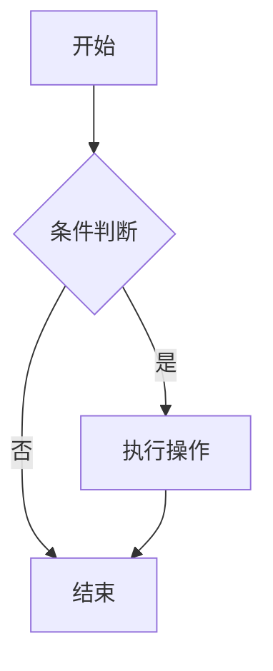

# 快速开始

## 代码示例

```javascript
function hello() {
  console.log('Hello, Docusaurus!');
}
```

## Mermaid 图表示例


```mermaid
graph TD
    A[开始] --> B{条件判断}
    B -->|是| C[执行操作]
    B -->|否| D[结束]
    C --> D
```
