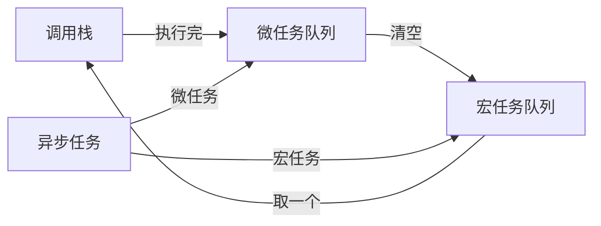

内容主要来自：[前端面试 浏览器原理篇_w3cschool](https://www.w3cschool.cn/web_interview/web_interview-ncsq3pv3.html)
## 浏览器架构

浏览器的主要功能是将用户选择的 web 资源呈现出来，它需要从服务器请求资源，并将其显示在浏览器窗口中，资源的格式通常是 HTML，也包括 PDF、image 及其他格式。用户用 URI（Uniform Resource Identifier 统一资源标识符）来指定所请求资源的位置。

HTML 和 CSS 规范中规定了浏览器解释 html 文档的方式，由 W3C 组织对这些规范进行维护，W3C 是负责制定 web 标准的组织。但是浏览器厂商纷纷开发自己的扩展，对规范的遵循并不完善，这为 web 开发者带来了严重的兼容性问题。

**浏览器可以分为两部分，shell 和 内核**。其中 shell 的种类相对比较多，内核则比较少。也有一些浏览器并不区分外壳和内核。
- shell 是指浏览器的外壳：例如菜单，工具栏等。主要是提供给用户界面操作，参数设置等等。它是调用内核来实现各种功能的。
- 内核是浏览器的核心。内核是基于标记语言显示内容的程序或模块。

### 浏览器内核
浏览器内核主要分成两部分：  渲染引擎和JS引擎。
- 渲染引擎的职责就是渲染，即在浏览器窗口中显示所请求的内容。默认情况下，渲染引擎可以显示 html、xml 文档及图片，它也可以借助插件显示其他类型数据，例如使用 PDF 阅读器插件，可以显示 PDF 格式。
- JS 引擎：解析和执行 javascript 来实现网页的动态效果。
### 五大进程

- **浏览器进程**：主要负责界面显示、用户交互、子进程管理，同时提供存储等功能。
- **渲染进程**：核心任务是将 HTML、CSS 和 JavaScript 转换为用户可以与之交互的网页，排版引擎 Blink 和 JavaScript 引擎 V8 都是运行在该进程中，默认情况下，Chrome 会为每个 Tab 标签创建一个渲染进程。出于安全考虑，渲染进程都是运行在沙箱模式下。
- **GPU 进程**：其实， GPU 的使用初衷是为了实现 3D CSS 的效果，只是随后网页、Chrome 的 UI 界面都选择采用 GPU 来绘制，这使得 GPU 成为浏览器普遍的需求。最后，Chrome 在其多进程架构上也引入了 GPU 进程。
- **网络进程**：主要负责页面的网络资源加载，之前是作为一个模块运行在浏览器进程里面的，直至最近才独立出来，成为一个单独的进程。
- **插件进程**：主要是负责插件的运行，因插件易崩溃，所以需要通过插件进程来隔离，以保证插件进程崩溃不会对浏览器和页面造成影响。
#### 渲染进程

**（1）GUI渲染线程**  
负责渲染浏览器页面，解析HTML、CSS，构建DOM树、构建CSSOM树、构建渲染树和绘制页面；当界面需要**重绘**或由于某种操作引发**回流**时，该线程就会执行。  
**（2）JS引擎线程**  
JS引擎线程也称为JS内核，负责处理Javascript脚本程序，解析Javascript脚本，运行代码；JS引擎线程一直等待着任务队列中任务的到来，然后加以处理，一个Tab页中无论什么时候都只有一个JS引擎线程在运行JS程序；
注意：GUI渲染线程与JS引擎线程的互斥关系，所以如果JS执行的时间过长，会造成页面的渲染不连贯，导致页面渲染加载阻塞。

**（3）事件触发线程**  
**事件触发线程**属于浏览器而不是JS引擎，用来控制事件循环；当JS引擎执行代码块如setTimeOut时（也可是来自浏览器内核的其他线程,如鼠标点击、AJAX异步请求等），会将对应任务添加到事件触发线程中；当对应的事件符合触发条件被触发时，该线程会把事件添加到待处理队列的队尾，等待JS引擎的处理；  
注意：由于JS的单线程关系，所以这些待处理队列中的事件都得排队等待JS引擎处理（当JS引擎空闲时才会去执行）；  
**（4）定时器触发进程**  
**定时器触发进程**即setInterval与setTimeout所在线程；浏览器定时计数器并不是由JS引擎计数的，因为JS引擎是单线程的，如果处于阻塞线程状态就会影响记计时的准确性；因此使用单独线程来计时并触发定时器，计时完毕后，添加到事件队列中，等待JS引擎空闲后执行，所以定时器中的任务在设定的时间点不一定能够准时执行，定时器只是在指定时间点将任务添加到事件队列中；  
注意：W3C在HTML标准中规定，定时器的定时时间不能小于4ms，如果是小于4ms，则默认为4ms。  
**（5）异步http请求线程**  
- XMLHttpRequest连接后通过浏览器新开一个线程请求；
- 检测到状态变更时，如果设置有回调函数，异步线程就产生状态变更事件，将回调函数放入事件队列中，等待JS引擎空闲后执行；


## 浏览器渲染
浏览器渲染主要有以下步骤：  
- **首先解析收到的文档，根据文档定义构建一棵 DOM 树**，DOM 树是由 DOM 元素及属性节点组成的。
- 然后对 CSS 进行解析，生成 CSSOM 规则树。
- **根据 DOM 树和 CSSOM 规则树构建渲染树**。渲染树的节点被称为渲染对象，渲染对象是一个包含有颜色和大小等属性的矩形，渲染对象和 DOM 元素相对应，但这种对应关系不是一对一的，不可见的 DOM 元素不会被插入渲染树。还有一些 DOM元素对应几个可见对象，它们一般是一些具有复杂结构的元素，无法用一个矩形来描述。
- 当渲染对象被创建并添加到树中，它们并没有位置和大小，所以当浏览器生成渲染树以后，就会根据渲染树来进行布局（也可以叫做回流）。这一阶段浏览器要做的事情是要弄清楚各个节点在页面中的确切位置和大小。通常这一行为也被称为“**自动重排**”。
- 布局阶段结束后是绘制阶段，**遍历渲染树并调用渲染对象的 paint 方法将它们的内容显示在屏幕上，绘制使用 UI 基础组件**。

### 渲染优化

##### （1）针对JavaScript
JavaScript既会阻塞HTML的解析，也会阻塞CSS的解析。因此我们可以对JavaScript的加载方式进行改变，来进行优化：
（1）尽量将JavaScript文件放在body的最后
（2） body中间尽量不要写 ​`<script>`​标签
（3）​`<script>`​标签的引入资源方式有三种，有一种就是我们常用的直接引入，还有两种就是使用 async 属性和 defer 属性来异步引入，两者都是去异步加载外部的JS文件，不会阻塞DOM的解析（尽量使用异步加载）。三者的区别如下：

- **script** 立即停止页面渲染去加载资源文件，当资源加载完毕后立即执行js代码，js代码执行完毕后继续渲染页面；
- **async** 是在下载完成之后，立即异步加载，加载好后立即执行，多个带async属性的标签，不能保证加载的顺序；
- **defer** 是在下载完成之后，立即异步加载。加载好后，如果 DOM 树还没构建好，则先等 DOM 树解析好再执行；如果DOM树已经准备好，则立即执行。多个带defer属性的标签，按照顺序执行。
##### （2）针对CSS
使用CSS有三种方式：使用**link、@import、内联样式**，其中link和@import都是导入外部样式。它们之间的区别：  
- **link**：浏览器会派发一个新等线程(HTTP线程)去加载资源文件，与此同时GUI渲染线程会继续向下渲染代码
- **@import**：GUI渲染线程会暂时停止渲染，去服务器加载资源文件，资源文件没有返回之前不会继续渲染(阻碍浏览器渲染)
- **style**：GUI直接渲染
外部样式如果长时间没有加载完毕，浏览器为了用户体验，会使用浏览器会默认样式，确保首次渲染的速度。所以CSS一般写在headr中，让浏览器尽快发送请求去获取css样式。
所以，在开发过程中，导入外部样式使用link，而不用@import。如果css少，尽可能采用内嵌样式，直接写在style标签中。

##### （3）针对DOM树、CSSOM树
可以通过以下几种方式来减少渲染的时间：  
- HTML文件的代码层级尽量不要太深
- 使用语义化的标签，来避免不标准语义化的特殊处理
- 减少CSSD代码的层级，因为选择器是从右向左进行解析的
##### （4）减少回流与重绘
- 操作DOM时，尽量在低层级的DOM节点进行操作
- 不要使用 ​`table`​布局， 一个小的改动可能会使整个 ​`table`​进行重新布局
- 使用CSS的表达式
- 不要频繁操作元素的样式，对于静态页面，可以修改类名，而不是样式。
- 使用absolute或者fixed，使元素脱离文档流，这样他们发生变化就不会影响其他元素
- 避免频繁操作DOM，可以创建一个文档片段 ​`documentFragment`​，在它上面应用所有DOM操作，最后再把它添加到文档中
- 将元素先设置 ​`display: none`​，操作结束后再把它显示出来。因为在display属性为none的元素上进行的DOM操作不会引发回流和重绘。
- 将DOM的多个读操作（或者写操作）放在一起，而不是读写操作穿插着写。这得益于**浏览器的渲染队列机制**。浏览器针对页面的回流与重绘，进行了自身的优化——**渲染队列** 。 **浏览器会将所有的回流、重绘的操作放在一个队列中，当队列中的操作到了一定的数量或者到了一定的时间间隔，浏览器就会对队列进行批处理。这样就会让多次的回流、重绘变成一次回流重绘。** 将多个读操作（或者写操作）放在一起，就会等所有的读操作进入队列之后执行，这样，原本应该是触发多次回流，变成了只触发一次回流。

## 浏览器缓存

- 浏览器第一次加载资源，服务器返回 200，浏览器从服务器下载资源文件，并缓存资源文件与 response header，以供下次加载时对比使用；
- 下一次加载资源时，由于强制缓存优先级较高，先比较当前时间与上一次返回 200 时的时间差，如果没有超过 cache-control 设置的 max-age，则没有过期，并命中强缓存，直接从本地读取资源。如果浏览器不支持HTTP1.1，则使用 expires 头判断是否过期；
- 如果资源已过期，则表明强制缓存没有被命中，则开始协商缓存，向服务器发送带有 If-None-Match 和 If-Modified-Since 的请求；
- 服务器收到请求后，优先根据 Etag 的值判断被请求的文件有没有做修改，Etag 值一致则没有修改，命中协商缓存，返回 304；如果不一致则有改动，直接返回新的资源文件带上新的 Etag 值并返回 200；
- 如果服务器收到的请求没有 Etag 值，则将 If-Modified-Since 和被请求文件的最后修改时间做比对，一致则命中协商缓存，返回 304；不一致则返回新的 last-modified 和文件并返回 200；
很多网站的资源后面都加了版本号，这样做的目的是：每次升级了 JS 或 CSS 文件后，为了防止浏览器进行缓存，强制改变版本号，客户端浏览器就会重新下载新的 JS 或 CSS 文件 ，比如Vue框架的PWA。
注：
`If-Modified-Since` 是基于**时间戳**的缓存校验字段，它的值是客户端本地缓存资源的「最后修改时间」（这个时间最初是服务器通过 `Last-Modified` 响应头告诉客户端的。
`If-None-Match` 是基于**唯一标识（ETag）** 的缓存校验字段，它的值是客户端本地缓存资源的「唯一标识」，这个标识最初是服务器通过 `ETag` 响应头告诉客户端的，通常是服务器根据资源内容计算的哈希值（比如 MD5）
### 缓存的位置
资源缓存的位置一共有 3 种，按优先级从高到低分别是：  
1. **Service Worker**：**Service Worker 运行在 JavaScript 主线程之外，虽然由于脱离了浏览器窗体无法直接访问 DOM，但是它可以完成离线缓存、消息推送、网络代理等功能。它可以让我们自由控制**缓存哪些文件、如何匹配缓存、如何读取缓存，并且**缓存是持续性的**。当 Service Worker 没有命中缓存的时候，需要去调用 ​`fetch` ​函数获取 数据。也就是说，如果没有在 Service Worker 命中缓存，会根据缓存查找优先级去查找数据。**但是不管是从 Memory Cache 中还是从网络请求中获取的数据，浏览器都会显示是从 Service Worker 中获取的内容。**
2. **Memory Cache**：Memory Cache 就是内存缓存，它的效率最快，但是内存缓存虽然读取高效，可是缓存持续性很短，会随着进程的释放而释放。**一旦我们关闭 Tab 页面，内存中的缓存也就被释放了**。
3. **Disk Cache**：Disk Cache 也就是存储在硬盘中的缓存，读取速度慢点，但是什么都能存储到磁盘中，比之 Memory Cache 胜在容量和存储时效性上。在所有浏览器缓存中，Disk Cache 覆盖面基本是最大的。它会根据 HTTP Herder 中的字段判断哪些资源需要缓存，哪些资源可以不请求直接使用，哪些资源已经过期需要重新请求。**并且即使在跨站点的情况下，相同地址的资源一旦被硬盘缓存下来，就不会再次去请求数据。**
### 刷新按钮或F5、按 Ctrl+F5 （强制刷新）、地址栏回车的区别？

- 点击刷新按钮或者按 F5：浏览器直接对本地的缓存文件过期，但是会带上If-Modifed-Since，If-None-Match，这就意味着服务器会对文件检查新鲜度，返回结果可能是 304，也有可能是 200。
- 用户按 Ctrl+F5（强制刷新）：浏览器不仅会对本地文件过期，而且不会带上 If-Modifed-Since，If-None-Match，相当于之前从来没有请求过，返回结果是 200。
- 地址栏回车： 浏览器发起请求，按照正常流程，本地检查是否过期，然后服务器检查新鲜度，最后返回内容。

## 浏览器存储
**浏览器前端有5种存储方式**。
- cookies： 在HTML5标准前本地储存的主要⽅式，优点是兼容性好，请求头⾃带cookie⽅便，缺点是⼤⼩只有4k，⾃动请求头加⼊cookie浪费流量，每个domain限制20个cookie，使⽤起来麻烦，需要⾃⾏封装；
- localStorage：HTML5加⼊的以键值对(Key-Value)为标准的⽅式，优点是操作⽅便，永久性储存（除⾮⼿动删除），⼤⼩为5M，兼容IE8+ ；
- sessionStorage：与localStorage基本类似，区别是sessionStorage当⻚⾯关闭后会被清理，⽽且与cookie、localStorage不同，他不能在所有同源窗⼝中共享，是会话级别的储存⽅式；
- Web SQL：2010年被W3C废弃的本地数据库数据存储⽅案，但是主流浏览器（⽕狐除外）都已经有了相关的实现，web sql类似于SQLite，是真正意义上的关系型数据库，⽤sql进⾏操作，当我们⽤JavaScript时要进⾏转换，较为繁琐；
- IndexedDB： 是被正式纳⼊HTML5标准的数据库储存⽅案，它是NoSQL数据库，⽤键值对进⾏储存，可以进⾏快速读取操作，⾮常适合web场景，同时⽤JavaScript进⾏操作会⾮常便。
### Cookie
- Cookie一旦创建成功，**名称就无法修改**
- Cookie是**无法跨域名的**，也就是说a域名和b域名下的cookie是无法共享的，这也是由Cookie的隐私安全性决定的，这样就能够阻止非法获取其他网站的Cookie
- 每个域名下Cookie的**数量不能超过20个，每个Cookie的大小不能超过4kb**
- 有安全问题，如果Cookie被拦截了，那就可获得session的所有信息，即使加密也于事无补，无需知道cookie的意义，只要转发cookie就能达到目的。
- Cookie在请求一个新的页面的时候都会被发送过去
如果需要域名之间跨域共享Cookie，有两种方法：  
1. 使用Nginx反向代理
2. 在一个站点登陆之后，往其他网站写Cookie。服务端的Session存储到一个节点，Cookie存储sessionId
服务器端可以使用 Set-Cookie 的响应头部来配置 cookie 信息。一条cookie 包括了5个属性值 expires、domain、path、secure、HttpOnly。其中 **expires 指定了 cookie 失效的时间**，domain 是域名、path是路径，domain 和 path 一起限制了 cookie 能够被哪些 url 访问。**secure 规定了 cookie 只能在确保安全的情况下传输，HttpOnly 规定了这个 cookie 只能被服务器访问，不能使用 js 脚本访问**。

### 如何实现浏览器内多个标签页之间的通信?

实现多个标签页之间的通信，本质上都是通过中介者模式来实现的。因为标签页之间没有办法直接通信，因此我们可以找一个中介者，让标签页和中介者进行通信，然后让这个中介者来进行消息的转发。通信方法如下：  

- **使用 websocket 协议**，因为 websocket 协议可以实现服务器推送，所以服务器就可以用来当做这个中介者。标签页通过向服务器发送数据，然后由服务器向其他标签页推送转发。
- **使用 ShareWorker 的方式**，shareWorker 会在页面存在的生命周期内创建一个唯一的线程，并且开启多个页面也只会使用同一个线程。这个时候共享线程就可以充当中介者的角色。标签页间通过共享一个线程，然后通过这个共享的线程来实现数据的交换。
- **使用 localStorage 的方式**，我们可以在一个标签页对 localStorage 的变化事件进行监听，然后当另一个标签页修改数据的时候，我们就可以通过这个监听事件来获取到数据。这个时候 localStorage 对象就是充当的中介者的角色。
- **使用 postMessage 方法**，如果我们能够获得对应标签页的引用，就可以使用postMessage 方法，进行通信。
## 浏览器同源策略

> 同源指的是：**protocol（协议）、domain（域名）、port（端口）三者必须一致。**

下表给出了与 URL `http://www.hanphone.top/dir/page.html`的源进行对比的示例：

| URL                                              | 是否跨域 | 原因                             |
| ------------------------------------------------ | -------- | -------------------------------- |
| `http://www.hanphone.top/dir/page.html`          | 同源     | 完全相同                         |
| `http://www.hanphone.top/dir/inner/another.html` | 同源     | 只有路径不同                     |
| `https://www.hanphone.top/secure.html`           | 跨域     | 协议不同                         |
| `http://www.hanphone.top:81/dir/etc.html`        | 跨域     | 端口不同 ( http:// 默认端口是80) |
| `http://www.abc.top/dir/other.html`              | 跨域     | 主机不同                         |

**同源政策主要限制了三个方面：**  
- 当前域下的 js 脚本不能够访问其他域下的 cookie、localStorage 和 indexDB。
- 当前域下的 js 脚本不能够操作访问操作其他域下的 DOM。
- 当前域下 ajax 无法发送跨域请求。

## 浏览器事件机制

### JS 异步机制

js 是单线程运行的，在代码执行时，通过将不同函数的执行上下文压入执行栈中来保证代码的有序执行。在执行同步代码时，如果遇到异步事件，js 引擎并不会一直等待其返回结果，而是会将这个事件挂起，继续执行执行栈中的其他任务。当异步事件执行完毕后，再将异步事件对应的回调加入到一个任务队列中等待执行。**任务队列可以分为宏任务队列和微任务队列，当当前执行栈中的事件执行完毕后，js 引擎首先会判断微任务队列中是否有任务可以执行，如果有就将微任务队首的事件压入栈中执行。当微任务队列中的任务都执行完成后再去执行宏任务队列中的任务**。

#### Event Loop

Event Loop 是 JavaScript 的执行机制，负责协调执行栈、任务队列和微任务队列：



##### 宏任务与微任务有哪些
- 微任务包括： promise 的回调、node 中的 process.nextTick 、对 Dom 变化监听的 MutationObserver。
- 宏任务包括： script 脚本的执行、setTimeout ，setInterval ，setImmediate 一类的定时事件，还有如 I/O 操作、UI 渲染等。
#### 回调函数（Callback）

回调函数是处理异步操作最常用的方式。它是指将一个函数作为参数传递给另一个函数，等待某个操作完成后调用这个回调函数。回调函数使得异步操作能够在任务完成时执行特定的代码。


##### 回调地狱问题
多个回调函数嵌套会造成：**可读性差** 、 **维护困难** 、 **调试复杂**
```javascript
// 回调地狱示例：多层异步回调嵌套，代码向右延伸，层级越深越难维护
// 逻辑：先获取a，再用a获取b，最后用b获取c并打印
getData(function(a) { // 第一层回调：获取a
    getMoreData(a, function(b) { // 第二层回调：用a获取b
        getMoreData(b, function(c) { // 第三层回调：用b获取c
            console.log(c); // 业务逻辑被深埋在嵌套底层
        });
    });
});
```

#### Promise

Promise 是 ES6 引入的异步编程解决方案，**用于解决传统回调函数嵌套（回调地狱）的问题。它代表一个异步操作的最终完成（或失败）及其结果值，一旦状态改变就会固定，不会再变。**
Promise 有三种执行状态：pending(等待态)、fulfilled(成功态)、rejected(失败态)
##### then 方法
`then` 是 Promise 实例的核心方法，用于指定异步操作成功（fulfilled）和失败（rejected）时的回调函数。它会返回一个新的 Promise，因此支持链式调用，可解决回调地狱问题。
```javascript
promise.then(
  result => { /* 处理成功状态 */ },
  error => { /* 处理失败状态 */ }
);

// 链式调用：上一个then的返回值会作为下一个then的入参，实现异步操作串行执行
promise
  .then(result => result + 1)
  .then(newResult => console.log(newResult));
```

##### catch 方法
`catch` 方法专门用于捕获 Promise 链中的所有错误（包括 `then` 中抛出的异常和 rejected 状态的 Promise），等价于 `then(null, errorHandler)`。搭配 `finally` 方法可指定无论 Promise 成功或失败都会执行的回调，常用于清理资源（如关闭加载弹窗）。
```javascript
promise
  .then(result => console.log(result))
  .catch(error => console.error(error)) // 捕获整个链中的错误
  .finally(() => console.log('无论成功失败都会执行')); // 最终执行的回调
```

##### Promise 静态方法
Promise 提供了多个静态方法，用于批量处理多个 Promise 实例，满足不同的异步场景需求：
- `Promise.all`：等待所有 Promise 都成功，才返回成功结果数组；只要有一个失败，立即返回该失败原因。
- `Promise.race`：多个 Promise 中**第一个完成**（无论成功 / 失败）的结果，就是最终结果。
- `Promise.allSettled`：等待所有 Promise 都完成（无论成功 / 失败），返回每个 Promise 的状态和结果，不会因某个失败而中断。
```javascript
// Promise.all - 所有成功才成功，适用于需要所有异步结果都返回后再处理的场景（如批量获取数据）
Promise.all([promise1, promise2])
  .then(results => console.log(results)); // results是按顺序的成功结果数组

// Promise.race - 第一个完成的结果，适用于超时控制（如请求超时后触发兜底逻辑）
Promise.race([promise1, promise2])
  .then(result => console.log(result));

// Promise.allSettled - 返回所有结果状态，适用于需要知道所有异步操作最终状态的场景（如批量提交表单）
Promise.allSettled([promise1, promise2])
  .then(results => console.log(results)); // results包含每个Promise的status（fulfilled/rejected）和value/reason
```

#### Async/Await
Async/Await 是 ES2017（ES8）引入的更简洁的异步编程方式。它是基于 Promise 的语法糖，使得异步代码看起来像同步代码一样，从而提高了代码的可读性和可维护性。
**Async/Await 的基本用法：**
async 关键字用于定义一个异步函数，该函数执行后必然返回一个 Promise（即使函数内部返回普通值，也会被包装成成功态的 Promise）。
await 关键字只能在async函数内部使用，用于暂停函数执行，等待右侧 Promise 完成（成功 / 失败），并返回 Promise 的结果值；若 Promise 失败，await 会抛出异常，需用 try/catch 捕获。

```javascript
// 基本用法：用try/catch捕获await的错误，替代Promise的catch
async function fetchData() {
  try {
    const response = await fetch('https://api.example.com/data'); // 等待请求完成
    const data = await response.json(); // 等待解析JSON完成
    console.log(data);
  } catch (error) {
    console.error('Error:', error); // 捕获请求/解析过程中的所有错误
  }
}

// 并行处理：结合Promise.all实现多个异步操作并行执行，提升效率（避免串行等待）
async function fetchMultiple() {
  const [data1, data2] = await Promise.all([
    fetch('url1').then(r => r.json()),
    fetch('url2').then(r => r.json())
  ]);
  return { data1, data2 };
}
```
