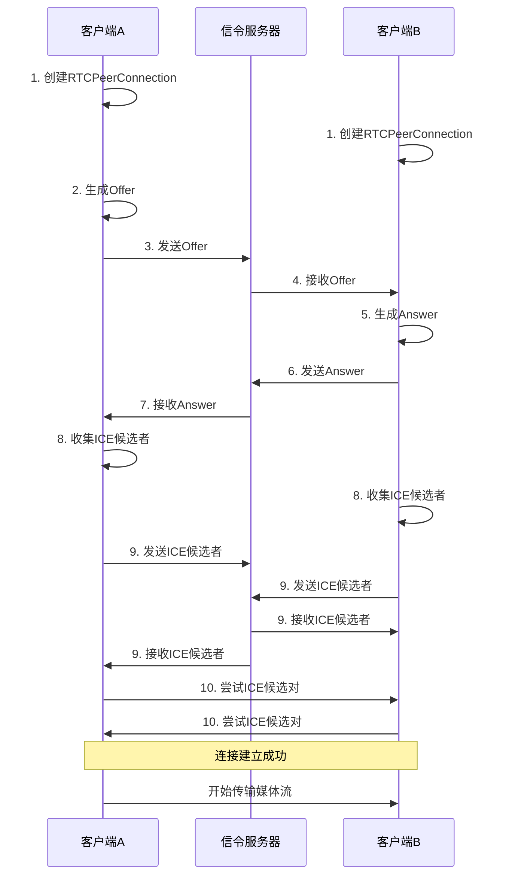

# WebSocket

WebSocket 是一种网络传输协议，可在单个 TCP 连接上进行全双工通信，位于 OSI 模型的应用层。

### 轮询推送技术

早期，很多网站为了实现推送技术，所用的技术都是轮询（也叫短轮询）。轮询是指由浏览器每隔一段时间向服务器发出 HTTP 请求，然后服务器返回最新的数据给客户端。浏览器需要不断的向服务器发出请求，然而 HTTP 请求与响应可能会包含较长的头部，其中真正有效的数据可能只是很小的一部分，会消耗很多带宽资源。
常见的轮询方式分为轮询与长轮询

WebSocket 协议的工作原理分为握手和数据传输两个阶段：

1. **握手阶段**：客户端通过 HTTP 请求与 WebSocket 服务器协商升级协议。客户端发起的 WebSocket 连接报文类似传统 HTTP 报文，其中包含*Upgrade: websocket*和*Connection: Upgrade*等字段。服务器收到请求后，返回*101 Switching Protocols*状态码，表示协议切换成功。

2. **数据传输阶段**：握手成功后，数据直接通过 TCP 通道传输，不再依赖 HTTP 协议。WebSocket 协议的数据帧格式定义了标识、操作代码、掩码、数据、数据长度等字段。

### WebsocketAPI

[awesome-websockets](https://github.com/facundofarias/awesome-websockets?tab=readme-ov-file)

[Node.js 实现：websockets/ws](https://github.com/websockets/ws)

WebSocket 构造函数

- \_1）url：表示连接的 URL，这是 WebSocket 服务器将响应的 URL；
- \_2）protocols（可选）：一个协议字符串或者一个包含协议字符串的数组。

WebSocket 对象的属性

- \_1）binaryType：使用二进制的数据类型连接；
- \_2）bufferedAmount（只读）：未发送至服务器的字节数；
- \_3）extensions（只读）：服务器选择的扩展；
- \_4）onclose：用于指定连接关闭后的回调函数；
- \_5）onerror：用于指定连接失败后的回调函数；
- \_6）onmessage：用于指定当从服务器接受到信息时的回调函数；
- \_7）onopen：用于指定连接成功后的回调函数；
- \_8）protocol（只读）：用于返回服务器端选中的子协议的名字；
- \_9）readyState（只读）：返回当前 WebSocket 的连接状态，共有 4 种状态：
- - *CONNECTING — 正在连接中，对应的值为 0；*
- - *OPEN — 已经连接并且可以通讯，对应的值为 1；*
- - *CLOSING — 连接正在关闭，对应的值为 2；*
- - *CLOSED — 连接已关闭或者没有连接成功，对应的值为 3*
- \_10）url（只读）：返回值为当构造函数创建 WebSocket 实例对象时 URL 的绝对路径。

WebSocket 的方法

- \_1）close(code, reason)：该方法用于关闭 WebSocket 连接，如果连接已经关闭，则此方法不执行任何操作；
- \_2）send(data)：该方法将需要通过 WebSocket 链接传输至服务器的数据排入队列，并根据所需要传输的数据的大小来增加 bufferedAmount 的值 。若数据无法传输（比如数据需要缓存而缓冲区已满）时，套接字会自行关闭。

WebSocket 事件

- \_1）close：当一个 WebSocket 连接被关闭时触发，也可以通过 onclose 属性来设置；
- \_2）error：当一个 WebSocket 连接因错误而关闭时触发，也可以通过 onerror 属性来设置；
- \_3）message：当通过 WebSocket 收到数据时触发，也可以通过 onmessage 属性来设置；
- \_4）open：当一个 WebSocket 连接成功时触发，也可以通过 onopen 属性来设置。

## Socket.io

[介绍 | Socket.IO](https://socket.io/zh-CN/docs/v4/)

Socket.IO 是一个库。尽管 Socket.IO 确实在可能的情况下使用 WebSocket 进行传输，但它**为每个数据包添加了额外的元数据**。这就是为什么 WebSocket 客户端将无法成功连接到 Socket.IO 服务器，而 Socket.IO 客户端也将无法连接到普通 WebSocket 服务器。Socket.IO 服务器 (Node.js) 和 Socket.IO 客户端（浏览器, Node.js 或   其他编程语言）之间的双向通道尽可能使用 WebSocket 连接建立，并将使用 HTTP 长轮询作为后备。

Socket.IO 代码库分为两个不同的层：

- 底层通道：我们称之为 Engine.IO，Socket.IO 内部的引擎
- 高级 API：Socket.IO 本身

# WebRTC

[WebRTC API - Web API 接口 |MDN 系列](https://developer.mozilla.org/en-US/docs/Web/API/WebRTC_API)

[WebRTC 示例](https://webrtc.github.io/samples/)

**WebRTC** （Web Real-Time Communication） 是一种技术，它使 Web 应用程序和站点能够捕获和选择性地流式传输音频和/或视频媒体，以及在浏览器之间交换任意数据，而无需中介。
WebRTC 有多种用途;它们与  [Media Capture 和 Streams API](https://developer.mozilla.org/en-US/docs/Web/API/Media_Capture_and_Streams_API)  一起，为 Web 提供了强大的多媒体功能，包括支持音频和视频会议、文件交换、屏幕共享、身份管理以及与旧式电话系统的接口.

两个对等体之间的连接由  [`RTCPeerConnection`](https://developer.mozilla.org/en-US/docs/Web/API/RTCPeerConnection)  接口表示。使用 建立并打开连接后，可以将媒体流 （[`MediaStream`](https://developer.mozilla.org/en-US/docs/Web/API/MediaStream)） 和/或数据通道 （[`RTCDataChannel`](https://developer.mozilla.org/en-US/docs/Web/API/RTCDataChannel)） 添加到连接中。`RTCPeerConnection`媒体流可以包含任意数量的媒体信息轨道;轨道由基于  `MediaStreamTrack`  接口的对象表示，可能包含多种类型的媒体数据之一，包括音频、视频和文本（如字幕甚至章节名称）。

### STUN 和 TURN

**STUN（Session Traversal Utilities for NAT）**  和  **TURN（Traversal Using Relays around NAT）**  是两个关键的网络协议，用于解决 NAT（网络地址转换）和防火墙导致的连接问题。

#### STUN 协议

##### 1. 核心作用

- **发现公网 IP 和端口**：当客户端位于 NAT 设备（如家用路由器）后方时，STUN 服务器帮助客户端获取其在公网上的 IP 地址和端口号。
- **检测网络类型**：判断客户端所处的 NAT 类型（如 Full Cone、Restricted Cone、Symmetric NAT 等），为后续连接策略提供依据。

##### 2. 工作原理

1. 客户端向 STUN 服务器发送请求。
2. STUN 服务器返回客户端的公网 IP 和端口。
3. 客户端使用这些信息向对端（如另一个浏览器）发送连接请求。

#### TURN 协议

##### 1. 核心作用

- **中继传输**：当 STUN 无法建立 P2P 连接时（如双方处于 Symmetric NAT 或防火墙限制严格），TURN 服务器作为中继，接收一方的数据并转发给另一方。

##### 2. 工作原理

1. 客户端向 TURN 服务器申请中继服务。
2. TURN 服务器分配中继地址（公网 IP 和端口）。
3. 双方客户端将数据发送到 TURN 服务器，由服务器转发给对方。

### 建立连接

#### 1. 信令交换（Signaling）

- **目的**：在两个客户端之间传递元数据（如会话描述、网络地址），为后续直接通信做准备。
- **流程**：
  1. **创建 RTCPeerConnection 对象**：客户端初始化 WebRTC 连接。
  2. **生成 Offer（邀请）**：发起方创建会话描述（SDP），包含支持的编解码器、媒体类型等信息。
  3. **通过信令服务器交换 Offer**：将 Offer 发送给接收方。
  4. **生成 Answer（响应）**：接收方收到 Offer 后，生成自己的 SDP 并返回给发起方。
     信令服务器的作用是协助双方交换元数据，常见的实现方式有：
- **WebSocket**：全双工通信，适合实时交换信令。
- **HTTP 长轮询**：服务器保持连接直到有新数据。
- **XMPP**：基于 XML 的即时通信协议。

#### 2. ICE 候选对收集与连接

- **目的**：找到双方之间最优的通信路径（可能是 P2P 直连或通过 TURN 服务器中继）。
- **流程**：
  1. **收集 ICE 候选者**：客户端通过 STUN/TURN 服务器收集可能的连接地址（如公网 IP、中继服务器地址）。
  2. **交换 ICE 候选者**：通过信令服务器互相发送 ICE 候选者。
  3. **连接建立**：尝试所有候选对，找到最快且可用的路径（通常优先尝试 P2P）。
- **三种候选类型**：
  - **主机候选（Host Candidate）**：本地设备的 IP 和端口。
  - **服务器反射候选（Server Reflexive Candidate）**：通过 STUN 服务器获取的公网 IP 和端口。
  - **中继候选（Relay Candidate）**：通过 TURN 服务器中继的地址。

#### 3. 媒体协商与流传输

- **目的**：确定双方都支持的媒体格式和编解码器，开始传输音视频数据。
- **流程**：
  1. **匹配 SDP 参数**：对比 Offer 和 Answer 中的编解码器、分辨率等参数，选择共同支持的配置。
  2. **开始传输**：通过已建立的连接，使用 SRTP（安全实时传输协议）加密传输媒体流。

##### 流程图

#### 视频通话示例

[信令和视频通话 - Web API |MDN 系列](https://developer.mozilla.org/en-US/docs/Web/API/WebRTC_API/Signaling_and_video_calling)

### 媒体服务器

在 WebRTC（Web 实时通信）中，**媒体服务器**并非必需组件，但在特定场景下扮演关键角色。其核心作用是处理、中转或分发媒体流，解决 P2P 直连的局限性。

#### 媒体服务器的常见类型

| **类型**        | **核心功能**                 | **适用场景**                  | **典型实现**               |
| --------------- | ---------------------------- | ----------------------------- | -------------------------- |
| **TURN 服务器** | 中继传输，解决 NAT 穿透问题  | P2P 连接失败时的兜底方案      | Coturn、Twilio TURN 服务   |
| **MCU**         | 混合多路媒体流，生成单路输出 | 小型视频会议（3-10 人）       | Jitsi Videobridge、Kurento |
| **SFU**         | 选择性转发媒体流，节省带宽   | 大型多人会议或直播（10 + 人） | Mediasoup、Janus Gateway   |
| **录制服务器**  | 录制并存储媒体流             | 会议录制、直播回放            | FFmpeg、Node Media Server  |
| **CDN 集成**    | 与 CDN 协作实现大规模分发    | 超大规模直播（万级并发）      | Wowza Streaming Engi       |
