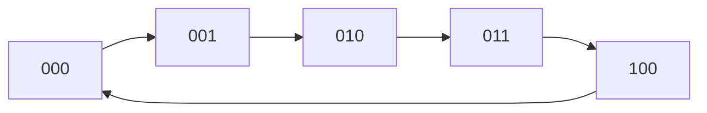
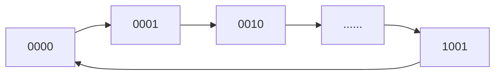

# 第一章 绪论与前导知识

## 1.1 BCD 码

**用二进制数表示十进制数（0-9）**，是 “用 4 位二进制数对应 1 位十进制数”，本质还是十进制（仅用二进制形式存储）；分为有权码和无权码。
### 8421 码
8421BCD 码的规则是：**将十进制数的每一位单独转换为 4 位 BCD 码，再依次拼接**，每一位的权分别是 8421。
仅使用 4 位二进制数中的前 10 种组合（0000-1001），舍弃后 6 种无效组合（1010-1111）
**直观性强**：直接对应十进制数的每一位，转换过程简单，无需复杂计算

2421 码、5421 码与 8421 不同之处就在于每一位的权不同。

2421 码的核心设计是 **“自补特性”** —— 某十进制数的 2421 码，与该数 “9 的补码” 的 2421 码，恰好是 “按位取反”（0 变 1，1 变 0）。这一特性可大幅简化十进制减法运算。
示例：十进制数 “3” 的 2421 码是`0011`（2+1=3），其 9 的补码是 “6”，“6” 的 2421 码是`1100`（4+2=6），恰好是`0011`按位取反的结果。

5421 码的位权包含 “5”，与十进制数 “0-4”（小于 5）和 “5-9”（大于等于 5）的分段逻辑天然契合，且同样具备**部分自补特性**（仅对 5-9 有效）。

#### 余 3 码
余 3 码是无权码，就是 **8421 码+3**。编码核心是 **“偏移 3”**：**对每一个十进制数（0-9），先加 3，再将结果转换为 4 位二进制数，即为该十进制数的余 3 码**。
余 3 码的自补特性比 2421 码更严谨 ——**任意十进制数的余 3 码，与该数 “9 的补码” 的余 3 码，必然是按位取反（0 变 1，1 变 0）**，且无 “编码不唯一” 问题（2421 码存在部分数多编码的情况）。

在十进制加减运算中，若使用 8421 码，当运算结果超出 “0-9”（即出现无效码 10-15）时，需额外进行 “加 6 修正”（因 8421 码与自然二进制的 “进位差” 为 6）；而余 3 码的 “偏移 3” 规则，让加减运算的中间过程更适配十进制逻辑：

- 两个 1 位十进制数相加（如 5+6=11），用余 3 码计算时：  
   5 的余 3 码（1000） + 6 的余 3 码（1001） = `10001`，去掉高位进位 1 后得`0001`，恰好是 “11” 的个位 “1” 的余 3 码（1+3=4→`0100`）此处需注意：余 3 码的加减需结合 “进位处理”，但是 “结果的无效码范围更小”，修正逻辑比 8421 码简单）。

| 维度         | 8421 码（有权）            | 2421 码（有权）          | 5421 码（有权）         | 余 3 码（无权）                           |
| ------------ | -------------------------- | ------------------------ | ----------------------- | ----------------------------------------- |
| **编码逻辑** | 位权 8、4、2、1            | 位权 2、4、2、1          | 位权 5、4、2、1         | 十进制数 + 3 的二进制                     |
| **核心特性** | 通用、直观                 | 完整自补（但编码不唯一） | 5 分段适配、部分自补    | 完整自补（编码唯一）、抗干扰强            |
| **核心作用** | 通用数据转换（仪表、芯片） | 简化减法（金融计算）     | 简化比较 / 舍入（钟表） | 简化加减运算、高可靠性场景（工业 / 医疗） |
| **运算适配** | 需 “加 6 修正”（加减）     | 减法无需修正（自补）     | 部分减法无需修正        | 加减修正逻辑简单                          |
| **适用场景** | 大部分通用场景             | 频繁十进制减法           | 5 分段逻辑场景          | 高可靠性加减场景                          |
## 1.2 七段码
abcdefg，各自对应一条边，用于图形化显示数字
## 1.3 可靠性编码
#### 格雷码
格雷码（又称循环二进制码或反射二进制码）是**一种特殊的二进制编码方式**，其核心特征是：**任意两个相邻的代码（按数值顺序排列）之间，仅有 1 位二进制数不同**（其他位完全相同）。

| 十进制数 | 4 位自然二进制 | 4 位格雷码 | 十进制数 | 4 位自然二进制 | 4 位格雷码 |
| -------- | -------------- | ---------- | -------- | -------------- | ---------- |
| 0        | 0000           | 0000       | 8        | 1000           | 1100       |
| 1        | 0001           | 0001       | 9        | 1001           | 1101       |
| 2        | 0010           | 0011       | 10       | 1010           | 1111       |
| 3        | 0011           | 0010       | 11       | 1011           | 1110       |
| 4        | 0100           | 0110       | 12       | 1100           | 1010       |
| 5        | 0101           | 0111       | 13       | 1101           | 1011       |
| 6        | 0110           | 0101       | 14       | 1110           | 1001       |
| 7        | 0111           | 0100       | 15       | 1111           | 1000       |

##### 自然二进制转格雷码
公式法：最高位与自然二进制最高位相同，当前位与自然二进制的高 1 位进行 “异或” 运算
#### 奇偶校验
奇校验码：总 1 的个数为奇数
偶校验码：总 1 的个数为偶数
### 进制转换
将 n 进制转换为十进制：由权展开
将十进制转换为 n 进制：整数部分使用基数连除法，小数部分使用基数连乘法
数字信号可分为 NRZ 电平型和 RZ 脉冲型(Return to Zero)
## 逻辑门电路
#### TTL
三极管–三极管–逻辑
[干货|TTL 电路详细讲解，工作原理+电路图，图文结合，轻松搞定-CSDN 博客](https://blog.csdn.net/luolt42/article/details/129674260)

# 第二章 逻辑代数基础

## 2.1 基本概念
主要掌握与或非三种基本运算
### 2.1.1 逻辑函数的表示方法

真值表：直观
逻辑函数表达式：主要用于获得逻辑电路图
卡诺图：用于逻辑函数化简
时序图：工作波形图
### 2.1.2 逻辑门符号与复合运算
偶数个变量的异或和同或是互反的，奇数个变量的异或和同或是相同的

## 2.2 基本定理和规律

### 2.2.1 比较重要的基本定律

##### 吸收律
$$
\begin{aligned}
&1. \ A + A \cdot B = A \quad \text{（或运算吸收与项：\(A \cdot B\) 被 A 吸收）} \
&2. \ A \cdot (A + B) = A \quad \text{（与运算吸收或项：\(A + B\) 被 A 吸收）}
\end{aligned}
$$

##### 消去律
$$
\begin{aligned}&1. \ A + \overline{A} \cdot B = A + B \quad \text{（消去冗余变量 \(\overline{A}\)）} \ 2. \ A \cdot (\overline{A} + B) = A \cdot B \quad \text{（消去冗余变量 \(\overline{A}\)）}\end{aligned}
$$

##### 冗余律
$$
\begin{aligned}
&1. \ \text{主形式：} \ A \cdot B + \overline{A} \cdot C + B \cdot C = A \cdot B + \overline{A} \cdot C \quad \text{（冗余项：\(B \cdot C\)）} \
&2. \ \text{对偶形式：} \ (A + B) \cdot (\overline{A} + C) \cdot (B + C) = (A + B) \cdot (\overline{A} + C) \quad \text{（冗余项：\(B + C\)）}
\end{aligned}
$$

##### 摩根律
$$
\begin{aligned}
&1. \ \text{二元形式：} \ \overline{A \cdot B} = \overline{A} + \overline{B} \quad \text{（与非转或非）} \
&2. \ \text{二元形式：} \ \overline{A + B} = \overline{A} \cdot \overline{B} \quad \text{（或非转与非）} \
&3. \ \text{多变量推广：} \ \overline{A \cdot B \cdot C \cdot \dots} = \overline{A} + \overline{B} + \overline{C} + \dots \
&4. \ \text{多变量推广：} \ \overline{A + B + C + \dots} = \overline{A} \cdot \overline{B} \cdot \overline{C} \cdot \dots
\end{aligned}
$$


### 2.2.2 重要规则
代入规则

##### 反演规则

**乘加互换，01 互换，原反互换**，运算优先级不变。对于任意逻辑函数  F，若将其表达式中：

- 所有**逻辑运算符**：`与（·）` ↔ `或（+）`  互换
- 所有**逻辑常量**：`真（1）` ↔ `假（0）`  互换
- 所有**逻辑变量**：原变量（如  \(A,B\)） ↔ 反变量（如  $\overline{A},\overline{B}$)互换
  即为原函数  F  的反函数  $\overline{F}$
对 $F=\overline{A}B + \overline{B}C$ 应用反演规则：$\overline{F}=(A+\overline{B})(B+\overline{C})$。
##### 对偶规则

**乘加互换，01 互换**。若一个定理是正确的，则其对偶式也一定正确。若两个逻辑式相等，则它们的对偶式也相等。对偶式的对偶就得原函数本身。
与反演规则的区别在于不变换变量。设原逻辑函数为  $F = f(A,B,C,\dots; \cdot,+,1,0)$（变量、运算符、常量的集合），则：
反演规则：$\overline{F} = f\left(\overline{A},\overline{B},\overline{C},\dots; +,\cdot,0,1\right)$
对偶规则：$F' = f\left(A,B,C,\dots; +,\cdot,0,1\right)$

### 2.2.3 正负逻辑
**同一个电路的正逻辑表达式与负逻辑表达式互为对偶式。**
正逻辑的与门 = 负逻辑的或门。正逻辑的与非门 = 负逻辑的或非门。正逻辑的或门 = 负逻辑的与门。

| 逻辑类型    | 高电平（H）对应逻辑值 | 低电平（L）对应逻辑值 |
| ------- | ----------- | ----------- |
| **正逻辑** | 逻辑 1        | 逻辑 0        |
| **负逻辑** | 逻辑 0        | 逻辑 1        |
## 2.3 表达式的形式变换

### 2.3.1 逻辑函数表达的标准形式

逻辑函数的标准式是基于 “最小项” 或 “最大项” 定义的规范表达式，分为**标准与或式（最小项之和） 和标准或与式（最大项之积）** 两类。它们的核心特征是：每个项（最小项 / 最大项）都包含逻辑函数的全部变量，且每个变量仅以 “原变量” 或 “反变量” 形式出现一次。

##### 最小项

积项，输入变量的任何一种取值下，必有一个最小项且仅有一个最小项的值为 1，任意两个不相同的最小项的乘积为 0，所有最小项的和为 1。逻辑相邻的最小项之和可消去一个变量，即互反的那一个变量。

##### 最大项

是和项。 在输入变量的任何取值下，有且仅有一个最大项的值为 0，任意两个最大项之和为 1，全体最大项之积为 0。相邻的两个最大项的乘积等于各相同变量之和，即消去一个变量。

**相同编号的最大项与最小项互为反函数。**

### 2.3.2 逻辑函数表达式的转换

#### 2.3.2.1 代数转换法

求一个函数的“最小项之和”的形式：将函数式变换成一般“与或”表达式，反复使用$A=A(B+\overline{B} )$ ，将表达式中所有非最小项的“与项”扩展成最小项。
求一个函数的“最大项之积”的形式：将函数表达式转换成一般“或与”式，反复利用$A=(A+B)(A+\overline{B})$把表达式中非最大项的“或项”扩展成最大项。

#### 2.3.2.2 真值表转换法

实在不行就用。三个变量都可以速通。

## 2.4 逻辑函数的化简

### 2.4.1 公式法

并项、吸收、消去、配项。对偶化简。

### 2.4.2 卡诺图化简

一般变量个数不超过 5 个。常使用`4*4`的图。

卡诺图变量分两组，每组按类格雷码的顺序排列，使几何位置上相邻的最小项在逻辑上也相邻，方便化简。图形两侧标注的“0”和“1”表示使对应小方格内最小项为 1 时的变量取值(1 为原变量,0 为反变量)

化简：画圈。


### 2.4.3 实际问题

某些变量的取值不会出现 + 某些变量的某些取值对函数无意义(无关) 的逻辑函数 == 具有无关项（约束项）的逻辑函数，对应最小项为约束项，约束项之和称为约束条件。

约束项：由于电路结构、输入条件或实际功能限制，某些输入变量的组合在实际电路中永远不会出现。输入变量的取值存在物理或功能上的约束，导致部分组合 “无效”，因此这些组合对应的逻辑函数输出 “天然不存在”，无需定义。

无关项：包含两类情况：
（1）约束项：即 “不可能出现的输入组合”（输出无意义）；
（2）任意项（Optional Term）：输入组合可能出现，但该组合对应的输出结果对电路功能无影响（既可以是 0，也可以是 1）
**在卡诺图中表示为 d 或 x，可视作 1**，辅助化简，但不要求被圈。

# 第三章 Verilog HDL

## 3.1 Verilog HDL 概述

[Verilog 教程 | 菜鸟教程](https://www.runoob.com/w3cnote/verilog-tutorial.html)

### 3.1.1 作用

Verilog 作为硬件描述语言，主要用来生成专用集成电路 ASIC。
**1、可编程逻辑器件**
FPGA 和 CPLD 是实现这一途径的主流器件。他们直接面向用户，具有极大的灵活性和通用性，实现快捷，测试方便，开发效率高而成本较低。
**2、半定制或全定制 ASIC**
通俗来讲，就是利用 Verilog 来设计具有某种特殊功能的专用芯片。
**3、混合 ASIC**

### 3.1.2 语言特性

- 提供了多种描述方式：开关级描述方式（开关级建模，pmos、nmos）、门级描述方式（门级建模，and、or、nand）、数据流级描述方式（数据流级建模，&、︳、~、 ˆ、~ˆ）和行为级描述方式（行为级建模，initial、always）。
- 两类数据类型：线网（wire）数据类型与寄存器（reg）数据

### 3.1.3 Verilog 设计流程


## 3.2 Verilog HDL 基本语法

Verilog 是区分大小写的。格式自由，可以在一行内编写，也可跨多行编写。
每个语句必须以分号为结束符。空白符（换行、制表、空格）都没有实际的意义，在编译阶段可忽略。注释与 C 语言保持一致。只有小写的关键词才是保留字。

## 3.3 Verilog HDL2 的操作符

### 3.3.1 数值表示

格式：<位宽><’进制><数字>

```verilog
1'b0; // 1位二进制数0（低电平）
1'b1; // 1位二进制数1（高电平）
1'bx; // 1位二进制未知值
1'bz; // 1位二进制高阻态
4'b1010; // 4位二进制数1010
4'b1x0z; // 4位二进制数，含未知值x和高阻态z
3'o5; // 3位八进制数5（对应二进制101）
8'o77; // 8位八进制数77（对应二进制111111）
5'd10; // 5位十进制数10（对应二进制1010）
'd25; // 默认位宽十进制数25
6'h1a; // 6位十六进制数1a（对应二进制011010）
'h3f; // 默认位宽十六进制数3f（对应二进制111111）
4'sb1011; // 4位有符号二进制数1011（补码，值为-5）
8'shff; // 8位有符号十六进制数ff（补码，值为-1）
3.14; // 十进制实数
6.02e23; // 科学计数法表示的实数（6.02×10²³）
"verilog"; // 字符串常量
```

若定义的位宽比常量指定的位宽小，则最左边多余的位将被截断。

### 3.3.2 数据类型

#### 3.3.2.1 线网 wire/net

wire 类型表示硬件单元之间的物理连线，由其连接的器件输出端连续驱动。线网的缺省值为 Z(高阻)

```verilog
wire   interrupt ;
wire   flag1, flag2 ;
wire   gnd = 1'b0 ;
```

#### 3.3.2.2 寄存器 reg

寄存器（reg）用来表示存储单元。包括 reg、integer、time、real、realtime，在仿真时，寄存器的值可在任意时刻通过赋值操作进行改写。缺省值为 X(未知)。register 型变量需要被明确地赋值，并且在被重新赋值前一直保持原值。在设计中要将 register 型变量放在过程块语句（如 Initial , always)中赋值。

```verilog
reg    clk_temp;
reg    flag1, flag2 ;
integer j ;  //整型变量，用来辅助生成数字电路

real        data1 ;
initial begin
    data1 = 2e3 ;
    data1 = 3.75 ;
end

time       current_time ;
initial begin
       #100 ;
       current_time = $time ; //current_time 的大小为 100
end
```

#### 3.3.2.3 向量 vector

当位宽大于 1 时，wire 或 reg 即可声明为向量的形式(本质上还是一个变量)。赋值或访问位时对应关系不同。reg \[3:0] 与 reg\[0:3] 有区别  

```verilog
reg [3:0]      counter ;    //声明4bit位宽的寄存器counter
wire [32-1:0]  gpio_data;   //声明32bit位宽的线型变量gpio_data
wire [8:2]     addr ;       //声明7bit位宽的线型变量addr，位宽范围为8:2
reg [0:31]     data ;       //声明32bit位宽的寄存器变量data, 最高有效位为0
```

#### 3.3.2.4 数组
是在变量名后面进行声明
```verilog
integer          flag [7:0] ; //8个整数组成的数组
reg  [3:0]       counter [3:0] ; //由4个4bit计数器组成的数组
wire [7:0]       addr_bus [3:0] ; //由4个8bit wire型变量组成的数组
wire             data_bit[7:0][5:0] ; //声明1bit wire型变量的二维数组
reg [31:0]       data_4d[11:0][3:0][3:0][255:0] ; //声明4维的32bit数据变量数组
data_4d[2][1][0][100] = 32'h12345678;
```

#### 3.3.3.5 参数 parameter

**参数用来表示常量**，用关键字 parameter 声明，只能赋值一次。

```verilog
parameter      data_width = 10'd32 ;
parameter      i=1, j=2, k=3 ;
parameter      mem_size = data_width * 10 ;
```

## 3.4 Verilog HDL 的基本结构

#### 模块的基本结构

```verilog
module模块名（端口参数）：module G (A,B,F);
	端口定义---input A,B;
	output F;
	寄存器定义---reg C;
	线网定义------net D;
	内置门原语---and G1(F,A,B);
	或assign语句--assign F=A&B;
endmodule
```

三种基本级别：门级、数据流级和行为级。

### 3.4.1 门级描述方式

and(与)、or(或)、not(非)、nand(与非)、nor(或非)、xor(异或)、xnor(同或)、buf(缓冲器)。

```verilog
module sa_plus_sb(a,b,s,y);
	output y; //门级，输出放第一个
	input s,a,b;
	wire not_s;
	wire and_sa,and_sb;
	not U1(not_s,s); //调用函数要用实例
	and U2(and_sa,not_s,a);
	and U3(and_sb,s,b);
	or  U4(y,and_sa,and_sb);
endmodule
```

### 3.4.2 数据流级描述方式

**用 assign 来赋值。位运算符的种类和功能有 &：AND；︳：OR；~：NOT；ˆ：XOR；~ˆ：XNOR。**
位运算的优先顺序如下：~取反、&并、︳或、ˆ异或、~ˆ同或、
`assign`语句用于**连续赋值**，专门驱动`wire`类型变量（线网），其核心特点是：**右侧表达式的值会实时传递给左侧变量，当表达式中任何输入信号变化时，左侧变量会立即更新**。
**在 Verilog 中，模块的输出端口如果没有显式指定类型，默认是 wire 类型**

```verilog
module ab_plus_ac(
    input A, B, C,
    output Y
);
    wire nand_ab, nand_ac;
    // 使用连续赋值语句实现NAND操作
    assign nand_ab = ~(A & B);
    assign nand_ac = ~(A & C);
    assign Y = ~(nand_ab & nand_ac);
endmodule
```

## 3.5 Verilog HDL 的行为级描述

行为级描述相当于软件设计过程中的流程图描述或算法描述，它抽象地表达电路功能的行为表现，而不是具体的实现手段和方法。**使用过程块就是行为级别。顺序、分支语句等只有在过程块中才能被使用。**
Verilog HDL 的行为级描述可以使用过程块结构进行描述，过程块结构有**initial 过程块和 always 过程块**。**只有寄存器型数据能够在这两种语句中被赋值**，这种类型的变量数据在被赋新值前保持原有值不变，所有的 initial 过程块和 always 过程块**在 0 时刻并发执行**。

### 3.5.1 赋值操作

Verilog 有如下几种赋值操作
**连续赋值：用于对线网(nets)的赋值；不需要使用逻辑门，直接使用逻辑表达式驱动线网。**

```verilog
assign mynet={enable? data : 1’b0};
```

**过程赋值：用于对寄存器的赋值**；把值放在寄存器中，过程赋值没有持续时间，相反，寄存器将保持赋值的值，直到发生下一次对变量的赋值。过程赋值发生在过程块(always,initial,task 和 function)中，可以把它认为是触发器赋值。当执行到达过程块的赋值时，触发就发生。

### 3.5.2 initial 模块

在 0 时刻开始执行，只执行一次。

```verilog
initial
	语句块;
endmodule
```

### 3.5.3 always 过程块

在 0 时刻开始无限循环，反复执行。

```verilog
always@(敏感事件表)
	语句块;
	//always存储块，输出必须是reg
endmodule
```
敏感事件包括 \* 、posedge clk、negedge clk 等等
### 3.5.4 顺序语句

顺序结构可以采用 begin-end 对来实现。**在顺序块中出现的语句都是过程性赋值语句**。

1. 阻塞过程性赋值：用“=”，赋值是按照顺序执行的，在其后所有的语句执行前执行，即在下一条语句执行前该赋值语句必须已全部执行完毕。
2. 非阻塞过程性赋值：用“<=”，赋值安排在未来时刻，然后继续执行，即并不等到前式赋值完成后才执行下一句。而阻塞过程性赋值是一直等到前式被赋了新值后才执行下一句
```verilog
// 错误示范：时序块用阻塞赋值
always @(posedge clk) begin
    a = b;  // a先更新为b的旧值
    b = a;  // b再更新为a的新值（最终a和b都等于b的旧值，逻辑错误）
end

// 正确写法：非阻塞赋值
always @(posedge clk) begin
    a <= b;  // 先计算b的旧值
    b <= a;  // 先计算a的旧值
end
// 时钟沿到来后，a和b同时交换值（符合触发器并行更新的硬件逻辑）
```
### 3.5.5 分支语句

```verilog
if (条件表达式1) 语句1；
else if(条件表达式2) 语句2;
……
else 语句n；

case (控制表达式)
分支项表达式1： 语句1;
分支项表达式2： 语句2;
……
default： 语句n；
endcase
```

示例

```verilog
module MUX4_1(Y, D0, D1, D2, D3, A);
    output reg Y;
    input [1:0] A;
    input D0, D1, D2, D3;
    always@(D0 or D1 or D2 or D3 or A)
    case (A)
        2'b00: Y=D0;
        2'b01: Y=D1;
        2'b10: Y=D2;
        2'b11: Y=D3;
    endcase
endmodule
```

# 第四章 组合逻辑电路

组合逻辑电路是无记忆电路，没有触发器！

## 4.1 组合逻辑电路分析

给出电路，回答描述与功能。

## 4.2 组合逻辑电路设计

给出描述与功能，设计电路

首先确定输入输出，随后做真值表，写基本表达式，再转换成接近电路要求的表达式。

## 4.3 典型组合逻辑电路

### 4.3.1 基本运算电路

#### 4.3.1.1 半加器

若不考虑有来自低位的进位将两个 1 位二进制数相加，称为半加
**和**：$S = A \oplus B$ **进位**：$C_{out} = A \cdot B$


#### 4.3.1.2 加法器

##### 全加器

将两个多位二进制数相加时，除了最低位以外，**每一位都应考虑来自低位的进位**，称为全加
依次将低位全加器的进位输出端 CO 接到高 位全加器的进位输入端 CI 即可构成多位串行加法器。


```verilog
//全加器数据流级描述
module add(a, b, cl, ch, s);
	input wire a, b, cl;
	output wire ch, s;
	assign ch = (a&b) | ((a|b)&cl);
	assign s = a^b^cl;
endmodule
```

##### 4 位串行进位加法器


##### 超前进位加法器

已知 $Ci$ 的递推式，可求通项公式，直接求出进位输入。
运算时间得以缩短是用增加电路复杂程度 的代价换取的。加法器的位数增加时，电路的 复杂程度也随之急剧上升。74283 集成芯片。
#### 4.3.1.3 全减器


$$\begin{align*} {本位差}D_i = A_i \oplus B_i \oplus G_{i-1} = m_1 + m_2+ m_4 + m_7 \end{align*} $$

$$
\begin{align*} {向高位借位}G_i = \overline{A}_i (B_i \oplus G_{i-1}) + B_i G_{i-1} = m_1+ m_2+m_3+m_7\end{align*}
$$


```verilog
//全减器数据流级描述
module sub(a,b,gl,gh,d);
	input wire a,b,gl;
	output wire gh,d;
	gh= ~a&(b^gl) | b&gl;
	d= a^b^gl;
endmodule
```

**全加器和全减器的本位做和或做差都是三个输入值做异或**

### 4.3.2 数值比较电路

#### 4.3.2.1 一位比较

$𝐹1=𝐴\overline𝐵$， $𝐹2=\overline𝐴⋅\overline𝐵 +𝐴B$，$𝐹3=\overline𝐴𝐵$

```verilog
//数据流级描述
module compare1bit(a,b,gt,eq,lt);
	input wire a,b;
	output wire gt,eq,lt;
	gt = a&~b;
	eq = ~a&~b | a&b;
	lt = ~a&b;
endmodule
```

#### 4.3.2.2 四位比较

```verilog
//行为级描述
module compare4bit(A,B,gt,eq,lt);
	input wire[3:0] A,B;
	output wire gt,eq,lt;
	always @(A,B) //当输入信号 `A` 或 `B` 发生变化时，执行块内语句
	begin
		gt=0;eq=0;lt=0;
		if(A>B) gt=1;
		if(A==B) eq=1;
		if(A<B) lt=1;
	end
endmodule
```

### 4.3.3 编码器

##### 4.3.3.1 4 线-2 线编码器

```verilog
//数据流级
module ENC4_2a(i,y);
	input wire [3:0] i;
	output wire [1:0] y;
	assign y[0] = i[3]|i[1];
	assign y[1] = i[3]|i[2];
endmodule

//行为级
module ENC4_2b(i,y);
	input wire [3:0] i;
	output reg [1:0] y;
	always @(i)
	 case(i)
		 4'b0001:y=2'b00;
		 4'b0010:y=2'b01;
		 4'b0100:y=2'b10;
		 4'b1000:y=2'b11;
	 endcase
endmodule

//顶层文件
module ENC4_2a_top (
	input wire[3:0] sw,
	output wire[1:0] ld
	);
	ENC4_2a D1(.i(sw),
	.y(ld)
	);
endmodule
```

##### 4.3.3.2 8 线-3 线编码器

输入是 8 个需要编码的信号，输出是用来进行编码的 3 位二进制代码。**同时只能有一个有效输入**。逻辑电路图中与$I_0$无关，输入：反变量(低电平有效)，输出：原码。

**优先编码器：允许几个信号同时输入，但是电路只对其中优先级最高的进行编码**

### 4.3.4 译码器

二进制译码器属于完全译码器（设译码器有$n$个输入和$m$个输出，则$m = 2^{n}$），不满足该条件的称为部分译码器。

#### 4.3.4.1 2-4 译码器

使能端 E 的作用：当 E=1 时，译码器处于工作状态；用于译码器的扩展，比如 3 线 - 8 线译码器的输入为$A_{2}$、$A_{1}$、$A_{0}$，由$A_{2}$控制两个 2 线 - 4 线译码器的使能端$E$。


#### 4.3.4.2 3-8 译码器
设置三位使能端，一高两低，稳健性强，可供串联
```verilog
//数据流级描述
module DEC3_8a(
    input wire [2:0] a,
    output wire [7:0] z
);
	assign z[0] = ~a[2] & ~a[1] & ~a[0];
	assign z[1] = ~a[2] & ~a[1] & a[0];
	assign z[2] = ~a[2] & a[1] & ~a[0];
	assign z[3] = ~a[2] & a[1] & a[0];
	assign z[4] = a[2] & ~a[1] & ~a[0];
	assign z[5] = a[2] & ~a[1] & a[0];
	assign z[6] = a[2] & a[1] & ~a[0];
	assign z[7] = a[2] & a[1] & a[0];
endmodule

//顶层文件
module DEC3_8a_top (
    input wire [2:0] sw,
    output wire [7:0] ld
);
DEC3_8a D1(.a(sw),
            .z(ld)
);
endmodule
```

#### 4.3.4.3 数据分配器

数据分配器是将一路输入数据根据地址选择码分配给多路数据输出中的某一路输出，本质是译码器。

#### 4.3.4.4 2 到 10 进制译码器

8421BCD 码翻译成十个不同点位的指定电平。

#### 4.3.4.5 数字显示译码器

本质是 8421BCD 码-七段码

```verilog
module hex7seg1(x, a_to_g);
    input wire [3:0] x;
    output wire [6:0] a_to_g;
    assign a_to_g[6] = x[3] | x[2]&x[0] | x[1]&x[0] | ~x[2]&~x[0];
    assign a_to_g[5] = ~x[2] | x[1]&x[0] | ~x[1]&~x[0];
    assign a_to_g[4] = x[2] | ~x[1] | x[0];
    assign a_to_g[3] = ~x[2]&~x[1] | x[1]&~x[0] | ~x[2]&x[1] | x[2]&~x[1]&x[0];
    assign a_to_g[2] = ~x[2]&~x[0] | x[1]&~x[0];
    assign a_to_g[1] = x[3] | ~x[1]&~x[0] | x[2]&~x[0] | x[2]&~x[1];
    assign a_to_g[0] = x[3] | x[1]&~x[0] | ~x[2]&x[1] | x[2]&~x[1];
endmodule
```

#### 4.3.4.6 74LS138 译码器


### 4.3.5 代码转换电路

#### 4.3.5.1 8421 码转换为余三码


#### 4.3.5.2 4 位 2 进制码转格雷码

```verilog
module bin_to_gray(
    input wire [3:0] binary,
    output wire [3:0] gray
);
    assign gray[3] = binary[3];
    assign gray[2] = binary[3] ^ binary[2];
    assign gray[1] = binary[2] ^ binary[1];
    assign gray[0] = binary[1] ^ binary[0];
endmodule
```


### 4.3.6 数据选择器

数据选择器是根据地址选择码从多路输入数据中选择一路数据输出，也称复用器。

#### 4.3.6.1 二选一

$y = \overline{s}a + sb$

```verilog
//二选一选择器数据流级
module mux21b(a,b,s,y);
	input a,b,s;
	output y;
	assign y=(~s&a) | (s&b);
endmodule
```

4 位 2 选一

```verilog
//4位2选1多路选选择器
module mux24a(a,b,s,y);
	input wire [3:0] a;
	input wire [3:0] b;
	input wire s;
	output wire [3:0] y;
	assign y={4{~s}&a|{4{s}}&b};
endmodule

```

#### 4.3.6.2 四选一


## 4.4 组合逻辑电路的险象

### 4.4.1 竞争 Race

由于电路中各个信号通过的路径不同，当加到某个门电路的
两个信号同时向相反方向变化时：
(1)变化时间有微小差异。
(2)信号边沿变化时间存在差异。

### 4.4.2 冒险(险象)

由于存在竞争，使电路的输出出现瞬间的逻辑错误称为险象。工程上也称为毛刺

### 4.4.3 险象的分类

若在输入变化而输出不应发生变化的情况下，输出产生的险象，称为静态险象。
若在输入变化而输出应该发生变化的情况下，输出在变化过程中产生的险象，称为动态险象。
若错误输出为负脉冲称“0”型险象。若错误输出为正脉冲称“1”型险象。

### 4.4.4 怎样判定有无险象

#### 4.4.4.1 逻辑表达式判断

对逻辑表达式，令除了某个逻辑变量(如变量$A$)及该变量的非(如$\overline{A}$)以外的其它变量为某个恒定值后，若出现$A + \overline{A}$或$A \cdot \overline{A}$，则必然存在险象。
例：$F = AB + \overline{A}C$ 令 $B = C = 1$，则$F = A + \overline{A}$有险。
理论上$F = A + \overline{A} = 1$，下面看实际情况：


#### 4.4.4.2 卡诺图判断
**如果两个不同的卡诺圈相切，且相切部分又未被其他卡诺圈圈住，则该电路必然存在险象。**


### 4.4.5 险象的消除或减弱

1、引入封锁脉冲，由于同步问题不易实现
2、增加冗余项
如 $F = AB + \overline{A}C + BC$，则当 $B = C = 1$ 时或门输出恒为 “1”，消除了 “0” 险象。
3、输出加低通滤波电路

# 第五章 触发器

## 5.1 触发器概述

能够**存储**一位二进制信息的基本单元电路称触发器(Flip-Flop)。触发器接收输入信号之前的状态叫做
现态，用$Q_n$表示。触发器接收输入信号之后的状态叫做次态，用$Q_{n+1}$表示。现态和次态是两个相邻离散时间里触发器输出端的状态。
特点：1.有两个能自行保持的状态，用来表示 0 和 1；2.根据输入信号可以置成 0 或 1


## 5.2 基本 RS 触发器

信号输入端低电平有效，状态随输入立即变化。这是最典型的结构，由两个互补的或非门（G1、G2）交叉连接而成，输入信号为  $\bar{R}$（复位端，Reset，默认置 0）和  $\bar{S}$（置位端，Set），输出为  Q（原码输出）和  $\bar{Q}$（反码输出，正常状态下  Q  与  $\bar{Q}$  始终相反）。
次态方程为 $Q^{n+1} = S + \overline{R}Q^{n}$ ，其中 $\bar{S}+\bar{R}=1$(与或门) 或 $S·R=1$（或非门）。
RS 触发器存在的问题：(1)存在约束条件的限制；(2)没有时钟信号，无法与其他部件同步工作。
与或门实现：


| 输入 $\bar{S}$（置位） | 输入 $\bar{R}$（复位） | 输出 $Q$（原码） | 输出 $\bar{Q}$（反码） | 逻辑功能说明                                                                                                                                    |
| ---------------- | ---------------- | ---------- | ---------------- | ----------------------------------------------------------------------------------------------------------------------------------------- |
| 1                | 1                | 保持原状态      | 保持原状态            | **保持功能**：输入均为高电平（无效），触发器记忆当前状态，不改变。                                                                                                       |
| 0                | 1                | 1          | 0                | **置位功能**：$\bar{S}=0$（有效）、$\bar{R}=1$（无效），触发器被“置 1”，$Q=1$。                                                                                 |
| 1                | 0                | 0          | 1                | **复位功能**：$\bar{S}=1$（无效）、$\bar{R}=0$（有效），触发器被“置 0”，$Q=0$。                                                                                 |
| 0                | 0                | 1          | 1                | **禁用状态（不定态）**：输入均为低电平（均有效），此时 $Q$ 与 $\bar{Q}$ 均为 1（违反“互补”原则）；若同时撤销输入（$\bar{S}$、$\bar{R}$ 变回 1），触发器最终状态无法确定（可能为 0 或 1），因此实际电路中**禁止此输入组合**。 |


## 5.3 钟控触发器

### 5.3.1 钟控/同步 RS 触发器
**相比基本 RS 触发器增加了时钟信号 CP**。**一个完整的时钟脉冲（Clock Pulse, CP）周期包含低电平和高电平两个核心阶段**，同时还会伴随两个关键的跳变沿（上升沿、下降沿）。CP=0 时，保持状态不变；CP=1 时，接收输入信号。“空翻” 是数字电路中触发器的一种现象，**在一个时钟周期内，触发器的状态发生了多次翻转，就被称为 “空翻”**，这使工作不可靠。比如在$CP = 1$期间，只要输入的 R、S 信号稍有变化，触发器的输出端 Q 也会跟着变化，从而出现多次翻转的情况。
接CP线处的三角形符号代表上升沿触发，三角形+圈代表下降沿触发。

- **特性方程**：$Q^{n + 1} = S + \overline{R}Q^{n}$，（$CP = 1时有效）$。
- **约束条件**：$S \cdot R = 0$。
  

##### 钟控触发器 Q 状态图


### 5.3.2 主从 RS 触发器

**主从 RS 触发器**：由主触发器和从触发器两级组成（两个同样的同步 RS 触发器）。在 $CP = 1$ 期间，主触发器根据输入信号 $R$ 和 $S$ 接收数据，但从触发器被封锁，状态保持不变；当 $CP$ 由 $1$ 变为 $0$ 时（下降沿），主触发器被封锁，其状态不再改变，而从触发器按照主触发器的状态进行翻转。这样，在一个 $CP$ 周期内，主从 RS 触发器只在 $CP$ 下降沿时刻翻转一次，有效避免了空翻现象，使触发器工作更加稳定可靠。
优点：有时钟信号，可以同步工作；解决了“空翻”问题。但仍旧有约束条件。

- **特性方程**：$Q^{n + 1} = S + \overline{R}Q^{n}$。
- **约束条件**：$S \cdot R = 0$。
  


### 5.3.3 D 触发器

**只有一个数据输入端 D ，以及时钟信号端。** 可以同步工作；没有约束条件。但存在“空翻”问题。
**特性方程**：$Q^{n+1}=D$
  
```verilog
// 数据流级
module Dffa(clk, D, q, nq);
    input wire clk, D;
    output wire q, nq;
    wire g1, g2, g3, g4, g5, g6;
    assign q = g1;
    assign nq = g2;
    assign #5 g1 = ~(g3&g2);
    assign #5 g2 = ~(g1&g4);
    assign #5 g3 = ~(g5&clk);
    assign #5 g4 = ~(g3&g5&clk);
    assign #5 g5 = ~(g3&g6);
    assign #5 g6 = ~(g4&D);
endmodule
// 行为级
module Dffb(clk, D, q, nq);
    input wire clk, D;
    output reg q, nq;
    always @ (posedge clk)
    begin
        q <= D;
        nq <= ~D;
    end
endmodule
```
```verilog
//带异步清零端(高电平有效)的D触发器的Verilog行为级描述
module Dffc(clk, clr, D, q);
    input wire clk, clr, D;
    output reg q;
    always @ (posedge clk or posedge clr)
    if (clr == 1)
        q <= 0 ;
    else
        q <= D;
endmodule

//带同步清零端(高电平有效)的D触发器的Verilog行为级描述
module Dffd(clk, clr, D, q);
    input wire clk, clr, D;
    output reg q;
    always @ (posedge clk)
    if (clr == 1)
        q <= 0 ;
    else
        q <= D;
endmodule

//带异步清零端(低电平有效)和异步置位端(低电平有效)的D触发器(集成D触发器)的Verilog行为级描述
module Dffe(clk, clr, set, D, q);
    input wire clk, clr, set, D;
    output reg q;
    always @ (posedge clk or nege
    if (clr == 0)
        q <= 0 ;
    else if (set == 0)
        q <= 1;
    else
        q <= D;
endmodule
```
### 5.3.4 维持阻塞 D 触发器
有时钟信号，可以同步工作；没有约束条件；解决了“空翻”问题。但只有一个输入端，逻辑功能简单。


### 5.3.5 主从JK 触发器


### 5.3.6 边沿JK触发器
**JK 触发器是功能最完整的基本触发器，而其中边沿JK触发器最完整。所有JK触发器都没有约束条件**
$Q^{n + 1} = J\overline{Q^n} + \overline{K}Q^n$
CP=0时，$G_1$、$G_2$ 、$G_3$ 、$G_6$ 被封锁，$\overline{S} = \overline{R} = 1$，所以$Q^{n + 1} = Q^n$。 CP=1时， $Q^{n + 1} = \overline{CP \cdot \overline{Q^n} + \overline{S} \cdot \overline{Q^n}} = Q^n$ $\overline{Q^{n + 1}} = \overline{CP \cdot Q^n + \overline{R} \cdot Q^n} = \overline{Q^n}$ 触发器处于自锁状态，所以$Q^{n + 1} = Q^n$。 CP从0变1，即CP上升沿时，触发器由保持状态不变进入自锁状态，所以 $Q^{n + 1} = Q^n$。

CP从1变0，即CP下降沿时，$G_3$ 、$G_6$输出0，触发器解除自锁状态，虽然$G_1$、$G_2$由于CP从1变0而被封锁，但其输出端S、R要经过一个与非门延迟才能变为1，所以在解除自锁的一刻，被基本RS触发器接收的R、S仍为CP下降沿到来之前的值，即：$\overline{R} = \overline{K \cdot Q^n}$ ，$\overline{S} = \overline{J \cdot \overline{Q^n}}$ 于是由电路图可得：$\overline{Q^n} = \overline{0 + \overline{R} \cdot Q^n} = \overline{\overline{K \cdot Q^n} \cdot Q^n}$ 所以：$Q^{n + 1} = \overline{0 \cdot \overline{Q^n} + \overline{S} \cdot \overline{Q^n}} = \overline{\overline{J \cdot \overline{Q^n}} \cdot \overline{\overline{K \cdot Q^n} \cdot Q^n}} = J \cdot \overline{Q^n} + \overline{K} \cdot Q^n$


```verilog
case ({j,k})
    2'b00 : q <= q;
    2'b01 : q <= 0;
    2'b10 : q <= 1;
    2'b11 : q <= ~q;
endcase
```

## 5.4 集成触发器
不同于上面介绍的触发器概念，集成触发器是实际的元件。
### 5.4.1 集成D触发器

### 5.4.2 集成JK触发器

### 5.4.3 其它功能的触发器

#### 5.4.3.1 T 触发器
$$Q^{n+1}=T\oplus Q^n$$
$$T=0 时，Q^{n+1}=Q^n；当 T=1 时，Q^{n+1}=\overline{Q^n}$$

T触发器无产品，一般由JK触发器来实现其功能。**JK 触发器通过简单连接（短接 J、K 端，令J=K=T）即可直接实现 T 触发器的功能**
#### 5.4.3.2 T\`触发器
$Q^{n+1}=\overline{Q^n}$，T\`触发器可以由JK触发器（下降沿触发）或D触发器（上升沿触发）构成。

#### 5.4.3.3 单稳态触发器
有稳态和暂稳态两个工作状态；暂稳态：在触发脉冲作用下，翻转成的状态。
在外界触发脉冲作用下，输出能从稳态翻转到暂稳态，在暂稳态维持一段时间后，再**自动返回**稳态；暂稳态维持时间的长短取决于电路本身参数，与触发脉冲的宽度和幅度无关
#### 5.4.3.4 施密特触发器
施密特触发器是一种能够把输入波形整形成适合于数字电路需要的矩形脉冲的电路
特点：
输入信号在变化过程中会引起电路状态变化，
输入信号在上升过程中引起电路状态翻转时的输入电压值（记做 UT+或 VT+）与降低过程中引起电路输出状态翻转时的输入电压值（记做 UT-或 VT-）不同，即形成滞回特性，
在电路输出状态转换时，通过电路内部的正反馈，使输出波形的边沿很陡，改善了输出波形。

## 5.5 各类触发器的相互转换


### 5.5.1 JK触发器转换为D
$$J=D；K=\overline{D}$$
### 5.5.2 JK触发器转换为RS
$$J = S；K = R$$
### 5.5.3 D触发器转换为JK
$$ \begin{align*} D = J\overline{Q^n} + \overline{K}Q^n  = \overline{\overline{J\overline{Q^n} + \overline{K}Q^n}} = \overline{\overline{J\overline{Q^n}} \cdot \overline{\overline{K}Q^n}} \end{align*} $$
### 5.5.4 D触发器转换为RS
$$
\begin{align*}
D = S + \overline{R}Q^n 
= \overline{\overline{S + \overline{R}Q^n}} = \overline{\overline{S} \cdot \overline{\overline{R}Q^n}}
\end{align*}
$$
### 5.5.5 D触发器转换为T
$$D = T \oplus Q^n$$
## 5.6 寄存器
寄存器是触发器的应用扩展。

### 5.6.1 1位寄存器

当load=1时，在下一时钟上升沿，将inp0的值存入q中。
```verilog
//1位寄存器实现
module reg1bitb (load, clk, clr, inp0, q0);
    input wire load, clk, clr, inp0;
    output reg q0;
    always @ (posedge clk or posedge clr)
    if (clr == 1)
        q0 <= 0;
    else if (load == 1)
        q0 <= inp0;
endmodule
```
### 5.6.2 4位寄存器
```verilog
// 4位寄存器实现
module reg4bit (load, clk, clr, inp, q);
    input wire load, clk, clr;
    input wire [3:0] inp;
    output reg [3:0] q;
    always @ (posedge clk or posedge clr)
    if (clr == 1)
        q <= 0;
    else if (load == 1)
        q <= inp;
endmodule
```


### 5.6.3 任意N位寄存器
parameter用来定义模块内部的常量，定义格式为：parameter  参数名 = 数据名；
```verilog
// 任意N位寄存器
module register 
	#(parameter N = 8)
	(
	    input wire load,        // 加载控制信号（1: 加载数据；0: 保持数据）
	    input wire clk,         // 时钟信号（上升沿触发）
	    input wire clr,         // 复位信号（1: 复位；异步生效）
	    input wire [N-1:0] d,   // N位输入数据
	    output reg [N-1:0] q    // N位输出数据（寄存器存储的值）
	);
	always @ (posedge clk or posedge clr)  
	if (clr == 1)              // 第一步：优先判断复位
	    q <= 0;                // 复位时，输出置0（异步复位，不受时钟控制）
	else if (load == 1)        // 第二步：无复位时，判断加载信号
	    q <= d;               // 加载有效时，将输入d存入寄存器（时钟上升沿生效）
	// 隐含逻辑：若load=0且clr=0，则q保持原值（寄存器特性）
endmodule
```


### 5.6.4 4位右移寄存器
同一个时钟上升沿，所有的数值都是同时移位。
```verilog
// 4位右移寄存器实现
module shiftreg4 (clk, clr, data_in, q);
    input wire clk, clr, data_in;
    output reg [3:0] q;
    always @ (posedge clk or posedge clr)
    if (clr == 1)
        q <= 0;
    else
        begin
            q[2:0] <= q[3:1];  // q <= q>>1 ;
            q[3] <= data_in;
        end
endmodule
```


### 5.6.5 时钟脉冲


## 5.7 计数器
**用以统计输入计数脉冲 CP 的个数**。计数器累计输入脉冲的最大数目称为计数器的“模”，用 M 表示。如 M=6 计数器,又称六进制计数器。所以，**计数器的“模”实际上为电路的有效状态数** 。
### 5.7.1 8分频计数器(8进制计数器)

```verilog
//带异步清0端（高电平有效）的8分频计数器
module counter8 (clk, clr, q);
    input wire clk;
    input wire clr;
    output reg [2:0] q;
    always @ (posedge clk or posedge clr)
    if (clr == 1)
        q <= 0;
    else
        q <= q + 1;
endmodule
```
### 5.7.2 模5计数器（五进制计数器）

```verilog
module counter5 (clk, clr, q);
    input wire clk, clr;
    output reg [2:0] q;
    always @ (posedge clk or posedge clr)
    if (clr == 1)
        q <= 0;
    else if (q == 4)
        q <= 0;
    else
        q <= q + 1;
endmodule
```
### 5.7.3 模10计数器（十进制计数器）

```verilog
module counter10 (clk, clr, q);
    input wire clk, clr;
    output reg [3:0] q;
    always @ (posedge clk or posedge clr)
    if (clr == 1)
        q <= 0;
    else if (q == 9)
        q <= 0;
    else
        q <= q + 1;
endmodule
```
### 5.7.4 N位计数器（2^n进制计数器）
```verilog
module counterN
    #(parameter N = 8)
    (input wire clk,
     input wire clr,
     output reg [N-1:0] q);
    always @ (posedge clk or posedge clr)
    if (clr == 1)
        q <= 0;
    else
        q <= q + 1;
endmodule
```


# 第六章 同步时序电路
## 6.1 基本概念
### 6.1.1 定义和结构
时序电路：时序逻辑电路又称时序电路主要由 **存储电路** 和 **组合逻辑电路** 两部分组成。任一时刻的输出既与即刻输入有关（若有输入），还与电路当时的状态有关（和以前的输入有关），即电路具有记忆能力。**一定有存储元件（触发器）**。
- 输出方程：$Y(t_{n}) = F[X(t_{n}), Q(t_{n})]$
- 激励方程：$Z(t_{n}) = G[X(t_{n}), Q(t_{n})]$
- 状态方程：$Q(t_{n + 1}) = H[Z(t_{n}), Q(t_{n})]$
**输出方程是最容易求的，通常由电路的功能需求直接定义。比如若设计一个 “检测连续 3 个 1 的序列检测器”，输出 $Z=1$ 的条件是 “当前输入为 1 且前两个状态均为 1”，可直接写出 $Z = X \cdot Q_1^n \cdot Q_0^n$（$Q_1, Q_0$ 为现态）。状态方程描述触发器次态 $Q^{n+1}$ 与现态 $Q^n$、外部输入 X 之间的关系。激励方程最难求，描述触发器输入信号（激励信号，如 $J/K$、D 等）与现态 $Q^n$、外部输入 X 之间的关系，是触发器输入的逻辑表达式。**

### 6.1.2 分类
按时钟同步异步信号分类：若时钟CP同时加到每一个存储元件上为同步，否则为异步。
按输出信号的特性分类：
（1）Moore型：无输入$X$，或有输入$X$，但$Y(t_{n}) = F[Q(t_{n})]$。
（2）Mealy型：一定有输入$X$，且$Y(t_{n}) = F[X(t_{n}), Q(t_{n})]$。
### 6.1.3 同步时序电路的描述方法

1方程组：输出方程、激励方程和状态方程
2状态转换真值表
3状态转换图
4时序图(时间图)或称工作波形图
## 6.2 同步时序电路分析

1、了解电路组成：电路的输入、输出信号以及触发器的结构
2、根据给定的时序电路图，写下逻辑方程式（激励方程、状态方程、输出方程）
3、根据方程组列出状态转换表
4、作出状态图（输入决定状态转换方向，且转换过程伴随特定输出）
5、作出时序图(时间图、工作波形图）
6、确定电路逻辑功能，是否自启动

## 6.3 同步时序电路设计
### 6.3.1 形成原始状态图和状态表
若状态表中的次态和输出都有确定的状态和输出，则称为完全确定状态表。
存在任意项(或约束项)的状态表称不完全确定状态表，它所描述的电路叫不完全确定电路。
以下是101串行序列检测器(可重叠)的状态图和状态表。0/0表示输入信号0时输出信号0，**当且仅当序列检测到了时输出信号才为1**。

例2：试求作用于检测串行输入的8421BCD码的状态图和状态表。 要求： 1、输入顺序是先高位后低位； 2、当出现非法数字1010～1111时，输出为“1”，否则输出为“0”。 3、每一组数输入完后均返回起始状态。

### 6.3.2 状态化简
**状态化简是比较麻烦的。**
目的：(1) 使触发器个数最少； (2) 简化激励方程。化简就是要省略等效状态，即从原始状态表中找出最大等效类的集合，然后用一个新符号表示最大等效类，从而得到最小化状态表。
两个现态等效要求：输出完全相同；次态满足下列条件之一：
	**（1）次态相同；**
	**（2）次态交错（循环）；**
	**（3）次态保持原状态不变；**
	**（4）次态对等效。**
#### 完全确定状态表的化简
##### 观察法状态化简
最大等效类集合为：｛(A),(B),(C,D)｝。

##### 隐含表法状态化简
等效状态**具有传递性**。
基本思想：
	对原始状态表中的所有状态两两比较，找出等效状态对；
	利用等效状态的传递性得到等效类和最大等效类；
	将最大等效类中的状态合并，得到最小化状态表。
步骤：
	作隐含表：横向少尾，纵向少头，
	**顺序比较：先将水平方向A与纵向的所有状态一一比较，再将水平方向B与纵向一一比较，依此类推。**
	关联比较：如果隐含表中某方格内有一个次态对不等效，则该方格对应的两个状态就不等效。于是在相应方格中增加标志“/ ”。例如：AB对应的方格中次态为CF，而CF有“√”表明CF等效，故判定AB等效。
	确定最大等效类，作最小化状态表。


#### 不完全确定状态表的化简
等效变成了相容，即加入了任意值(d)。**相容状态无传递性**，为了从相容状态对中找出最大相容类，引入了状态合并图。它将状态以“点”的形式均匀的绘在圆周上，然后把所有相容对都用线段连接起来，而所有点之间都有连线的多边型就构成了一个最大相容类。
作最小化状态表时，先要从最大相容类中选出一组能覆盖原始状态表中全部状态的相容类即同时具备最小、闭合和覆盖三个条件的相容类的(包含最大相容类)集合，称**最小闭覆盖**。
假设原始状态为 ${s1, s2, s3, s4}$，最大相容类为：
- $C1 = {s1, s2} $，其状态的后继均属于 $C1$ 和 $C2$
- $C2 = {s2, s3}$，其状态的后继均属于 $C2$ 和 $C3$
- $C3 = {s3, s4}$，其状态的后继均属于 $C3$
- 覆盖性要求：子集需包含所有 $s1-s4$，可能的候选为 ${C1, C3} $、$ {C1, C2, C3}$ 等。
- 闭包性验证：
    - ${C1, C3}$ 中，$C1$ 的后继包含 $C2$，但 $C2 \notin {C1, C3}$，不满足闭包性。
    - ${C1, C2, C3}$ 中，每个 $C_i$ 的后继均在子集中，且覆盖所有状态，是闭覆盖。
    - 若存在更小的子集（如 ${C2}$ 无法覆盖 $s1$ 和 $s4$），则 ${C1, C2, C3}$ 可能为最小闭覆盖（需进一步验证是否有更小子集）。


### 6.3.3 状态分配
解决如何给状态编码的问题。有三大原则：
（1）在相同输入条件下具有相同次态的现状态应分配逻辑相邻编码。
这样可以保证相应触发器的激励函数对应的卡诺图中有较多的“1”相邻，有利于激励函数的化简。
（2）同一现状态在相邻输入条件下的不同次态应分配逻辑相邻编码。
这是因为在激励函数的卡诺图中，同一现态，相邻输入所对应的方格相邻。该原则也有利于激励函数的化简。
（3）在所有输入条件下具有相同输出的现状态应分配逻辑相邻编码。 这可使输出函数对应的卡诺图中有较多的“1”相邻，有利于输出函数的化简。


### 6.3.4 求激励方程和输出方程
#### 从状态方程中提取激励方程
需要明确使用的触发器类型，在求出状态方程后，提取激励方程。

已知$Q_2^{n+1} = XQ_2^n + \overline{X} \cdot \overline{Q_1^n} \cdot \overline{Q_2^n}$，得$J_2 = \overline{X} \cdot \overline{Q_1^n}$，$K_2 = \overline{X}$
已知$Q_1^{n+1} = \overline{Q_1^n}$  ，得 $J_1 = K_1 = 1$
#### 直接求激励方程 
直接画出包含J、K的状态表

### 6.3.5 检查电路的自启动情况

有效状态：电路设计目标中，用于实现指定逻辑功能的状态集合，这些状态会按设计规律循环跳转。例如：设计一个 3 进制计数器，有效状态为 00、01、10，三者按固定顺序循环。
无效状态：电路所有可能的状态中，未被纳入有效状态集合的状态。例如：3 进制计数器用 2 位触发器实现，触发器能表示 00、01、10、11 共 4 种状态，其中 11 就是无效状态。
**自启动能力**：电路因上电随机进入无效状态，或因干扰跳转到无效状态后，**无需外部干预，能通过时钟信号驱动，自动跳转到有效状态集合的能力**。
如果无效状态之间形成独立的无效循环，无法跳转到有效状态就失去了自启动能力。例：3 进制计数器的无效状态 11，若下一个时钟仍跳转到 11（自环），或与其他无效状态形成循环，则电路 “卡死”，失去功能。

## 6.4 Mealy和Moore有限状态机
**Mealy状态机输出由当前状态和当前输入共同决定**。同一状态下，不同输入会产生不同输出。输出的变化**与输入同步**，无需等待状态跳转，响应速度更快。
**Moore状态机输出仅由当前状态决定**，与输入信号无关。状态机处于某一固定状态时，输出是唯一确定的。
**对比示例：设计一个“1101”序列检测器，下图左侧是Moore状态机，右侧是Mealy状态机。**


```verilog
// 摩尔状态机实现
module seqdeta(clk, clr, din, dout);
    input wire clk, clr, din;
    output reg dout;
    reg [2:0] present_state, next_state;
    parameter S0 = 3'b000, S1 = 3'b001,
              S2 = 3'b010, S3 = 3'b011, S4 = 3'b100;

    // 状态寄存器
    always @(posedge clk or posedge clr)
        if (clr == 1)
            present_state <= S0;
        else
            present_state <= next_state;
    // 下一状态+输出逻辑（合并版本）
    always @(*)
        case (present_state)
            S0: if (din == 1) begin next_state <= S1; dout <= 0; end
                else          begin next_state <= S0; dout <= 0; end
            S1: if (din == 1) begin next_state <= S2; dout <= 0; end
                else          begin next_state <= S0; dout <= 0; end
            S2: if (din == 0) begin next_state <= S3; dout <= 0; end
                else          begin next_state <= S2; dout <= 0; end
            S3: if (din == 1) begin next_state <= S4; dout <= 0; end
                else          begin next_state <= S0; dout <= 0; end
            S4: if (din == 0) begin next_state <= S0; dout <= 1; end
                else          begin next_state <= S2; dout <= 1; end
            default:          begin next_state <= S0; dout <= 0; end
        endcase
endmodule

// 米利状态机实现
module seqdetb(clk, clr, din, dout);
    input wire clk, clr, din;
    output reg dout;
    reg [1:0] present_state, next_state;
    parameter S0 = 2'b00, S1 = 2'b01,
              S2 = 2'b10, S3 = 2'b11;

    // 状态寄存器
    always @(posedge clk or posedge clr)
        if (clr == 1)
            present_state <= S0;
        else
            present_state <= next_state;

    // 下一状态+输出逻辑（合并版本）
    always @(*)
        case (present_state)
            S0: if (din == 1) begin next_state <= S1; dout <= 0; end
                else          begin next_state <= S0; dout <= 0; end
            S1: if (din == 1) begin next_state <= S2; dout <= 0; end
                else          begin next_state <= S0; dout <= 0; end
            S2: if (din == 0) begin next_state <= S3; dout <= 0; end
                else          begin next_state <= S2; dout <= 0; end
            S3: if (din == 1) begin next_state <= S1; dout <= 1; end
                else          begin next_state <= S0; dout <= 0; end
            default:          begin next_state <= S0; dout <= 0; end
        endcase
endmodule
```
## 6.5 同步电路设计示例
# 第七章 异步时序逻辑电路
#### 顺序脉冲发生器
顺序脉冲是指在每个循环周期内,在时间上按一定先后顺序排列的脉冲信号。由移位寄存机和译码器组成。在数字系统中,常用以控制某些设备按照事先规定的顺序进行运算或操作 。
#### 多谐振荡器
定义：是一种自激振荡器，在接通电源后，不需外加触发信号，就能自动产生矩形脉冲。由于矩形波中含有丰富的高次谐波分量，习惯上又称为多谐振荡器
特点：无稳态，有**两个暂稳态**，称为第一暂稳态，第二暂稳态
用途：产生脉冲波形


