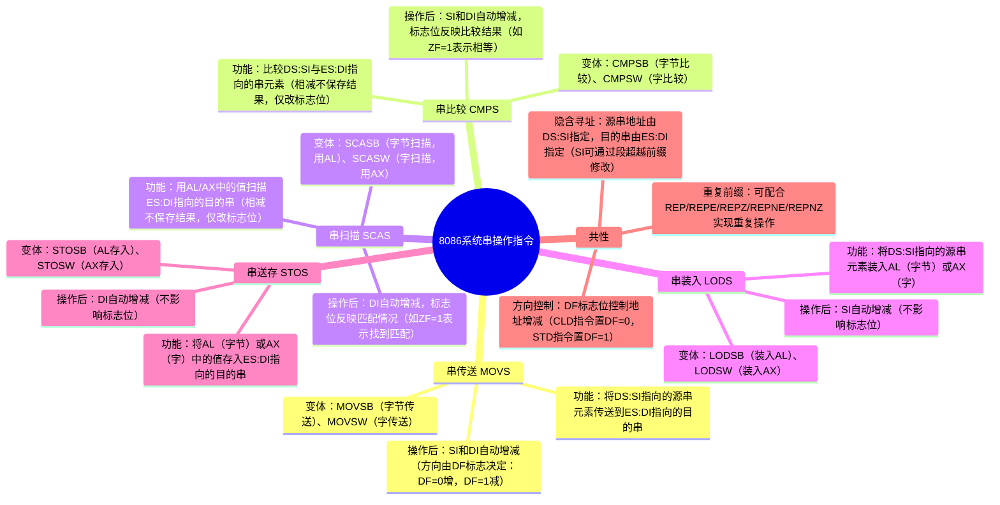

## 前言

#### 汇编语言的特点

不区分单引号和双引号

补码加法规则：**符号位与数值位一同参与运算，结果自然为补码**，无需额外处理符号位。直接对 16 位数逐位相加

#### 汇编语言的类型

**主要取决于 cpu 架构**

- **x86 汇编**（Intel/AMD）：用于个人计算机，支持 16 位（如 8086）、32 位（如 IA-32）和 64 位（x86-64）指令集。
- **ARM 汇编**：广泛用于移动设备、嵌入式系统，分 32 位（ARMv7）和 64 位（ARMv8/AArch64）。
- **MIPS 汇编**：用于路由器、游戏机（如 Nintendo 64）等。
- **PowerPC 汇编**：曾用于苹果 Macintosh、超级计算机（如 IBM 深蓝）。
- **RISC-V 汇编**：开源指令集，近年在嵌入式和新兴硬件中流行

###### 按语法风格分类

- **Intel 语法**（如 MASM）：常见于 Windows 和 x86 开发，格式为 `MOV EAX, [EBX+4]`。
- **AT&T 语法**（如 GAS）：用于 Unix/Linux 和 GCC，格式为 `movl 4(%ebx), %eax`。
- **ARM 语法**：支持符号式寻址，如 `LDR R0, [R1, #4]`
#### 开发环境配置

###### VSCODE 环境配置

###### x86 汇编

**安装插件 MASM/TASM**，相关软件已打包在插件之中。
[vscode搭建8086汇编环境_8086在线编译器-CSDN博客](https://blog.csdn.net/weixin_45817780/article/details/121251747)
编辑工作区设置文件settings.json
```json
{
    "masmtasm.ASM.emulator": "msdos player",  
    "masmtasm.dosbox.run": "exit",
    "masmtasm.ASM.assembler": "MASM-v5.00",
    "masmtasm.ASM.actions": {
        "TASM": {
            "baseBundle": "<built-in>/TASM.jsdos",
            "before": [
                "set PATH=C:\\TASM"
            ],
            "run": [
                "TASM ${file}",
                "TLINK ${filename}",
                ">${filename}"
            ],
            "debug": [
                "TASM /zi ${file}",
                "TLINK /v/3 ${filename}.obj",
                "TD ${filename}.exe"
            ]
        },
        "MASM-v6.11": {
            "baseBundle": "<built-in>/MASM-v6.11.jsdos",
            "before": [
                "set PATH=C:\\MASM"
            ],
            "run": [
                "masm ${file};",
                "link ${filename};",
                ">${filename}"
            ],
            "debug": [
                "masm ${file};",
                "link ${filename}.OBJ;",
                ">debug ${filename}.exe"
            ]
        },
        "MASM-v5.00": {
            "baseBundle": "<built-in>/MASM-v5.00.jsdos",
            "before": [
                "set PATH=C:\\MASM"
            ],
            "run": [
                "masm ${file};",
                "link ${filename};",
                ">${filename}"
            ],
            "debug": [
                "masm ${file};",
                "link ${filename}.OBJ;",
                ">debug ${filename}.exe"
            ],
            "support": [
                "jsdos",
                "dosbox",
                "dosboxX",
                "msdos player"
            ]
        }
    }
}


```
###### ARM 汇编

有点太复杂，得不偿失，算了

###### μVision 配置

[[Keli与μVision使用教程]]

## x86 汇编

针对 80x86 微处理器，学习 win32 汇编语言

#### Interl x86 微处理器

###### 特点

可并行处理，分段管理内存，有主处理器和协处理器。
8086 数据线是 16 条，支持 16 位数据传输，而 8088 只有 8 条数据线。
8088 可工作于最大最小两种模式下，由 CPU 上的$MN/\overline{MX}$引脚的输入决定。
最小模式为单处理器模式，不接总线控制器，CPU 直接输出控制信号到总线。
最大模式为多处理器模式，即 CPU+协处理器，接控制总线。

###### 主要引线与信号

地址线和数据线：20 条，8086 有 16 条是共用的，而 8088 只有 8 条是公用。
AD0-AD7：低 8 位地址和低 8 位数据信号分时复用。在传送地址信号时为单向，传送数据信号时为双向。
A8-A15 ：8 位地址信号(8086 为地址与数据复用线。
A16-A19/S3-S6：高 4 位地址信号，与状态信号分时复用。

###### 控制信号

###### 读写信号

$\overline{WR}$： 写信号；$\overline{RD}$： 读信号；
$IO/\overline{M}$：为“0”表示访问内存，为“1”表示访问 I/O 接口；
$\overline{DEN}$： 低电平有效时，表示数据总线上数据有效，允许进行读/写操作；
$DT/\overline{R}$：数据收发器的传送方向控制，为“1”时 CPU 向存储器或 I/O 传送，否则为反向；WR： 写信号；
$ALE$：地址锁存信号，当其为高时表示地址线上地址有效。一般用它将地址锁存到一个锁存器中；
$RESET$：复位信号。当其为高时将完成 CPU 内部复位。

###### 中断信号
$INTR$（Interrupt Request）：可屏蔽中断请求输入端 
$NMI$（Non-Maskable Interrupt）：非屏蔽中断请求输入端
$\overline{INTA}$（Interrupt Acknowledge）：中断响应输出端 
###### ⭐内部寄存器

**14 个 16 位寄存器**，按功能可分为三类
###### 8 个通用寄存器
###### 4 个数据寄存器
每一个又可拆分为 2 个 8 位寄存器 AX 可拆分为 AH，AL。X是扩展的意思。
**AX（Accumulator）**：累加器。所有 I/O 指令都通过 AX 与接口传送信息，中间运算结果也多放于 AX 中；
**BX（Base）**：基址寄存器。在间接寻址中用于存放基地址；
**CX（Count）**：计数寄存器。用于在循环或串操作指令中存放计数值；
**DX（Data）**：数据寄存器。在间接寻址的 I/O 指令中存放 I/O 端口地址；在 32 位乘除法运算时，存放高 16 位数。
###### 2 个地址指针寄存器
**SP（Stack Pointer）**：堆栈指针寄存器，其内容为栈顶的偏移地址；
**BP（Base Pointer）**：基址指针寄存器，常用于在访问内存时存放内存单元的偏移地址。相比 BX，用 BP 则表示数据在堆栈段。

###### 2 个变址寄存器
变址寄存器在指令中常用于存放数据在内存中的地址。
**SI（Source Index）**：源变址寄存器。对应**DS数据段寄存器**。
**DI（Destination Index）**：目标变址寄存器。对应**ES附加段寄存器**。

###### 4 个段寄存器
每个逻辑段用来存放不同目的内容，如程序代码、数据等等。
每个逻辑段用一个段寄存器来指明该段的起始位置（也叫段基址）。


###### 2 个控制寄存器
**IP：指令指针寄存器，其内容为下一条要执行指令的偏移地址。**
FLAGS：标志寄存器，存放运算结果的状态特征和控制CPU的运行
###### ⭐标志寄存器IFLAGS
**运算标志位**
**CF（Carry Flag）**：进位/借位标志位。加(减)法运算时，若**最高位**（可能是符号位）有进(借)位则 CF=1
**PF（Parity Flag）**：奇偶标志位。运算结果的低 8 位中“1”的个数为偶数时 PF=1
**AF（Auxiliary Carry Flag）**：辅助进位标志位。加(减)操作中，若 Bit3 向 Bit4 有进位(借位)，AF=1。
**ZF（Zero Flag）**：零标志位。当运算结果为零时 ZF=1
**SF（Sign Flag）**：符号标志位。当运算结果的最高位为 1 时，SF=1
**OF（Overflow Flag）**：溢出标志位。当算术运算的**真实结果**超出了有符号数的可表达范围时，OF=1。溢出的唯一可能场景是：**两个同符号数相加，结果符号与加数符号相反。**
**控制标志位**
**TF（Trap Flag）**：陷井标志位，也叫跟踪标志位。TF=1 时，使 CPU 处于单步执行指令的工作方式。
**IF（Interrupt Enable Flag）**：中断允许标志位。IF=1 使 CPU 可以响应可屏蔽中断请求。
**DF（Direction Flag）**：方向标志位。在数据串操作时确定操作的方向,为0则增地址方向，1则减地址方向。
###### 段寄存器
CS（Code Segment）：代码段寄存器，存放代码段的段基地址。
DS：数据段寄存器，存放数据段的段基地址。
ES：附加段寄存器，存放数据段的段基地址。
SS：堆栈段寄存器，存放堆栈段的段基地址。
###### 存储器组织
###### 字
任何两个相邻字节单元就构成一个字单元
字单元的地址为两个字节单元中较小地址字节单元的地址。
字数据的存放规则是小端。

###### 内存编址
###### 物理地址
**16 位的段寄存器无法直接表示 20 位的物理地址**。
8086/8088CPU有20根地址线，5位十六进制数或一个符号来表示一个存储单元的地址。
字数据的存放规则是小端，即低8位放在较低地址字节单元，高8位放在较高地址字节单元。
###### 逻辑地址
每个存储单元的逻辑地址由两部分组成
16位的段（基）地址---决定该逻辑段在内存中的起始位置
16位的段内地址，也叫相对地址，或偏移地址---决定该存储单元相对段起始单元的距离
每个段最大长度为 64K（65536）个字节单元组成。
每个段的起始地址（段首）必须是一个小节的首址。
从 0 地址开始，每 16 个字节单元称为一个小节（Paragraph）1MB 内存就可划分为 64K 个小节。
###### 转换
**物理地址 = 段地址 × 16（左移 4 位，等价于段地址 + 4 个 0，因为物理地址是20位） + 偏移地址**
```plain
4514H：017BH --> 452BBH
```
###### 堆栈
在8086/8088微机中堆栈是由堆栈段寄存器SS指示的一段存储区。数据在堆栈中以字为单位存放。
已知SS=1000H，SP=0100H则：堆栈段的段首地址= 栈顶地址=SS\*16+SP=10100

#### IA-32 微处理器
Intel公司将80286之后的80X86 32位微处理器称为IA(Intel Architecture)-32结构。
###### 简介
###### 80386 微处理器
4GB 物理内存，64GB 虚拟内存，分段分页。
###### Pentium 微处理器
哈佛结构，64 位数据总线，突发传送，RISC。

###### IA-32 结构

###### 寄存器

###### 通用寄存器
E开头，是Extended的意思。


8 个 32 位的通用寄存器。
EAX,EBX,ECX 和 EDX 可以作为 32 位、16 位或 8 位寄存器使用。
使用 16 位和 8 位寄存器时，与 8086 中的命名（AX,BX,CX,DX，AH,AL,BH,BL 等）一致。
ESP、EBP、EDI 和 ESI 被扩展为 32 位，SP、BP、DI 和 SI 仍然与 8086 一致。
基址寄存器比变址寄存器多了ESP。
###### 指令
指令指针 EIP 为 32 位，其低 16 位与 8086 同名为 IP。
###### 段
共有 6 个 16 位的段寄存器，CS、SS、DS 和 ES 与 8086 相同，增加了两个数据段寄存器 FS 和 GS。
IA-32 中段基址和偏移量都是 32 位,段寄存器只有 16 位不直接作段基址，其内容称为段选择器，需间接访问才能得到段基地址。

###### 系统地址寄存器
两个 48 位的寄存器：全局描述符表寄存器 GDTR，中断描述符表寄存器 IDT。
两个 16 位的寄存器：局部描述符表寄存器 LDTR，任务状态段寄存器 TR。

###### IA-32 工作方式

###### 实地址方式
实模式，**是为了与 8086 兼容而设置的工作方式**。IA-32 的 30 多条地址线中只有低 20 条地址线起作用，可寻址 1MB 的物理地址空间，相当于一个快速的 8086。
###### 保护虚地址工作方式
保护模式，保护虚地址方式是 IA-32 微处理器的主要工作方式。
32 位地址可寻址 4GB 的线性存储器空间；支持虚拟存储器功能。每个任务运行可以有 16K 个段，每个段最大为 4GB，一个任务最大可使用 64TB 虚拟地址空间；
**程序运行分为 4 个特权等级，操作系统核心运行在最高特权级 0，一般应用程序运行在最低特权级 3。**

###### 虚拟 86 模式
 在虚拟8086方式下，IA-32微处理器总体上是工作在保护模式，支持多用户多任务操作系统。其中，**有的任务可以工作在虚拟8086方式**，运行DOS应用程序。

###### 保护模式下的存储器访问
在 8086 或实模式下 CPU 只能访问 1MB 的存储空间，用户可随意访问任何地址单元。
保护模式下可访问的地址空间达 4GB，但不是随意使用，而是要受到一定的限制，这种保护就是由段描述符来完成。
###### 64 位段描述符
**段基址：32 位**，它指示该段在 4GB 线性地址空间中的起始地址。
**属性：12 位**，包括特权级、段类型、段存在标志、粒度标志等。
特权级 DPL：每个段都有一个特权级，取值范围 0 ~3，0 级为最高级，一般用于操作系统核心代码。如果特权级数值高的程序试图访问特权级数值低的段，则发生处理器故障。
段类型：指定段的访问类型（只读、可读可写、只执行等）以及段生长的方向（向上或向下）。
段存在标志：指示该段当前是否在物理内存中
粒度标志 G：确定对段界限字段的解释。G=0:段界限以字节为单位。G=1:则段界限的解释单位为 4096 字节。。
**段界限：20 位**，指定段的大小。按照粒度标志，有两种解释：
G=0: 允许段大小的范围为 1B〜1MB。•G=1:允许段大小的范围为 4KB〜4GB。
###### 描述符表
系统中所有任务都可能会用到的段描述符所构成的描述符表称为全局描述符表 GDT。系统中只有一个 GDT！
用全局描述符表寄存器 GDTR 来指示 GDT 在内存中的存放位置。
每个任务的代码段、数据段和堆栈段的段描述符，以及该任务所使用的门描述符组成该任务的局部描述符表 LDT。
每个任务的 LDT 在内存中的存放空间形成一个段，这个段的描述符叫 LDT 描述符。
LDT 描述符作为系统描述符也存放在 GDT 中。
局部描述符表寄存器 LDTR 用来指示 LDT 描述符在 GDT 中的位置

###### 段选择器

IA-32 有 CS、DS、ES、SS、 FS 和 GS 6 个段寄存器
段寄存器的内容称为段选择器（或段选择子），用来从 GDT 或 LDT 中选择一个段描述符，即用来选择一个段。
索引值：13 位，指示在描述符表中的相对位置。GDT 和 LDT 最多有 213=8192 个段描述符。
**TI：1 位，为 0 则描述符在 GDT 中，为 1 则在 LDT 中。**
CPL/RPL：2 位，表示当前的代码或数据的优先级。CS 中就是 CPL，其他段寄存器中为 RPL。
**保护模式下的逻辑地址表示仍然是：段寄存器：段内地址**
段寄存器--为 CS、DS、ES、SS、GS、FS 之一
段内地址--为 32 位，段的长度可达 232=4GB

###### 逻辑地址转换为线性地址的过程
“索引” 是描述符在 GDT 中的 “序号”


###### 平坦存储模式
在 80386 以后的 CPU 中采用了有效的保护模式机制，所以不需要分段管理的安全作用。
将所有的段描述符中的段基址都设置为指向相同的线性地址 0，代码段、数据段、堆栈段都位于同一个 4GB 的线性地址空间。这种工作模式称为平坦存储模式（或平面存储模式）。
平坦存储模式下完全可以不管段寄存器的使用，**访问存储器只使用 32 位的偏移地址，程序中不会出现 CS、DS、SS 等段寄存器。**
###### IA-32e
有兼容模式和 64 位模式两种工作模式。
#### 指令系统
立即数不能是目的操作数，因为其没有地址含义。
在保护模式下，不能使用常数作为存储单元地址，否则会被视为立即数。
**存储器操作数的长度与指令中另一个操作数的长度要一致。** 
32位模式下，偏移地址为32位，故不能使用16位寄存器作间址寄存器。EBP、ESP：默认在堆栈段（SS），其他的寄存器默认的段都是在数据段DS。
```armasm
MOV  AX, [EBX+DATA]
或：MOV  AX, DATA[EBX]
或：MOV  AX, [EBX]+DATA但不能是 MOV AX, [EBX]DATA或MOV CL, [EBX]5
位移量不能放在括号后面
```
隐含寻址：MUL  BL，隐含了寄存器操作数AL以及存放结果的AX。
###### 80X86指令系统
###### 数据传送
###### 一般数据传送指令
MOV  指令使用上的注意：两操作数长度必须相同；**存储单元之间不能直接传送；段寄存器 CS 只能作源操作数，段寄存器之间不能直接传送；在源操作数是立即数时，目标操作数不能是段寄存器；**
如果要把位数短的操作数传到较长的操作数，则可使用零扩展指令MOVZX或符号扩展指令MOVSX。
标志寄存器（EFLAGS 或 FLAGS）一般不作为操作数在指令中出现。MOV 指令不影响标志位
将符号“\*”的 ASCII 码 2AH 送入内存数据段中以变址指针 EDI 所指的单元再偏移 100 个字节单元中。
```assembly
MOV AL，‘*’或MOV AL,2AH
MOV 100[EDI]，AL
```
###### 堆栈操作
实模式下，堆栈操作以字为单位，操作数必为16位，不能是立即数，可以是16位寄存器或存储器的1个字单元；若为存储器操作数，需要声明为字存储单元。入栈SP减2,出栈SP加2。
保护模式下，操作上可以是32位，可以是立即数。
###### 交换指令
XCHG  REG/MEM，MEM/REG
两操作数必须至少有一个是寄存器操作数，不允许使用段寄存器。

###### 输入输出
专门面向I/O端口操作的指令
指令格式：输入指令： IN  acc，PORT；输出指令 ：OUT  PORT，acc
PORT为端口地址；acc为累加器，在16位模式可以是AL或AX，在32位模式还可以是EAX。
当端口地址为8位时，指令中的PORT直接由一个8位无符号常数；当端口地址超过255时，地址码为16位，指令中的端口地址必须由DX指定(不能使用EDX指定)。
###### 取偏移地址指令LEA
将一个存储单元的16位(实模式)或32位(保护模式)偏移地址取出送目标寄存器。**仅计算地址，不访问内存！**
格式：LEA REG，MEM ，源操作数MEM必须是一个存储器操作数，目标操作数REG必须是16位或32位通用寄存器。
比较指令 MOV  EBX，\[EAX]与LEA   EBX，\[EAX]  ，设EAX=10000H。此时LEA EBX,\[EAX] 效果上等价于  MOV  EBX，EAX。但是
```assembly
LEA EBX, [EAX + 10]  ; EBX = EAX + 10（仅计算地址，不访问内存）
MOV EBX, EAX + 10    ; 错误！MOV不支持寄存器+立即数的直接运算
```


###### 标志位操作指令LAHF/SAHF
LAHF  将FLAGS的低8位装入AH，SAHF与之相反。

###### 算术运算
用BCD码处理指令，直接进行十进制数运算。它又有两种方法：
指令系统提供专门实现BCD码运算的加、减、乘、除运算指令。
先用二进制数的加、减、乘、除运算指令对BCD码运算，再用BCD码调整指令对结果校正，80x86就是用这种


在汇编语言中，**指令本身并不区分操作数是有符号数还是无符号数**，运算过程（二进制层面）完全相同。但**标志位的含义会因 “程序对数据的解读方式”（有符号 / 无符号）而不同**。
举例说明（以 `SUB AX, CX` 为例）对于 `AX=FFAAH`，`CX=FFABH`：
- 若视为**无符号数**：`FFAAH（65450） < FFABH（65451）`，减法不够减，产生借位（CF=1），结果 `FFFFH` 表示无符号数的 `65535`（相当于借了 `2^16` 后的结果）。
- 若视为**有符号数**（补码）：`FFAAH` 是 `-86`，`FFABH` 是 `-85`，`-86 - (-85) = -1`，而 `FFFFH` 恰好是 `-1` 的 16 位补码，此时 OF=0（结果未溢出），SF=1（结果为负）。
###### 加法
ADC指令：OPRD1+OPRD2+CF   --> OPRD1，CF是该指令执行前的值。ADC使用前应该将CF清零（执行CLC）。
```asm
; 功能：实现两个20字节无符号大数的加法（M1 + M2 → 结果覆盖存储到M2）
; 注：大数存储遵循x86小端序规则（低字节存低地址，高字节存高地址），因此从首地址开始逐字节加
	  LEA  ESI，M1        ; 把大数M1的首地址加载到ESI（ESI作为M1的字节指针）
	  LEA  EDI，M2        ; 把大数M2的首地址加载到EDI（EDI作为M2的字节指针）
	  MOV  CL，20         ; 初始化循环计数器CL=20（需要累加20个字节，逐字节处理）
	  CLC                 ；清空进位标志CF=0（ADC指令会用到CF，初始无进位）
NEXT：MOV  AL，[ESI]      ; 从M1当前指针（ESI）读取1个字节到AL（临时存储M1的当前字节）
	  ADC  [EDI]，AL      ; 核心：M2当前字节([EDI]) = M2当前字节 + AL(M1当前字节) + CF（进位标志）
						  ; ADC是带进位加法，既加两个字节，也加上一轮的进位
	  INC  ESI            ; M1指针ESI+1，指向下一个字节（处理高一位字节）
	  INC  EDI            ; M2指针EDI+1，指向下一个字节（同步偏移）
	  DEC  CL             ; 计数器CL-1（剩余处理字节数减1）
	  JNZ  NEXT           ; 若CL≠0（未处理完20字节），跳回NEXT继续循环；CL=0则结束
```
###### 减法
SBB指令：OPRD1- OPRD2- CF   --> OPRD1
NEG指令：0 - OPRD     -->  OPRD
CMP指令执行与SUB指令执行结果一致，但是只影响标志位，不修改值。
```assembly
CMP AX, BX  两个数的大小由哪个标志来判断？CF 或 ZF
若 AX ＞ BX CF=0,ZF=0
若 AX ＜ BX CF=1
若 AX = BX ZF=1
```
###### 乘法
运算结果长度是乘数的两倍，只影响CF、OF两个标志位，若运算结果的高半部分是无效数值，则OF=CF=0，否则OF=CF=1。**乘法指令采用隐含寻址，隐含的是存放被乘数的累加器AL或AX或EAX及存放结果的AX，DX，EDX。** 对于有符号乘法IMUL，根据最高位扩展！
DX:AX表示的意思是两个寄存器拼接在一起。

| 乘数类型      | 被乘数默认寄存器 | 乘积存储寄存器对 | 位数说明                |
| --------- | -------- | -------- | ------------------- |
| reg/mem8  | AL       | AX       | 8 位 ×8 位 → 16 位乘积   |
| reg/mem16 | AX       | DX:AX    | 16 位 ×16 位 → 32 位乘积 |
| reg/mem32 | EAX      | EDX:EAX  | 32 位 ×32 位 → 64 位乘积 |
###### 除法指令
| 被除数     | 除数        | 商   | 余数  |
| ------- | --------- | --- | --- |
| AX      | reg/mem8  | AL  | AH  |
| DX:AX   | reg/mem16 | AX  | DX  |
| EDX:EAX | reg/mem32 | EAX | EDX |
指令中只给出除数，而被除数和商、余数都为隐含。被除数是除数的双倍字长，因此除法指令常与扩展指令CBW、CWD、CDQ配合使用
###### 字位扩展指令CBW、CWD、CDQ 
指令为零操作数指令，采用隐含寻址，隐含的操作数为AX、DX或EAX、EDX。
根据最高位扩展，即原操作数最高位为1，则扩展位为1。


###### 逻辑运算
逻辑运算指令对操作数的要求大多与MOV指令相同。除“非”运算指令 外，其余指令的执行都会使标志位OF=CF=0，标志位SF、ZF、PF根据结果设置。
AND可以用于变量清零，以及CF和OF清零（AND AX,AX）
**清零与置1一般指的都是在其他位不变的情况**
清零的三种方法
```armasm
1. AND 清零：`a & 0`
2. XOR 清零：`a ^ a`
3. 赋值清零：`a = 0`
```
OR 用于置1  a | 1，以及CF和OF清零（OR AX,AX）
异或XOR：用于清零或让CF和OF=0
TEST测试指令，执行与运算，影响标志位但不影响值


###### 移位
SAL Shift Arithmetic Left，SHL Shift Logical Left，两者执行结果完全一致。SAR, SHR
SAL OPRD, imm8；SAL OPRD, CL  通过立即数或者CL来确定移位位数
ROL Rotate Left   RCL Rotate Carry Left，ROR  RCR
```asm
SAL  OPRD，imm8
SAL  OPRD，CL
```
**ROL 最高位（第 15 位）同时复制到 CF 和最低位。**
**RCL 循环左移时，最高位移入 CF，CF 原来的值移入最低位。**
**循环移位指令（RCL/RCR）设计为「经过进位标志 CF」！！！** 核心是为了突破单寄存器的位数限制，实现多寄存器 / 多字节数值的整体移位。
通过循环移位并检查CF，可以在移位判断某一位是否为1，从而实现计数等功能，可以保存最后一次移出的位信息。
双精度左移 SHLD dest，source，count，将目的操作数dest向左移动指定位数，移动形成的空位由源操作数source的高位填充，指令执行后source保持不变

###### 串操作
**源串地址由ESI提供，目的串由EDI提供。**
**在16位模式下源串的段基址由DS提供，目的串的段基址由ES提供**，但32位模式下一般设为平坦模式，故不用考虑段寄存器。
**每次只处理串中的一个单元(字节或字或双字)，并自动修改ESI和(或)EDI，使其指向下一个单元。地址修改方向由DF标志位决定，为0则增地址方向，1则减地址方向。**
指令前面可加上自动重复前缀，实现自动重复执行串操作，重复执行次数由ECX指定。
**操作指令中可以出现两个存储器操作数。**
一般指令后面添加S代表String是串操作指令，B是字节，W是字，D是双字。
SCAS    OPRD，执行EAX/AX/AL-OPRD，结果不保存，，只影响标志寄存器。
LODS    OPRD，源串用\[ESI]指示
STOS    OPRD，目的串用\[EDI]指示
###### 重复前缀
无条件重复  REP ——> 若 ECX≠0 则重复
条件重复：REPE 相等重复，REPZ 为零重复 ，ECX≠0 且 ZF=1
REPNE 不相等重复，REPNZ 不为零重复，ECX≠0 且 ZF=0。



###### 程序控制
本质是控制程序的执行方向，而从哪里取指令决定了程序的执行方向。顺序，分支，循环三种结构。32位模式下EIP决定了从哪里取指令，16位模式由CS和IP决定从哪里取指令。
JMP  Label 直接跳转到Label标号处，EIP变为Label的逻辑地址即转移目的地址
**JC/JNC 判断CF的状态。常用于比大小**  C是为1成立，NC是为0成立。N:Not
**JZ/JNZ 判断ZF的状态。常用于循环体的结束判断**
JO/JNO 判断OF的状态。常用于有符号数溢出的判断
JP/JNP 判断PF的状态。用于判断运算结果低8位中1的个数是否为偶数
JA/JAE/JB/JBE  判断CF或CF+ZF的状态。用于无符号数的大小比较。A:Above B:below
JG/JGE/JL/JLE  判断SF、OF和ZF的状态。用于带符号数的大小比较。 G:Greater L:Less
JCXZ/JECXZ 判断CX/ECX是否为0的转移指令，当CX=0(或ECX=0)则转移。


###### 过程调用和返回


16位模式下，被调用程序与调用程序在同一代码段，调用时只需保护断点的偏移地址IP
否则，调用时需要保护断点的段基址CS和偏移地址IP。保护方式即压栈。
返回指令 RET  从堆栈中弹出断点地址，返回原程序
###### 中断
 INT  n ，n用来形成中断服务程序入口地址，16位模式(n×4)为存放“中断服务程序入口地址”的存储单元的偏移地址。中断指令执行过程如下
```plaintext
将FLAGS压入堆栈；
将INT指令的下一条指令的CS、IP压栈；
由n×4得到存放中断向量的地址；
将中断向量（中断服务程序入口地址）送CS和IP寄存器；
转入中断服务程序。
```
INTO   指令执行时检查OF标志，若溢出则执行INT 4
IRET   中断返回
###### 处理器控制
包括对标志位的操作，与外部设备的同步。对标志位操作都是无操作数指令，操作数隐含为FLAGS的某个标志位。可操作的标志位有CF、IF和DF。
CL: Clear ST:Set  CM:Complement
**（1）清除进位标志 CLC**
**（2）置1进位标志STC**
**（3）进位标志取反CMC**
**（4）清除方向标志CLD**
**（5）置1方向标志STD**
**（6）清除中断标志CLI**
**（7）置1中断标志STI**

###### 作业
由寄存器AX、DX组成一个32位带符号数（DX中存放高16位），试求这个数的负数。
```assembly
NOT AX
NOT DX
ADD AX, 1
ADC DX, 0
```
现有3个字节存储单元A、B、C，在不使用ADD和ADC指令的情况下实现：（A）+（B）=>（C）
```assembly
MOV AL, [B]      ; 将B加载到AL
NEG AL           ; AL = -B
MOV BL, [A]      ; 将A加载到BL
SUB BL, AL       ; BL = A - (-B) = A + B
MOV [C], BL      ; 结果存储到C
```
下列程序执行后，寄存器AX，BX，CX与DX的内容分别是什么？如果将LOOP指令分别换成LOOPZ与LOOPNZ指令，结果又如何？
```assembly
MOV AX, 2
MOV BX, 3
MOV ECX, 4
MOV DX, 5
NEXT: ADD AX, AX
MUL BX
SHR DX, 1
LOOP NEXT
```
- **LOOP**: AX=2592, BX=3, CX=0, DX=0
- **LOOPZ**: AX=12, BX=3, CX=3, DX=2
- **LOOPNZ**: AX=432, BX=3, CX=1, DX=0
#### 汇编程序
###### 汇编语言数据
**变量三个属性：段属性、偏移量属性、类型属性**
DUP称为重复数据操作。先计算总的数据项，最后乘单位。
```asm
DATA_B  DB   20H  DUP(‘AB’)  分配20H*2=40H个 字节，其内容为重复字符串‘AB’。
```
只能在DD和DQ伪指令语句中使用变量来初始化。
在MASM中使用local伪指令定义局部变量。
```asm
Local var1[1024]:byte ;定义了一个1024字节长的局部变量var1
```
**标号（指令地址别名）三个属性：段属性、偏移量属性、距离属性**
当标号加在指令语句前面时，它隐含为NEAR属性。
LABEL伪指令给标号指定距离属性，以及定义变量的属性
用LABEL定义的标号或变量的地址一定是相邻的下一指令语句或伪指令定义的变量。
```asm
SUB1_FAR  LABEL  FAR
SUB1:  MOV  AX,30H
```


###### 符号定义语句
###### EQU等值语句
```asm
符号名   EQU   表达式
COUNT  EQU  5
NUM       EQU  COUNT+5
ADR1  EQU  DS：[EBP+14]
```
等号语句与等值语句具有相同的作用。但等号语句可以对一个符号进行多次重复定义。但等号语句不能为寄存器名、助记符等系统关键字定义别名！
**等值语句与等号语句定义的符号都不会在内存分配存储单元。**


###### 表达式与运算符
“SHR ”和“SHL ”为逻辑移位运算符，**只能用于常数**。
```asm
NUM=11011011B
MOV   AX , NUM SHL  1 
等价于
MOV   AX  ，110110110B
```
###### 数值返回
SEG 取变量或标号所在段基址，仅16位可用
OFFSET则取偏移地址，OFFSET相比LEA无法取到寄存器的值。
TYPE 取变量或标号的类型属性
LENGTH取DUP说明的重复次数
LENGTHOF  取变量定义行中的初始值个数
SIZE取值等于LENGTH和TYPE两个运算符返回值的乘积。
SIZEOF取值等于LENGTHOF和TYPE返回值的乘积。
###### 属性修改
PTR  将地址表达式所指定的标号、变量或用其它形式表示的存储器地址的类型属性修改为 “类型”所指的值。修改是临时的，只在该运算符所在的语句内有效。
```asm
类型   PTR   地址表达式
```
HIGH/LOW运算符  取常数的最低8位和其后的8位。


以下是梳理后的运算符优先级表格：

| 优先级（由高到低） | 运算符                          |
|--------------------|-----------------------------------|
| 1                  | LENGTH、LENGTHOF、SIZE、SIZEOF、圆括号 |
| 2                  | PTR、OFFSET、TYPE、THIS           |
| 3                  | HIGH、LOW                         |
| 4                  | *、/、MOD、SHR、SHL               |
| 5                  | +、-                              |
| 6                  | EQ、NE、LT、LE、GT、GE            |
| 7                  | NOT                               |
| 8                  | AND                               |
| 9                  | OR、XOR                           |

###### 过程定义伪指令（PROC/ENDP)

- 在程序设计中，常将具有一定功能的程序段设计成**过程（子程序）**。
- 汇编语言主程序也需定义为过程，由操作系统调用运行。
- 在MASM宏汇编语言中，用伪指令**PROC/ENDP**构造子程序。
###### 过程定义伪指令格式
```
过程名 PROC [距离][语言类型][可视区域][USES 寄存器列表][,参数列表]
    LOCAL 局部变量列表
    指令语句序列
    ret
过程名 ENDP
```
- **PROC和ENDP**伪指令定义过程的开始和结束位置，PROC后的参数表示过程属性和输入参数。
###### 过程各参数说明
1. **过程名**：子程序的名称，可通过**CALL指令**或**INVOKE伪指令**调用。
2. **距离**：可选NEAR、FAR、NEAR16、NEAR32、FAR16或FAR32。Win32环境因段基地址相同，可忽略该项。
3. **语言类型**：表示参数进栈顺序和堆栈恢复方式，可选StdCall、C、SysCall、BASIC、FORTRAN、PASCAL；若忽略，使用程序头部`.model`定义的值。
4. **可视区域**：
    - `PRIVATE`：过程仅对本模块可见；
    - `PUBLIC`：对所有模块可见（默认设置）；
    - `EXPORT`：导出函数，编写DLL时用于导出函数。
5. **USES寄存器列表**：**用于保存执行环境**，寄存器间用空格分隔。**不是用来传参的！**
    - **编译器会在过程开始前自动`push`这些寄存器，`ret`前自动`pop`出栈**。
    - 示例：
```
        Exam1 PROC USES EAX ECX
            ;过程的功能语句
            ret
        Exam1 ENDP
```
编译器生成代码：
```
        Exam1 PROC
            PUSH EAX
            PUSH ECX
            ;过程的功能语句
            POP ECX
            POP EAX
            ret
        Exam1 ENDP
```
- 注意：若过程用寄存器返回参数，USES列表不能包含该寄存器；也可用`pushad`和`popad`指令一次性保存/恢复所有通用寄存器。
```asm
错误用法
; 需求：过程返回值 100，用 AX 传递
MyProc PROC USES AX  ; 错误：USES包含返回寄存器AX
    MOV AX, 100      ; 过程内设置返回值AX=100
    RET              ; USES自动恢复AX的原始值 → AX被覆盖
MyProc ENDP

; 调用方
CALL MyProc
; 此时AX不是100，而是过程调用前的原始值 → 返回值丢失
```
6. **参数列表**：定义过程使用的参数名和类型，格式为`参数1:类型, 参数2:类型, …`。
    - 若指定参数，需用`invoke`伪指令调用；未指定则可使用`CALL`或`invoke`。
    - 参数名不能与全局变量、局部变量重名。
    - Win32中参数类型仅32位（`dword`），可省略类型说明。
    - 可在参数最后加`VARARG`，表示支持数量不确定的参数。
###### 过程的返回与主程序特殊处理

- 过程中一般以`ret`指令结束，控制程序返回调用的上一级程序。
- 用户主程序因需执行返回操作系统的API函数`ExitProcess`，无需`ret`指令。

###### win32汇编语言源程序的结构
```asm
.386  ;允许的指令集
.MODEL flat,stdcall  ;内存模式，语言模式
OPTION casemap:none ;大小写敏感
;  <一些include语句>
INCLUDE user32.inc
INCLUDE kernel32.inc
INCLUDELIB user32.lib
INCLUDELIB kernel32.lib
.STACK [堆栈段的大小]  ;声明堆栈大小
ExitProcess PROTO, dwExitCode:DWORD  ;声明要用的API函数！
.DATA
;  <一些初始化过的变量定义>
firstval	   DWORD 20002000h
secondval DWORD 11111111h
.DATA?
;  <一些没有初始化过的变量定义>
.CONST
;  <一些常量定义>
.CODE
main PROC
;     <其他语句>
	INVOKE ExitProcess,0 ;相当于return 0
mian  ENDP
END main
```


###### 当前位置计数器$与定位伪指令ORG(Origin) 
汇编程序在汇编源程序时，每遇到一个逻辑段，就要为其设置一个位置计数器，即$
ORG－－用来改变位置计数器的值。
```asm
.DATA
        ORG  30H  ;从数据段开始偏移30H字节存DB1
     DB1   DB  12H,34H
        ORG  $+20H ;保留20H个字节单元，其后再存放STRING
   STRING  DB  ‘ABCDEFGHI’
   COUNT   EQU   $-STRING
   DB2  DWORD  $
```
###### 基于MS-Windows的输入输出编程
Irvine32头文件中已经包含了user32.inc和
kernel32.inc等系统头文件，不能重复包含，否则将发生符号定义冲突错误。


```asm
INCLUDE Irvine32.inc
INCLUDELIB Irvine32.lib
```

MASM（Microsoft Macro Assembler）、NASM（The Netwide Assembler）、TASM（Borland Turbo Assembler）是 x86 架构下最主流的三款汇编器，核心目标都是将汇编代码转换为机器码，但在**设计背景、语法风格、平台支持、功能特性** 上差异显著。以下从核心维度对比三者的异同：

|特性|MASM|NASM|TASM|
|---|---|---|---|
|开发者|微软（Microsoft）|开源社区（跨平台）|宝蓝（Borland），后归 Embarcadero|
|诞生年代|1981 年（适配 DOS / 早期 Windows）|1996 年（跨平台开源需求）|1989 年（对标 MASM，DOS/Windows）|
|核心定位|微软生态专属（DOS/Windows）|跨平台通用（Windows/Linux/macOS）|兼容 MASM 的替代方案（DOS / 早期 Windows）|
|授权模式|商业闭源（早期免费，MASM32 开源）|开源免费（BSD 协议）|商业闭源（已停更，仅历史版本）|
|主流版本|MASM 5.0（16 位）、6.11（32 位）、MASM32（Win32）|NASM 2.16+（支持 x86/x86_64）|TASM 4.1/5.0（16/3|

## ARM 汇编

#### 书写规范

**ARM 汇编程序中，指令是按顺序执行的**
**标签（Label）必须顶格书写**。
伪指令顶格不顶格都行，但要么全部顶格要么全部不顶格。一般空一格用于区分。
指令助记符、操作数**不能顶格**，需至少空一格（或跟在标签后）。
注释若单独成行，可顶格（分号顶格），也可缩进；若跟在指令后，不顶格。

#### ARM编程练习
求最大公约数

```armasm
 AREA MYDATA, DATA, READONLY
;在数据段中定义两个数
num1 DCD 24     ; 第一个数，使用DCD伪指令定义32位整数。num1属于标签，需要顶格
num2 DCD 18     ; 第二个数

 AREA MYCODE, CODE
	ENTRY
	EXPORT __main

__main
	;分两步读取参数：RM 指令是 32 位固定长度，无法在一条指令中同时包含 “操作码” 和 “32 位完整地址”（会超出指令长度限制）。
	;因此需要先用一条伪指令获取地址（汇编器会处理地址的存储和加载），再用另一条指令访问该地址的数据。
	;也可以直接写LDR R0,num1 汇编器会拆分成两步
    LDR R0, =num1   ; 将num1的地址加载到R0
    LDR R0, [R0]    ; 从num1的地址读取值到R0（第一个数）
    LDR R0, num1

    LDR R1, =num2   ; 将num2的地址加载到R1
    LDR R1, [R1]    ; 从num2的地址读取值到R1（第二个数）
	BL  gcd         ; 调用求最大公约数函数，结果将保存在R0中。
	;硬件会自动将当前指令（BL gcd）的下一条指令地址（即B .的地址）存入LR（链接寄存器），然后跳转到gcd函数执行。

	B .             ; 程序结束，进入无限循环 因为嵌入式系统通常没有操作系统来管理程序结束，所以用一个无限循环来保持程序处于运行状态。

; 求最大公约数函数
; 输入: R0, R1 两个正整数
; 输出: R0 最大公约数
gcd
	PUSH {R1, LR} ;保存R1到栈

gcd_loop
	CMP R1, #0      ; 比较第二个数是否为0
	BEQ gcd_end     ; 如果为0，结束循环，R0即为结果

	; 计算R0 = R0 mod R1
	MOV R2, R0      ; 暂存R0的值
	MOV R0, R1      ; R0 = R1
	BL  mod         ; 计算R2 mod R0，结果在R0中
	MOV R1, R0      ; R1 = 余数
	MOV R0, R2      ; 恢复R0为原来的值

	B gcd_loop      ; 继续循环

gcd_end
	POP {R1, LR} ; 恢复R1寄存器为第二个数
	BX LR
	;跳转到 LR 寄存器所存储的地址处继续执行，同时根据 LR 最低位的值自动切换处理器状态，从而实现从当前函数返回到调用它的位置。
	;这条指令常出现在函数的末尾，作为函数返回的标准操作

; 取模函数: 计算R0 = R2 mod R0
; 输入: R2 被除数, R0 除数
; 输出: R0 余数
; 中间值：R3 商
mod
	MOV R3, #0      ; 初始化商为0

mod_loop
	CMP R2, R0      ; 比较被除数和除数
	BLT mod_end     ; 如果被除数小于除数，结束
	SUB R2, R2, R0  ; 被除数 = 被除数 - 除数
	ADD R3, R3, #1  ; 商加1
	B mod_loop      ; 继续循环

mod_end
	MOV R0, R2      ; 结果为余数
	BX LR           ; 使用LR进行跳转，即跳转到	BL  mod的下一条指令处

	END ;程序结束
```

#### 错误记录

A1137E：行末有多余字符，工具链，宏展开插入错误

L6238E:：armc.o(AAA) contains invalid call from‘‘~PRES8 程序顶部加个 PRESERVE8

使用堆栈 SP 之前 必须对 SP 初始化 给它分配地址 否则不能使用，程序会跑飞。
