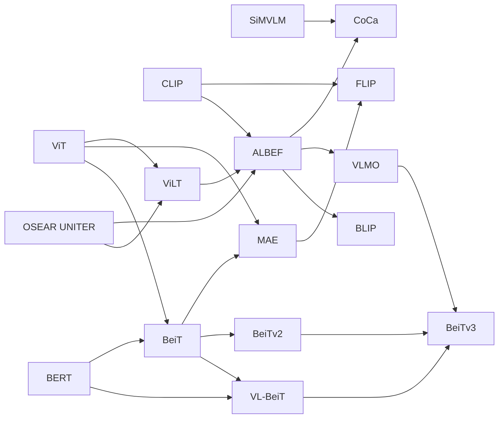

[多模态对齐与融合：综述 Multimodal Alignment and Fusion: A Survey - 知乎](https://zhuanlan.zhihu.com/p/1939338705220408438)

| 缩写      | 英文全称                         | 中文释义       | 核心说明                                                                           |
| ------- | ---------------------------- | ---------- | ------------------------------------------------------------------------------ |
| **VLM** | Vision-Language Model        | 视觉 - 语言模型  | 融合**计算机视觉**和**自然语言处理**能力的多模态模型，能同时理解图像 / 视频和文本信息。典型代表：GPT-4V、CLIP、BLIP         |
| **VLA** | Vision-Language Alignment    | 视觉 - 语言对齐  | 一种技术任务 / 目标，指让模型学习视觉特征和语言特征的**对应关系**，使两者在同一特征空间中可匹配（是 VLM 训练的核心环节）             |
| **VLP** | Vision-Language Pre-training | 视觉 - 语言预训练 | 针对视觉 - 语言模型的**预训练技术**，通过大规模图文对数据让模型学习通用的跨模态表示，为下游任务（如图文检索、视觉问答）打基础             |
| **MLM** | Masked Language Model        | 掩码语言模型     | 自然语言处理中的**预训练任务**，核心是随机掩盖输入文本中的部分 token，让模型预测被掩盖的内容。是 BERT、RoBERTa 等模型的核心预训练方式 |
# Image

## YOLO
**卷积神经网络 (CNN)**， 主要用于 **高性能的实时目标检测**（例如在监控、计数、工业检测等场景中）

## ResNet
[Deep Residual Learning for Image Recognition](https://arxiv.org/pdf/1512.03385)
[论文精度：撑起计算机视觉半边天的ResNet](https://www.bilibili.com/video/BV1Fb4y1h73E/?share_source=copy_web&vd_source=186f482d5782bc8b1831fb6379b26ea2)
残差网络（Residual Network，简称 ResNet）为了解决梯度消失或爆炸的问题而诞生，防止层数增加但效果变差，核心设计是**捷径连接（shortcut connections）**，添加连接时有两个注意事项：
1. 通过填充零来匹配维度，不增加新参数，保证了模型的轻量化。
2. 选项 B：当输入输出会改变时，通过 1×1 卷积（投影捷径）来调整维度，步幅为2，使得在不改变特征图尺寸的前提下，调整通道数，从而实现输入输出维度匹配。


为了降低计算量，高维度输入，先投影到低维，然后变换后，在输出前再升维


突变地方是由于学习率变为0.1倍，突然变小。 
### 数学解释
设x为梯度，由于x基本很小（0附近），所以一直相乘可能会造成梯度消失，而新增一个残差后则不会。

从 $\frac{\partial f(g(x))}{\partial x} = \frac{\partial f(g(x))}{\partial g(x)} \cdot \frac{\partial g(x)}{\partial x}$  到 $\frac{\partial \left( f(g(x)) + g(x) \right)}{\partial x} = \frac{\partial f(g(x))}{\partial g(x)} + \frac{\partial g(x)}{\partial x}$

## ViT(Vision Transforemer)

[ViT论文逐段精读](https://www.bilibili.com/video/BV15P4y137jb/?share_source=copy_web&vd_source=186f482d5782bc8b1831fb6379b26ea2) “An Image Worth 16x16 Words”

打破了AlexNet在计算机视觉领域的统治地位，不需要卷积神经网络，只要有大量数据，仅仅把NLP领域的Transforemer搬过来也可以得到良好的效果，打破了CV和NLP的壁垒，CV开启新时代。
卷积神经网络得益于两个归纳偏置（局部不变性+平移不变性），因而有许多前置信息，使得其在中小型数据集上表现更好。
### ViT模型结构
CV领域应用Transformer关键难点是在于把图片输入转为序列输入，而ViT中的方法是把图片划分为多个像素块（patch），每个patch大小为16x16。每个patch就相当于一个word，一张图片就能变为一个16x16=256维长度的序列。CLS分隔符保留，1x768维，而常见图片是224x224大小，变为输入序列后刚好是196x768(16x16x3)维，拼接后为197x768维，位置编码直接加到输入的向量上。
以12个头为例，经过Norm处理分为12个197x64维，每个头的Q\K\V都是197x64维。经过多头注意力层后又拼接在一起为197x768维，经过MLP先放大后缩小最后仍为197x768维。
最后以CLStoken作为全局的图像特征输出。


不过训练数据上不同于NLP领域的Transformer，还使用有监督训练。使用自监督学习时会差一点。挖了很多坑，很多地方没解释，很多东西的具体作用没确定。
对于已经预训练好的模型，难以使用不同尺寸的图片进行微调，已训练好的位置编码信息容易丢失。
这篇论文的想法不是最新，但是通过“力大砖飞”证明了在大型数据集上ViT胜过卷积神经网络，并且没有性能饱和。有钱，力大砖飞，666。
### ViT公式总结
1. $\mathbf{z}_0 = [\mathbf{x}_{\text{class}}; \mathbf{x}_p^1 \mathbf{E}; \mathbf{x}_p^2 \mathbf{E}; \cdots ; \mathbf{x}_p^N \mathbf{E}] + \mathbf{E}_{pos}, \quad \mathbf{E} \in \mathbb{R}^{(P^2 \cdot C) \times D}, \mathbf{E}_{pos} \in \mathbb{R}^{(N+1) \times D}$  输入向量
2. $\mathbf{z}'_\ell = \text{MSA}(\text{LN}(\mathbf{z}_{\ell-1})) + \mathbf{z}_{\ell-1}, \quad \ell = 1 \ldots L$  多头注意力
3. $\mathbf{z}_\ell = \text{MLP}(\text{LN}(\mathbf{z}'_\ell)) + \mathbf{z}'_\ell, \quad \ell = 1 \ldots L$  Transfomer块
4. $\mathbf{y} = \text{LN}(\mathbf{z}_L^0)$  最终结果


## CLIP
[CLIP 论文逐段精读](https://www.bilibili.com/video/BV1SL4y1s7LQ/?share_source=copy_web&vd_source=186f482d5782bc8b1831fb6379b26ea2)
**Contrastive Language-Image Pre-training（对比语言-图像预训练）**
能出圈核心是“力大砖飞”的思路，泛化性和稳健性实现跨越式提升。
**无需预定义分类体系，训练数据不用人工标注，彻底突破基础类别限制，支持Zero-shot（零样本）推理。推理时在推理时，为了让文本特征更贴合具体任务（比如分类），通过prompt template（提示词模板）引导，用模板把类别标签扩展成自然句子（比如把 “猫” 变成 “a photo of a cat”），这样能更好地和图像特征做匹配，提升效果，比如 “a photo of {label}, a type of pet”（一张{标签}的照片，属于宠物的一种）。**
### 对比学习
- 含义：**让匹配的图文对（正样本）特征更相近，不匹配的图文对（负样本）特征更疏远**。
- 选用原因：直接对齐图文语义，降低标注依赖，高效挖掘数据中的关联信息。
- 损失函数：**Image Text Contrastive Loss（图文对比损失）**，驱动模型学习更具区分度的特征。
### 工作流程
结构：双塔独立编码器
由一个图像编码器和一个文本编码器组成，两者独立完成特征提取，仅在最终的对比损失函数中发生交互。
1. 文本端：将图片分类标签扩展为描述性句子，通过文本编码器提取特征。
2. 图像端：用ResNet或ViT（视觉Transformer）提取图像特征。
3. 匹配计算：计算图文特征的相似度，经softmax输出概率分布，概率最高的句子对应的标签即为分类结果。

### 优缺点
图文匹配的效率和性能突出，学习到的特征语义性强，可扩展至图像检测、图像生成、视频检索等多个领域。
**但图文交互深度不足，融合层只是简单乘积没有可学习参数**，难以处理需要精细对齐的任务（如“图中的狗有几只？”这类计数、细节描述类问题）。

伪代码训练过程
```python
# image_encoder - ResNet or Vision Transformer
# text_encoder - CBOW or Text Transformer
# I[n, h, w, c] - minibatch of aligned images
# T[n, l]       - minibatch of aligned texts
# W_i[d_i, d_e] - learned proj of image to embed
# W_t[d_t, d_e] - learned proj of text to embed
# t             - learned temperature parameter

# 提取每个模态的特征表示
I_f = image_encoder(I)  # [n, d_i]
T_f = text_encoder(T)   # [n, d_t]

# 联合多模态嵌入 [n, d_e]
I_e = l2_normalize(np.dot(I_f, W_i), axis=1)
T_e = l2_normalize(np.dot(T_f, W_t), axis=1)

# 缩放的 pairwise 余弦相似度 [n, n]
logits = np.dot(I_e, T_e.T) * np.exp(t)

# 对称损失函数
labels = np.arange(n)
loss_i = cross_entropy_loss(logits, labels, axis=0)
loss_t = cross_entropy_loss(logits, labels, axis=1)
loss = (loss_i + loss_t) / 2
```


## ViLT
[ViLT: Vision-and-Language Transformer Without Convolution or Region Supervision](https://arxiv.org/pdf/2102.03334)
借鉴了ViT，总结了以往多模态模型的特点，发现它们**一般都依赖于目标检测器或卷积网络提取图像特征，而ViLT通过完全去除目标检测器，采用Patch Embedding Layer而大幅降低运行时间，而性能基本持平**。

ViLT的VE和TE都是轻量的线性嵌入层，


Whole Word Masking，对完整单词的所有子词令牌统一掩码
使用预训练的 bert-base-uncased 令牌器时，单词 “giraffe” 会被分词为三个词片令牌 \["gi", "##raf", "##fe"]。若未对所有令牌进行掩码（如 \["gi", "\[MASK]", "##fe"]），模型可能仅依赖相邻的两个语言令牌 \["gi", "##fe"] 预测被掩码的 "##raf"，而非利用图像信息。
图像增强（Image Augmentation），数据增强是很有用的提升训练效果的手段，但以往 图像文字对 经过数据增强容易出现错误，导致以往多模态模型训练基本不用数据增强，而ViLT能够应用数据增强。ViLT在微调阶段采用 RandAugment，保留了原始所有策略，但移除两项：颜色反转（因文本中常包含颜色信息）和裁剪（可能清除分散在整幅图像中虽小但重要的目标）。
### ViLT模型结构
假设TE输入为LxH，VE输入是NxH，那么对Transformer Encoder来说输入就是（L+N+2）x H ，输出不变。Pooler是 HxH，FC是 1xH


## MAE
Masked AutoEncoder[Masked Autoencoders Are Scalable Vision Learners](https://arxiv.org/pdf/2111.06377)
正如ViT是Transformer的CV版本，MAE是BERT的CV版本，也借鉴了ViT。
把部分像素块patch遮住作为Masked，让模型生成。把大部分patch遮住更有利于模型学习，使其更关注全局提取更多信息。对于被遮住的patch不进行encode以减小计算量。
使用无标号数据，较小的数据集即可。
每一个被遮住的patch都共享一个向量，这个向量可以学习
### MAE模型结构

### 模型效果


## ALBEF
[Align before Fuse: Vision and Language Representation Learning with Momentum Distillation](https://arxiv.org/pdf/2107.07651)
[多模态论文串讲·上【论文精读·46】](https://www.bilibili.com/video/BV1Vd4y1v77v/?share_source=copy_web&vd_source=186f482d5782bc8b1831fb6379b26ea2)
### ALBEF模型结构
经过对之前工作的总结，可以得知，**图像编码器应该比文本编码器要大，模态融合的部分也要大，目标函数是ITC+ITM+MLM三者结合体**，本质就是从不同角度认识图像-文本对
1. ITC：图像 - 文本对比学习（Image-Text Contrastive Learning）
核心是对匹配的图文对抽取全局特征，使其在特征空间中距离更近，不匹配的图文对距离更远。
- 训练时会构建正负样本对，正样本是原本配对的图文，负样本是其他不相关的图文。
- 目的是强化模型对 “图文语义一致性” 的判断，是跨模态对齐的基础。
2. ITM：图像 - 文本匹配（Image-Text Matching）
本质是二分类任务，判断输入的图文对是否为匹配关系（正样本）或不匹配关系（负样本）。
- 与 ITC 侧重特征空间距离不同，ITM 直接学习 “匹配 / 不匹配” 的判别逻辑。
- 能细化模型对跨模态语义一致性的理解，补充 ITC 在分类决策上的不足。
3. MLM：掩码语言模型（Masked Language Model）
经典的文本模态内预训练任务，核心是 “完形填空”。
- 训练时随机掩码文本中的部分 token（如 15%），让模型根据上下文和图像信息预测被掩码的 token。
- 目的是提升文本编码器的语义理解能力，同时迫使图像编码器提供辅助信息，间接强化跨模态交互。

左边是ViT，右边是BERT，BERT被分为两部分，一半拿来作文本编码，另一半作多模态融合。
图像编码和文本编码结合后，先作ITC，然后文本特征继续进入Self-Attention学习，图像特征通过Cross-Attention Layer与文本特征融合，经过N-L层多模态编码器得到多模态特征。
1. 动量模型（Momentum Model）的核心是维护 “在线模型（快更、算损失）” 和 “动量模型（慢更、不反向传播）” 两个实例，为对比学习提供稳定的正负样本特征。
2. 这些正负样本特征会存入特征队列，且可通过 Hard Negative 策略筛选更难区分的负样本，让对比学习更具挑战性，能减小NoisyData影响，提高ITM的训练难度避免其训练过于简单导致提升小。
3. 动量蒸馏（Momentum Distillation）是在动量模型基础上结合知识蒸馏，通过动量模型生成 Pseudo-Targets（伪目标，即软标签 / 概率分布），提供额外监督信号，减小噪声数据影响。
4. 两者在 ALBEF 中协同作用：对比学习依赖动量模型的稳定特征构建样本池，动量蒸馏依赖动量模型的伪目标补充监督，共同提升跨模态学习的鲁棒性和效果。

## VLMo
[VLMo: Unified Vision-Language Pre-Training with Mixture-of-Modality-Experts](https://arxiv.org/pdf/2111.02358)
### 混合专家模型结构


### 分阶段训练
stagewise pre-traning stragety
实验证明Self-Attentino层可以共享参数，先用Vision作训练，冻结Self-Attention，再作文本训练，效果才比较好，反之不行（未解）。
需要做多次Forward。


## BLIP
[BLIP: Bootstrapping Language-Image Pre-training for Unified Vision-Language Understanding and Generation](https://arxiv.org/pdf/2201.12086)
[多模态论文串讲·下【论文精读·49】](https://www.bilibili.com/video/BV1fA411Z772/?share_source=copy_web&vd_source=186f482d5782bc8b1831fb6379b26ea2)
### BLIP模型结构
和ALEBF很像，借鉴了VLMo的混合模型的思想，增加了一个Decoder使其能够兼容生成任务，相同颜色的代表共享参数，需要做多次Forward。

### Cap Filter Model
最重要的贡献是Cap Filter Model ，将Noisy Data生成更为干净的数据。


## Coca
[CoCa: Contrastive Captioners are Image-Text Foundation Models](https://arxiv.org/pdf/2205.01917)
和ALBEF模型结构非常相似，是其后续工作，改动是1、把Text Encoder 换成了 Text Decoder,，同时文本在进入SAL前就已经被遮住一半，让ITC Loss和Captioning Loss值需要一次训练 ，减少训练量。2、大幅增大数据集提升效果， 3、图像编码采用了Attentional Pooling


## BEIT V3
Masked Data Modeling

[Image as a Foreign Language: BEIT Pretraining for All Vision and Vision-Language Tasks](https://arxiv.org/pdf/2208.10442)


## LLaVA  

[LLaVA系列——LLaVA的快速学习和简单调用（附详细代码+讲解）-CSDN博客](https://blog.csdn.net/Wang_Dou_Dou_/article/details/146390905)
[Visual Instruction Tuning](https://arxiv.org/pdf/2304.08485)


**投影器 + 大语言模型**
- 架构非常巧妙：**视觉编码器 （如 CLIP ViT） + 简单的线性投影层 + 大语言模型 （如 LLaMA）。**
- 它不重新训练视觉或语言主干，而是训练一个“翻译官”（投影层），将视觉特征“翻译”成语言模型能懂的“语言”（Token），然后直接拼接到语言模型的输入序列中。


# Audio
## CPC

[Robust Speech Recognition via Large-Scale Weak Supervision](https://arxiv.org/pdf/1807.03748)

## Wav 2Vec


## HuBERT
[(43 封私信 / 80 条消息) HuBERT：基于BERT的自监督 (self-supervised)语音表示学习 - 知乎](https://zhuanlan.zhihu.com/p/492713675)
[HuBERT: Self-Supervised Speech Representation Learning by Masked Prediction of Hidden Units](https://arxiv.org/pdf/2106.07447)
1. 无监督单元发现：先对原始语音提取基础声学特征（如MFCC、对数梅尔频谱），通过k-means等聚类算法对这些特征进行离线聚类，将相似的声学片段归为一类，生成“声学单元伪标签”——这一步相当于给语音信号建立了一套“基础语义词典”，无需人工标注即可完成。
2. 掩码预测训练：采用类似BERT的掩码策略，随机屏蔽部分语音帧的特征，让模型通过未屏蔽的上下文信息，预测被屏蔽位置对应的“声学单元伪标签”。这个过程强制模型同时学习两方面能力：一是对未屏蔽帧的声学特征建模，二是捕捉语音序列的长期时序关系（比如前后音素的关联），最终输出的特征会同时包含声学细节和语义关联信息。
3. 迭代细化：将上一轮模型学习到的潜在特征再次进行聚类，生成更精准的“声学单元伪标签”，并用于下一轮模型训练。通过这种迭代优化，逐步提升特征的表征能力，让最终得到的特征更贴合语音的真实语义和声学规律。
## OpenAI Whisper


# Video
计算机视觉想要更进一步就必须利用视频数据，不能只局限在图片里。视频数据天然就有很好的数据增强。

[视频理解论文串讲（上）](https://www.bilibili.com/video/BV1fL4y157yA/?share_source=copy_web&vd_source=186f482d5782bc8b1831fb6379b26ea2)

## Hand-crafted—>CNN
自AlexNet，从手工特征到卷积神经网络的过渡阶段。
想法很简单，效果比手工特征差，但是想法创新：[Large-scale Video Classification with Convolutional Neural Networks](https://ieeexplore.ieee.org/stamp/stamp.jsp?tp=&arnumber=6909619)
想法就是如何将卷积神经网络从图片识别应用到视频识别里面，视频和图片的区别就是多了一个时间轴，有更多的视频帧而不是单个的图片，在不同的层面做特征融合以提取时间信息等。


## Two-stream双流
**卷积神经网络在视频理解领域的第一次有效应用！**
[Two-Stream Convolutional Networks for Action Recognition in Video](https://arxiv.org/pdf/1406.2199)
原有的空间流卷积神经网络+时间流（光流），光流神经网络负责抽取运动特征，最后Late Fusion。


## 3D CNN 3D卷积
## Video transformer