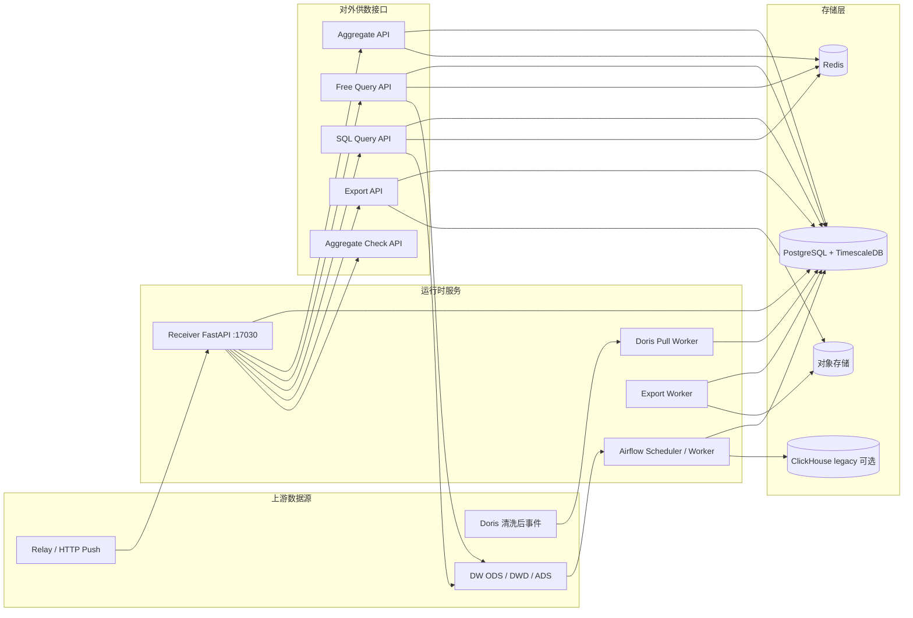
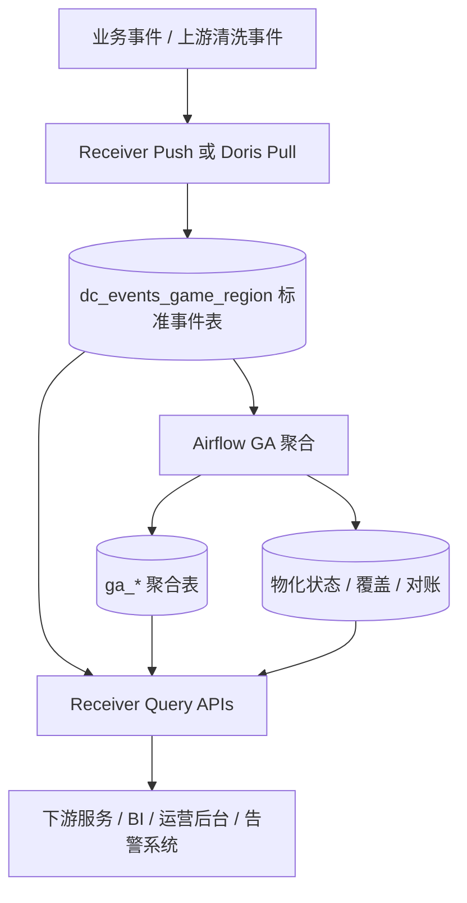
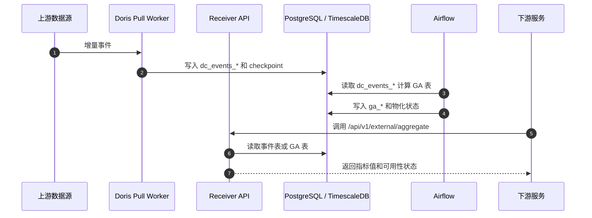
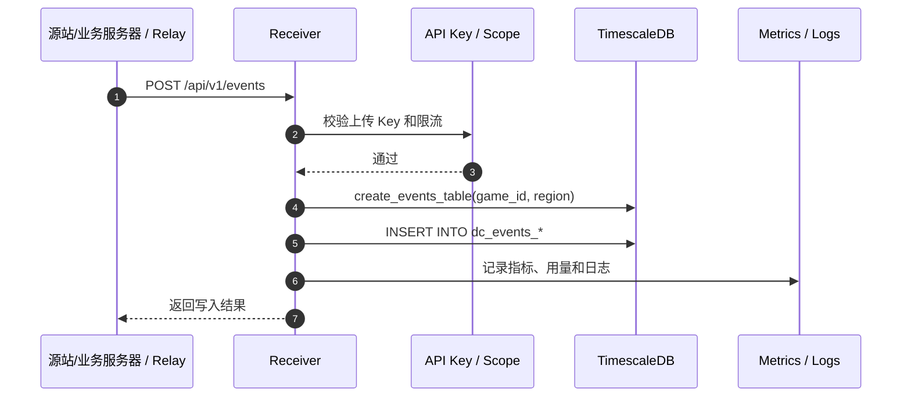
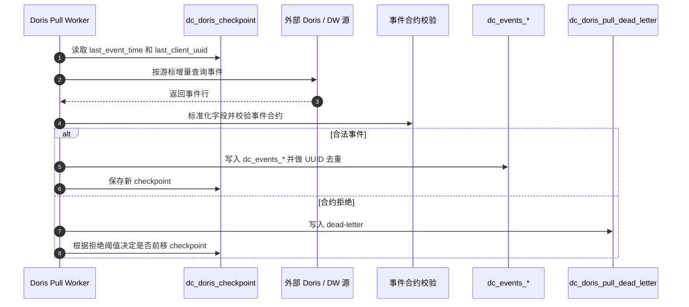
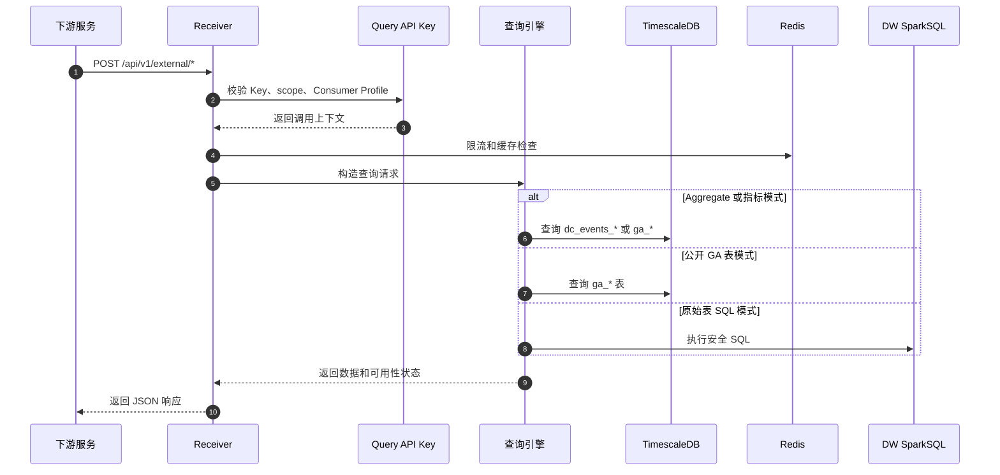
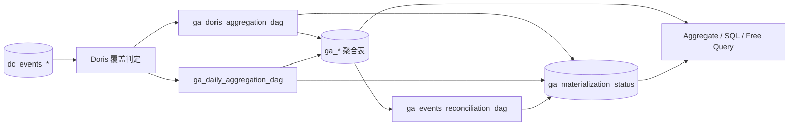

# DataCenter 架构设计文档

> 本文档面向第一次接触数据中台的研发、测试、运维和下游服务团队，说明系统的职责边界、运行时结构、数据链路、查询链路、存储模型、部署口径和代码入口。

## 目录

1. [定位与边界](#1-定位与边界)
2. [总体架构](#2-总体架构)
3. [运行时服务](#3-运行时服务)
4. [数据接入与写入链路](#4-数据接入与写入链路)
5. [查询服务链路](#5-查询服务链路)
6. [存储与元数据](#6-存储与元数据)
7. [调度与聚合计算](#7-调度与聚合计算)
8. [安全与控制面](#8-安全与控制面)
9. [部署与联调口径](#9-部署与联调口径)
10. [可观测性与数据质量](#10-可观测性与数据质量)
11. [能力边界与约束](#11-能力边界与约束)
12. [代码索引](#12-代码索引)

## 1. 定位与边界

数据中台是业务数据底座。它把业务侧或上游数据源中的事件统一接入、统一标准化、统一治理，再通过稳定的 HTTP API 给下游系统供数。

数据中台当前承担四类职责：

- 接入标准事件：接收 Relay/HTTP 事件，或通过 Doris Pull 从上游清洗后数据源增量拉取。
- 沉淀事实层：统一写入 `dc_events_{game_id}_{region}` 标准事件表。
- 计算与供数：通过 GA 聚合表、事件表、DW SparkSQL 和统一查询引擎向下游提供指标、自由查询、SQL 查询、导出和告警检测。
- 治理与运维：管理业务、项目、数据集、外部数据源、API Key、Consumer Profile、Schema Family、物化状态、补数和对账。

部署口径是一个组织一套实例。组织之间通过部署隔离实现数据隔离；实例内部按 Project、Game、Region、Dataset 和 API Key scope 管控访问。

数据中台不承担展示层职责。BI、运营后台、客服后台和下游服务应通过 HTTP API 或正式数据模型取数，不应直接依赖本地验证脚本、过程文档或临时表。

## 2. 总体架构

### 2.1 系统架构图



核心结论：

- Receiver 是对外 API 和控制面的统一入口，挂载接入、查询、导出、告警、管理后台和系统健康接口。
- Doris Pull 是主写入 worker 能力，生产环境应独立运行，不依赖 Receiver API 进程内嵌启动。
- `dc_events_*` 是标准事件事实层；GA 表是日级聚合供数层；Redis 主要承担限流、用量、L2 查询结果缓存和异步查询结果缓存。
- `/aggregate`、`/free-query`、`/sql-query` 都走 Receiver 的生产式 API 链路，共享认证、scope、限流、缓存和审计日志。

### 2.2 端到端数据链路图



这条链路表达的是生产联调口径：下游只调用 Receiver 的正式 API，数据准备、补数和验证脚本不作为对外接口入口。

### 2.3 主链路时序图



## 3. 运行时服务

| 服务/模块 | 当前职责 | 关键文件 |
|---|---|---|
| Receiver API | FastAPI 应用，默认 `0.0.0.0:17030` | `receiver/app.py` |
| 生命周期管理 | 用量定时落库、导出 worker 启停、Redis 关闭、Doris Pull 嵌入保护 | `receiver/shared/runtime.py` |
| Doris Pull Worker | 从 Doris/DW 外部源增量拉取，写入 `dc_events_*` | `receiver/workers/doris_pull_service.py`, `receiver/workers/doris_pull_worker.py` |
| Export Worker | Receiver lifespan 中后台线程轮询 `dc_export_task` 并写 对象存储 | `receiver/external/export_worker.py` |
| Airflow DAGs | GA 聚合、Doris/DW 覆盖判定、对账、修复、外部同步 | `airflow/dags/*.py` |
| Relay Agent | 源站/业务服务器侧先存后发代理，可向 Receiver `/api/v1/events` 推送 | `relay/data_relay.py` |
| Collector/TLog Adapter | 历史兼容、补录、迁移工具，不是下游联调入口 | `collector/`, `receiver/scripts/tlog_adapter.py` |

Receiver 当前挂载的主要路由：

| 路由组 | 路径 | 说明 |
|---|---|---|
| 系统 | `/health`, `/metrics`, `/api/v1/report-skipped` | 健康检查、Prometheus、跳过文件上报 |
| 接入 | `/api/v1/events`, `/api/v1/events/stats` | 标准事件写入和统计 |
| Schema | `/api/v1/schema/*` | TLog/事件 schema 查询与上传 |
| 控制面 | `/admin/*` | 登录、项目、业务、数据集、API Key、Consumer Profile、外部数据源、Cube 管理、Push 配置 |
| Schema Family | `/admin/schema-families/*` | 逻辑字段与物理字段映射治理 |
| 聚合查询 | `/api/v1/external/aggregate`, `/aggregate/metrics`, `/aggregate/distribution` | 指标查询和能力目录 |
| 告警检测 | `/api/v1/external/aggregate/check` | 批量指标阈值判断 |
| 自由查询 | `/api/v1/external/free-query` | 指标模式、GA 表模式、DW 原始表模式 |
| SQL 查询 | `/api/v1/external/sql-query` | 指标虚拟表、公开 GA 表、DW SQL |
| 冷查询 | `/api/v1/external/query` | 异步 DW 查询提交、轮询、取消 |
| 导出 | `/api/v1/external/export`, `/export/{task_id}` | 异步导出任务 |

## 4. 数据接入与写入链路

### 4.1 HTTP / Relay Push

`POST /api/v1/events` 是标准事件写入入口，使用上传类 API Key 认证，受 `BodySizeLimitMiddleware` 和 per-key 限流保护。



写入流程：

1. 校验请求体、API Key、game/region 身份和事件字段。
2. 通过 `create_events_table(game_id, region)` 确保 `dc_events_{game_id}_{region}` 存在。
3. 将事件写入 TimescaleDB 事件表，事件表索引和 hypertable 由数据库迁移维护。
4. 记录指标、用量和失败日志。

Relay Agent 是源站/业务服务器侧先存后发代理，使用 SQLite 本地队列、失败重试、状态查询、重发和归档能力。它发送的目标仍是 Receiver 的 `/api/v1/events`。

### 4.2 Doris Pull 主链路

Doris Pull 是当前 game_a 等业务的主写入 worker 能力。生产运行方式是独立 worker：

```bash
python -m receiver.workers.doris_pull_service
```



关键配置：

| 配置项 | 默认值 | 说明 |
|---|---:|---|
| `DORIS_PULL_WORKERS_ENABLED` | `false` | 是否启用 Doris Pull worker |
| `DORIS_PULL_API_EMBEDDED_ENABLED` | `false` | 是否允许 Receiver API lifespan 内嵌启动；生产不建议启用 |
| `DORIS_PULL_INTERVAL_SECONDS` | `30` | 拉取周期 |
| `DORIS_PULL_BATCH_SIZE` | `10000` | 单批最大行数 |
| `DORIS_PULL_INITIAL_LOOKBACK_SECONDS` | `3600` | 首次 checkpoint 回看窗口 |
| `DORIS_PULL_LOCK_ENABLED` | `true` | 是否启用分布式锁 |
| `DORIS_PULL_MAX_REJECT_RATIO` | `0.01` | 合约拒绝比例阈值 |
| `DORIS_PULL_MAX_REJECT_ROWS_PER_BATCH` | `100` | 单批拒绝行阈值 |

PullTarget 默认包含 `game_a`、`game_c`、`game_b`，也可以通过 `DORIS_PULL_GAMES` 覆盖。每个 target 指定公开 game/region、上游 database/table、`dc_external_source.id` 和落地事件表身份。

单次拉取流程：

1. 读取 `dc_doris_checkpoint`，按 `last_event_time` 和 `last_client_uuid` 增量拉取。
2. 通过 `dc_external_source` 加载外部源凭证，构造 Doris/DW 查询客户端。
3. 规范化字段名，解析 `event_time`/`record_date`，补齐 `server_time`。
4. 校验事件合约，合法行写入 `dc_events_*`。
5. 使用 `dc_event_uuid_dedup` 做全局 UUID 去重。
6. 拒绝行写入 `dc_doris_pull_dead_letter`，超过阈值时阻止 checkpoint 前移。
7. 写入 checkpoint 和 checkpoint health。

### 4.3 补数、重放与兼容采集

补数和重放通过 Airflow DAG、数据库脚本和 `scripts/` 运维脚本完成。它们用于修复生产链路的数据状态，不作为下游联调的替代入口。下游联调应始终调用 Receiver 对外 API。

## 5. 查询服务链路

### 5.1 外部查询统一入口

所有外部查询接口共享以下能力：

- Query API Key 认证，API Key 从 `dc_api_keys` 加载并带短 TTL 缓存。
- scope 授权，支持 game/project/dataset 维度，具体接口会限制 dataset scope 的适用范围。
- Consumer Profile 限流，Redis 可用时走 Redis 计数器，不可用时降级为进程内 token bucket。
- Redis L2 或外部查询结果缓存。
- 结构化日志和 Prometheus 指标。



### 5.2 Aggregate API

入口：

- `GET /api/v1/external/aggregate/metrics`
- `POST /api/v1/external/aggregate`
- `POST /api/v1/external/aggregate/distribution`

请求模型以 `game_id`、`region`、`metrics`、`start_date`、`end_date`、`dimensions` 为核心。响应会返回每个指标的 `source`、`freshness`、`quality`、`available`、`is_final`、`reason`、`as_of`。

路由规则：

- 当日或未最终物化的 open day：从 `dc_events_*` 事件表实时/近实时计算。
- 历史日：优先读取 GA TimescaleDB 物化表。
- GA 物化状态由 `ga_materialization_status` 校验；缺失或未成功时，已支持事件回退的指标可降级到事件表，否则返回不可用或 409。
- 纯 GA 历史查询可写入 Redis L2 查询缓存，缓存 key 绑定物化版本，避免补数后读旧结果。
- ClickHouse legacy 是兼容数据源，Aggregate 主链路不依赖它。
- Redis 不作为实时指标源；当日实时值来自 `dc_events_*`。

### 5.3 Free Query

入口：`POST /api/v1/external/free-query`。

三种模式：

- 指标模式：请求提供 `metrics` 时走 Unified Query Engine 和 AggregateEngine，返回指标行。
- 公开 GA 表模式：请求指定公开 GA 表时走 GA table executor。
- 原始表模式：请求指定外部 table 时，解析 `dc_external_table`/`dc_external_source`，拼接安全 SQL 后走 DW SparkSQL。

Free Query 支持 `columns`、`filters`、`group_by`、`aggregates`、`limit` 和 `cache_ttl`。缓存使用外部查询结果 Redis DB，`cache_ttl=0` 时不缓存。

### 5.4 SQL Query

入口：`POST /api/v1/external/sql-query`。

执行分支：

- 查询 `metrics` 虚拟表时，走 Unified Query Engine 指标协议。
- SQL 引用公开 GA 表时，走 GA table executor。
- 其他 SQL 先经过 SQL Validator，再解析外部表上下文并走 DW SparkSQL。

安全校验包括 SELECT-only、表白名单、危险关键字拦截、日期范围限制、LIMIT 注入、SparkSQL 方言兼容和 scope 过滤。`use_cache=true` 时启用 Redis L2 缓存。

### 5.5 冷查询、导出与告警检测

- 冷查询 `/api/v1/external/query` 提交异步任务，worker 查询 DW 后将结果写入 Redis，客户端轮询结果。
- 导出 `/api/v1/external/export` 写入 `dc_export_task`，Export Worker 执行 SQL 并上传 对象存储，客户端轮询下载 URL。
- 告警检测 `/api/v1/external/aggregate/check` 复用 AggregateEngine 拉取当前值和对比值，返回阈值判断结果。

## 6. 存储与元数据

| 存储 | 职责 | 主要表/数据 |
|---|---|---|
| PostgreSQL + TimescaleDB | 元数据、事件事实、GA 聚合、任务状态、质量状态 | `dc_game_config`, `dc_api_keys`, `dc_events_*`, `ga_*`, `ga_materialization_status`, `dc_doris_checkpoint`, `dc_doris_pull_dead_letter`, `dc_export_task` |
| Redis DB0 | 限流和 API Key 用量临时计数 | rate limit keys, usage keys |
| Redis DB1 | L2 查询结果缓存 | SQL/GA query cache |
| Redis DB2 | 外部异步查询和 Free Query 结果缓存 | `extq:*`, `fq:*` |
| DW/Doris | 上游数据源和原始/清洗数据查询 | 外部 source/table 元数据映射 |
| 对象存储 | 导出文件落地和预签名下载 | export objects |
| ClickHouse | legacy 兼容历史聚合 | `legacy_*` |

关键数据库迁移：

- `016_create_events_table.sql`：标准事件表创建函数。
- `044` 至 `071`：GA 聚合表、维度表、留存、货币、回流等模型。
- `056_create_doris_checkpoint.sql`：Doris Pull checkpoint。
- `057_create_consumer_profile.sql`：Consumer Profile 和 API Key 限流画像。
- `058_create_export_task.sql`：导出任务。
- `059_drop_tenant_system.sql`：移除 tenant 逻辑隔离。
- `063_create_ga_reconciliation_daily.sql`：GA 对账结果。
- `064_create_ga_coverage.sql`：Doris/DW 覆盖判定。
- `066_create_ga_materialization_status.sql`：GA 物化状态和表来源策略。
- `068_create_event_uuid_dedup.sql`：事件 UUID 全局去重。
- `074_create_doris_pull_dead_letter.sql`：Doris Pull 死信隔离。

## 7. 调度与聚合计算

Airflow 是日级聚合和数据质量治理的主要调度器。



| DAG/模块 | 说明 |
|---|---|
| `ga_doris_aggregation_dag.py` | 从 `dc_events_*` 计算 Doris 可覆盖的 GA 表 |
| `ga_daily_aggregation_dag.py` | DW/GA 日聚合主 DAG，读取覆盖策略和物化状态 |
| `ga_daily_aggregation_overseas_dag.py` | 海外区服日聚合 |
| `ga_events_reconciliation_dag.py` | 事件与 GA 指标对账，可反映到物化状态 |
| `ga_rolling_repair_dag.py` | 滚动修复覆盖和物化缺口 |
| `dc_external_sync_dag.py` | 外部数据源同步 |
| `legacy_etl_dag.py` | legacy ClickHouse 兼容 ETL |
| `tlog_collector_dag.py` / `tlog_collector_parallel_dag.py` | TLog 兼容采集和补数 |
| `maintenance_dag.py` | 死信重试、维护任务 |

GA 查询侧以 `ga_materialization_status` 作为可用性门禁。下游看到的 `available=false`、`quality=partial`、`reason=...` 不是简单缺省值，而是物化状态、事件回退和指标成熟度共同决定的结果。

## 8. 安全与控制面

控制面通过 `/admin/*` 管理：

- 管理员登录、JWT、密码修改和登录审计。
- Project、Game、Dataset 生命周期。
- API Key 创建、更新、删除、再生成、用量查询。
- Consumer Profile 限流画像。
- 外部数据源凭证管理和连接测试。
- Schema Family 和 TLog Schema。
- Cube 元数据和重启 webhook。
- Push 配置。

外部查询认证通过 Query API Key 完成。生产环境应配置：

- `JWT_SECRET`
- `DB_CONNECTION_STRING`
- `REDIS_URL`
- `CREDENTIAL_ENCRYPTION_KEY`
- 必要的 `CORS_ORIGINS`
- 外部 DW/Doris/对象存储 凭证

凭证通过 `dc_external_source` 集中管理，敏感字段加密存储，代码侧通过 `receiver/shared/source_credentials.py` 加载并缓存。

## 9. 部署与联调口径

生产参考进程：

| 进程 | 作用 | 备注 |
|---|---|---|
| Receiver API | 对外 API、控制面、接入入口 | `uvicorn receiver.app:app --host 0.0.0.0 --port 17030` |
| PostgreSQL/TimescaleDB | 元数据、事件、GA、状态表 | 需应用数据库迁移 |
| Redis | 限流、用量、缓存、异步结果 | DB0/DB1/DB2 分区 |
| Doris Pull Worker | 主写入链路 worker | 生产独立运行 |
| Airflow Scheduler/Worker | 日级聚合、补数、对账、修复 | 依赖数据库和外部源 |
| Cube/ClickHouse | 看板或兼容历史链路 | 不作为外部 API 必选入口 |

本地联调必须遵循生产数据链路：

1. 下游服务调用 Receiver 的正式 HTTP API。
2. 使用数据库中的正式 Query API Key 和 scope。
3. 查询走 `/aggregate`、`/free-query`、`/sql-query` 的生产实现分支。
4. 本地脚本只允许用于准备数据、修复数据、验证排障，不能作为下游调用入口，也不能为本地联调单独绕开认证、scope、缓存或数据源路由。
5. Receiver 对外监听应使用 `0.0.0.0:17030`，否则同网段下游可能无法访问。

## 10. 可观测性与数据质量

当前已落地的可观测性入口：

- `/health`：检查 API、数据库和 Redis 状态。
- `/metrics`：Prometheus 指标。
- 结构化日志：认证失败、限流命中、scope 拒绝、SQL 校验失败、Doris Pull checkpoint/dead-letter、Export 状态等。
- API Key 用量：Redis 临时计数，定时 flush 到 `dc_api_key_usage`。
- Doris Pull health：checkpoint、拒绝比例、dead-letter。
- GA 物化状态：`ga_materialization_status`。
- GA 覆盖与对账：`dc_ga_coverage`、`ga_reconciliation_daily`。

推荐生产告警：

- Receiver `/health` 失败或 DB/Redis 不可用。
- `/api/v1/external/*` 5xx 或 429 异常升高。
- Doris Pull checkpoint 长时间不前进。
- `dc_doris_pull_dead_letter` 未修复行增长。
- `ga_materialization_status` 长时间缺失、failed 或 warning。
- Redis L2/外部查询缓存连接失败持续发生。
- Export task 长时间 pending/running。

## 11. 能力边界与约束

| 领域 | 当前设计约束 |
|---|---|
| 下游入口 | 下游只调用 Receiver 正式 API，不直接调用本地验证脚本或临时工具 |
| 实时指标 | 当日或未最终物化日期从 `dc_events_*` 计算 |
| Redis | 用于限流、用量、L2 查询缓存和异步查询结果缓存，不作为实时指标源 |
| Doris Pull | 生产环境独立 worker 运行，不依赖 API 进程内嵌启动 |
| ClickHouse legacy | 作为兼容历史数据源，Aggregate 主链路不依赖它 |
| Cube | 可作为看板能力配套存在，下游查询接口以 Receiver API 为准 |
| 租户隔离 | 组织级隔离靠独立部署，实例内按 Project、Game、Dataset 和 API Key scope 管控 |
| 数据缺口 | 通过 `available`、`quality`、`reason`、物化状态、覆盖状态和 dead-letter 解释，不把缺失统一伪装成 0 |

## 12. 代码索引

| 领域 | 文件 |
|---|---|
| 应用入口 | `receiver/app.py` |
| 生命周期 | `receiver/shared/runtime.py` |
| 配置 | `receiver/shared/config.py` |
| 数据库 | `receiver/shared/database.py` |
| Redis | `receiver/shared/redis_client.py`, `receiver/cache/l2_query.py` |
| 接入事件 | `receiver/ingest/event_routes.py` |
| 系统接口 | `receiver/ingest/system_routes.py` |
| 控制面 | `receiver/control_plane/*.py` |
| 外部认证 | `receiver/external/auth.py`, `receiver/auth/api_key.py` |
| Aggregate | `receiver/external/aggregate_routes.py`, `receiver/external/aggregate_engine.py`, `receiver/external/metric_registry.py` |
| Free Query | `receiver/external/free_query_routes.py`, `receiver/external/free_query_service.py` |
| SQL Query | `receiver/external/sql_query_routes.py`, `receiver/external/sql_validator.py`, `receiver/external/sql_execution.py` |
| Unified Query Engine | `receiver/unified_query_engine/*.py` |
| Export | `receiver/external/export_routes.py`, `receiver/external/export_worker.py` |
| Doris Pull | `receiver/workers/doris_pull_service.py`, `receiver/workers/doris_pull_worker.py`, `receiver/workers/doris_event_writer.py`, `receiver/workers/event_contract.py` |
| Airflow | `airflow/dags/*.py` |
| Relay | `relay/data_relay.py`, `relay/README.md` |
| 数据库迁移 | `database/migrations/*.sql` |
