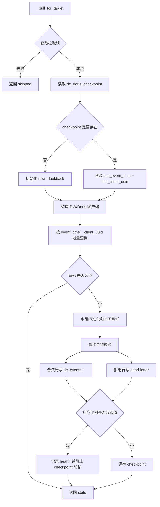

# Doris Pull Worker 数据拉取流程

> 本文档描述当前 `receiver/workers` 中 Doris Pull 的实际行为。Doris Pull 当前写入 `dc_events_*`、checkpoint、dead-letter 和健康状态，不写 Redis L0/L1 实时聚合。

## 1. 架构概览

Doris Pull Worker 是独立后台进程，从上游 Doris/DW 外部源按 checkpoint 增量拉取事件，标准化后写入 TimescaleDB 事件事实层。

```text
Doris / DW source
  -> DorisPullClient
  -> event contract validation
  -> dc_events_{game_id}_{region}
  -> dc_event_uuid_dedup
  -> dc_doris_checkpoint
  -> dc_doris_pull_dead_letter
```

生产启动入口：

```bash
python -m receiver.workers.doris_pull_service
```

Receiver API lifespan 默认不会启动 Doris Pull。生产环境必须通过 standalone worker 启动，避免 API 进程和 worker 抢占同一条拉取链路。

## 2. 关键配置

| 配置项 | 默认值 | 说明 |
|---|---:|---|
| `DORIS_PULL_WORKERS_ENABLED` | `false` | standalone worker 是否启用 |
| `DORIS_PULL_API_EMBEDDED_ENABLED` | `false` | 是否允许 API 进程内嵌启动，生产不建议启用 |
| `DORIS_PULL_INTERVAL_SECONDS` | `30` | 拉取循环间隔 |
| `DORIS_PULL_BATCH_SIZE` | `10000` | 单次查询最大行数 |
| `DORIS_PULL_TIMEOUT` | `120` | DW SparkSQL 查询超时 |
| `DORIS_PULL_INITIAL_LOOKBACK_SECONDS` | `3600` | 首次 checkpoint 回看窗口 |
| `DORIS_PULL_LOCK_ENABLED` | `true` | 是否启用拉取锁 |
| `DORIS_PULL_MAX_REJECT_RATIO` | `0.01` | 事件合约拒绝比例阈值 |
| `DORIS_PULL_MAX_REJECT_ROWS_PER_BATCH` | `100` | 单批拒绝行阈值 |
| `DORIS_PULL_DB_INSERT_CHUNK_SIZE` | `500` | DB 批量写入 chunk 大小 |

## 3. PullTarget

默认目标定义在 `receiver/workers/doris_pull_targets.py`：

| 公开 game_id | region | 上游 database.table | source_id | 落地事件表身份 |
|---|---|---|---:|---|
| `game_a` | `region_a` | `doris_game_a.events` | 1 | `game_a.region_a` |
| `game_c` | `region_a` | `doris_game_c.events` | 2 | `game_c.region_a` |
| `game_b` | `region_a` | `doris_game_b.events` | 2 | `game_b.region_a` |

可通过 `DORIS_PULL_GAMES` JSON 覆盖默认目标。每个目标必须包含：

- `game_id`
- `region`
- `database`
- `table_name`
- `source_id`
- 可选 `events_game_id`
- 可选 `events_region`

`events_game_id` 和 `events_region` 用于决定 `dc_events_*` 物理表名，避免公开 `game_id` 中的连字符等字符影响表名。

## 4. Worker 分配

当前 `_start_pull_workers()` 按 game 分组：

- Worker 1：`game_a` 独占。
- Worker 2：除 `game_a` 外的其他目标。

每个 worker 在循环中顺序处理自己负责的 target。若启用锁，同一 game/region 同时只允许一个 worker 持有拉取锁。

## 5. 单次拉取流程



## 6. 增量查询 SQL

`DorisPullClient.pull_incremental()` 生成的核心 SQL：

```sql
SELECT event_time, source, event_name,
       zone_id, role_id, account_id, device_id,
       client_ip, client_uuid, data
FROM {database}.{table}
WHERE event_time > TIMESTAMP '{last_event_time}'
   OR (
        event_time = TIMESTAMP '{last_event_time}'
        AND COALESCE(client_uuid, '') > '{last_client_uuid}'
      )
ORDER BY event_time ASC, COALESCE(client_uuid, '') ASC
LIMIT {batch_size}
```

游标使用 `last_event_time + last_client_uuid`，避免同一时间戳内批次切分时漏数。

## 7. 字段标准化

Worker 会对每行做以下处理：

- DW 返回字段名统一转小写。
- `event_time` 或 `record_date` 解析为 `record_date`。
- 无法解析时间时使用当前 `server_time`。
- 无时区时间补 UTC。
- `data` 如果是 dict，则转为 JSON 字符串。
- 每行保留 `_raw_data` 用于排障。

写入 `dc_events_*` 的标准字段包括：

- `record_date`
- `source`
- `event_name`
- `zone_id`
- `role_id`
- `account_id`
- `device_id`
- `client_ip`
- `client_uuid`
- `data`
- `server_time`

## 8. 事件合约、去重与写入

写入前会调用 `event_contract.validate_and_normalize_event_row()`。

合法行：

1. 通过 `create_events_table(game_id, region)` 确保事件表存在。
2. 先按当前批次内 `client_uuid` 去重。
3. 如果存在 `dc_event_uuid_dedup`，先写全局 UUID 去重表。
4. 只将全局未出现过的 UUID 写入 `dc_events_*`。

拒绝行：

- 写入 `dc_doris_pull_dead_letter`。
- 使用 dedupe key 合并重复死信并累加 occurrence。
- 根据拒绝比例和拒绝行数决定 checkpoint 是否允许前移。

会被拒绝的典型原因：

- 不支持的 `event_name`。
- `record_date` 无效。
- `data` 不是 JSON object。
- 缺少当前事件类型要求的必填字段。

## 9. Checkpoint 与健康状态

checkpoint 存储在 `dc_doris_checkpoint`。

每批成功时保存：

- `last_event_time`
- `last_client_uuid`
- `rows_pulled`
- `rows_rejected`
- `checkpoint_health_status`
- `checkpoint_health_reason`

当拒绝行超过阈值时：

- 拒绝行进入 dead-letter。
- checkpoint 不前移。
- health 标为 `contract_rejected_blocking`。
- 下一轮会从旧 checkpoint 继续拉取，防止吞掉未修复数据。

## 10. 失败模式

| 失败点 | 当前行为 |
|---|---|
| 获取锁失败 | 跳过该 target，本轮 stats 标记 skipped |
| checkpoint 不存在 | 初始化到当前时间减 lookback |
| DW/Doris 查询失败 | 记录错误，本轮不保存 checkpoint |
| 事件表不存在 | 调用数据库函数创建 |
| DB 写入失败 | 抛错并记录，本轮不保存 checkpoint |
| 事件合约拒绝低于阈值 | 写 dead-letter，checkpoint 前移 |
| 事件合约拒绝超过阈值 | 写 dead-letter，checkpoint 不前移 |

## 11. 生产监控建议

至少监控：

- `dc_doris_checkpoint.last_event_time` 滞后时间。
- `checkpoint_health_status` 是否持续异常。
- `rows_pulled`、`rows_written`、`rows_rejected` 趋势。
- `dc_doris_pull_dead_letter` 未修复行数。
- worker 进程存活。
- DW/Doris 查询耗时和失败率。

## 12. 与查询链路的关系

Doris Pull 的职责是把清洗后事件写入 `dc_events_*`。查询层随后按生产逻辑读取：

- `/aggregate` 当日或未最终物化日期从 `dc_events_*` 计算。
- `/aggregate` 历史日期优先读 GA 物化表。
- `/free-query` 和 `/sql-query` 在指标/GA 模式下走统一查询引擎，在原始表模式下走 DW SparkSQL。

因此，下游联调不应直接调用 Doris Pull 脚本或验证脚本，而应调用 Receiver 正式 API。
