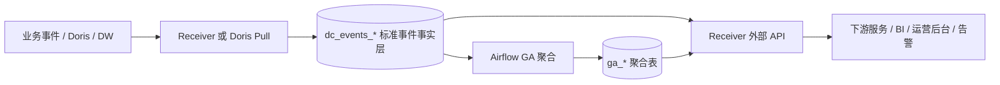

# 数据中台 产品架构说明

> 本文档用产品视角说明数据中台当前已经按代码实现形成的能力边界。技术细节以架构设计文档为准。

## 1. 一句话理解

数据中台是业务数据底座：把业务侧或上游数据源中的事件统一接入、统一标准化、统一治理，再通过稳定的 HTTP API 给下游系统供数。

它不是完整 BI 产品，也不是运营后台、客服系统或用户权限系统。展示层、报表页面、业务编排和通知发送由下游系统完成；数据中台负责提供可信数据和接口。

## 2. 当前服务对象

| 使用方 | 主要诉求 | 推荐入口 |
|---|---|---|
| 下游服务 / 运营后台 | 查询 KPI、留存、付费、回流等指标 | Aggregate API |
| BI / 数据分析 | 自由查询、SQL 查询、批量导出 | Free Query / SQL Query / Export |
| 客服 / 审计 | 查询事件事实和历史结果 | Free Query / SQL Query |
| 告警系统 | 判断指标是否触发阈值 | Aggregate Check API |
| 平台管理员 | 管理业务、项目、API Key、外部数据源 | Admin 控制面 |

## 3. 当前能力地图

```text
数据接入
  ├─ Relay / HTTP Push
  ├─ Doris Pull Worker
  └─ TLog / 补数兼容工具

事实沉淀
  └─ dc_events_{game_id}_{region}

聚合计算
  ├─ Airflow GA 日级聚合
  ├─ Doris/DW 覆盖判定
  └─ 物化状态与对账

对外供数
  ├─ Aggregate API
  ├─ Free Query API
  ├─ SQL Query API
  ├─ Export API
  └─ Aggregate Check API

治理运维
  ├─ API Key / Consumer Profile
  ├─ Project / Game / Dataset
  ├─ Schema Family / TLog Schema
  ├─ 外部数据源凭证
  └─ checkpoint / dead-letter / materialization status
```

## 4. 数据从上游到下游



当前 game_a 等联调重点业务应按生产式链路验证：

1. 数据通过 Doris Pull 或正式补数链路进入 `dc_events_*`。
2. GA DAG 对历史日生成 `ga_*` 聚合表，并写入物化状态。
3. 下游服务只调用 Receiver 的正式 API，不调用本地验证脚本。

## 5. 查询产品能力

| 能力 | 适用场景 | 当前实现口径 |
|---|---|---|
| Aggregate API | 标准指标、固定看板、告警取数 | 当日/未最终物化日期从事件表计算，历史日期优先读 GA 物化表 |
| Aggregate Metrics | 指标能力目录 | 返回指标是否支持当日、历史、维度、分布查询 |
| Distribution API | 付费分布、首充商品、回流画像等分布指标 | 读取对应 GA 分布表 |
| Free Query | 结构化自由查询 | 指标模式走统一查询引擎，原始表模式走 DW SparkSQL |
| SQL Query | SQL 查询 | 指标虚拟表/公开 GA 表走统一查询引擎，其他白名单表走 DW SparkSQL |
| Export | 大结果导出 | 提交任务后异步执行并生成 对象存储 下载地址 |
| Aggregate Check | 告警阈值判断 | 复用 AggregateEngine 查询当前值和对比值 |

## 6. 权限和调用方画像

数据中台对外调用依赖 API Key。每个 Key 可以绑定：

- key 类型：上传、查询等。
- scope：game、project 或 dataset。
- Consumer Profile：控制不同调用方的限流、允许接口和并发能力。

所有下游联调都应使用数据库中签发的正式 Query API Key。为了保证本地和生产一致，不应给本地联调额外写绕过认证、scope 或限流的逻辑。

## 7. 数据可用性解释

数据中台不把所有缺失都伪装成 0。查询响应会尽量给出可解释状态：

- `available=false`：当前指标不可用。
- `quality=partial`：可返回，但存在口径或覆盖限制。
- `is_final=false`：结果不是最终历史日物化结果。
- `reason`：不可用或降级原因，例如物化未完成、事件回看覆盖不足、指标不支持当日查询。

后台用于解释数据状态的表包括：

- `ga_materialization_status`
- `dc_ga_coverage`
- `ga_reconciliation_daily`
- `dc_doris_checkpoint`
- `dc_doris_pull_dead_letter`

## 8. 部署和联调原则

生产或本地联调都应按同一条链路验证：

```text
下游服务 -> Receiver API -> 认证/scope/限流 -> 查询引擎 -> 事件表/GA表/DW -> 返回结果
```

本地验证脚本只用于准备数据、补数、修复或排障。脚本执行成功不能等价于下游联调成功；联调成功必须以正式 API 可访问、API Key 有效、数据链路符合生产路由为准。

Receiver 需要监听 `0.0.0.0:17030`，同网段下游服务才能访问本地服务。

## 9. 不做什么

数据中台当前不负责：

- 实现完整分析产品 UI。
- 替代 BI/运营后台的页面和业务编排。
- 为本地联调提供单独逻辑分支。
- 让下游直接依赖临时脚本、过程文件或固定日期验证文件。
- 把未启用的 Redis L0/L1 实时缓存、Redis Streams Event Bus 或 legacy ClickHouse stub 作为生产主链路。

## 10. 术语速查

| 术语 | 含义 |
|---|---|
| Receiver | 数据中台的 FastAPI 服务，对外提供接入、查询和控制面接口 |
| Doris Pull | 独立 worker，从上游 Doris/DW 数据源增量拉取事件写入事件表 |
| `dc_events_*` | 标准事件事实表 |
| GA 表 | 日级聚合表，服务历史指标和看板数据 |
| Unified Query Engine | 指标、GA 表和 SQL/Free Query 的统一查询执行层 |
| Consumer Profile | 调用方画像，用于限制 QPS、允许接口和并发 |
| dead-letter | Doris Pull 中事件合约不合格的隔离行 |
| materialization status | GA 表按日期、业务、区域、表名记录的物化状态 |
