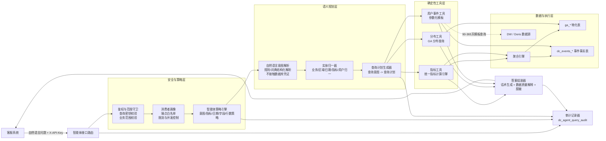
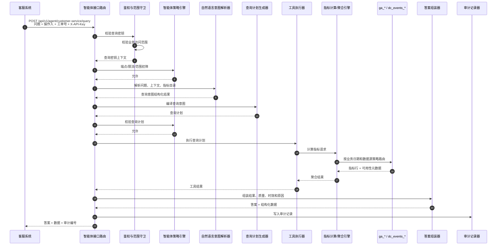
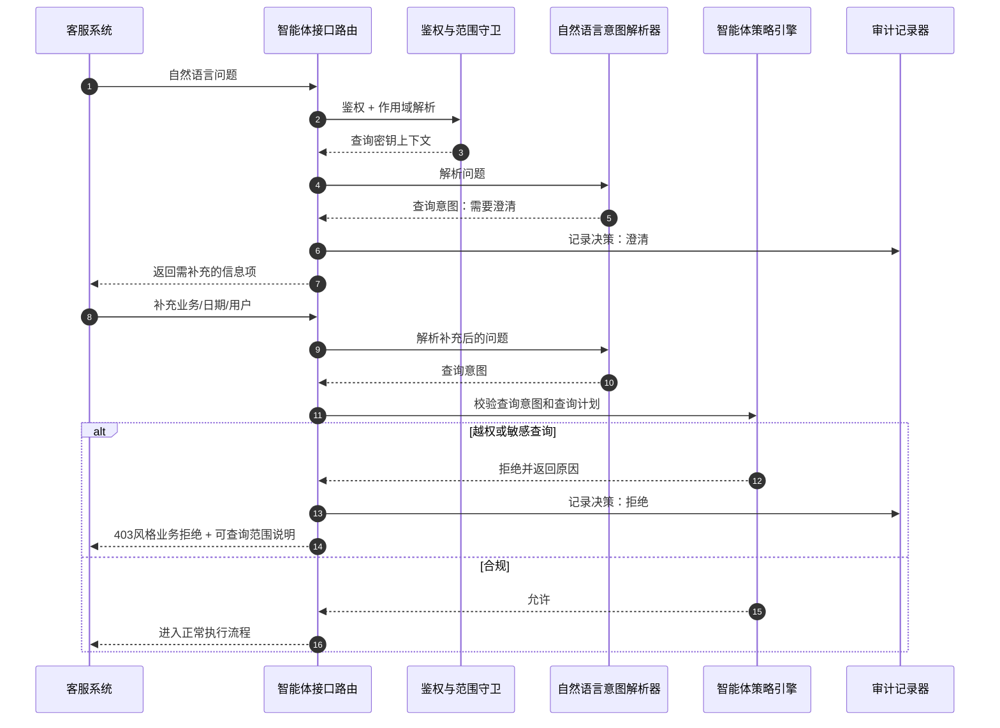
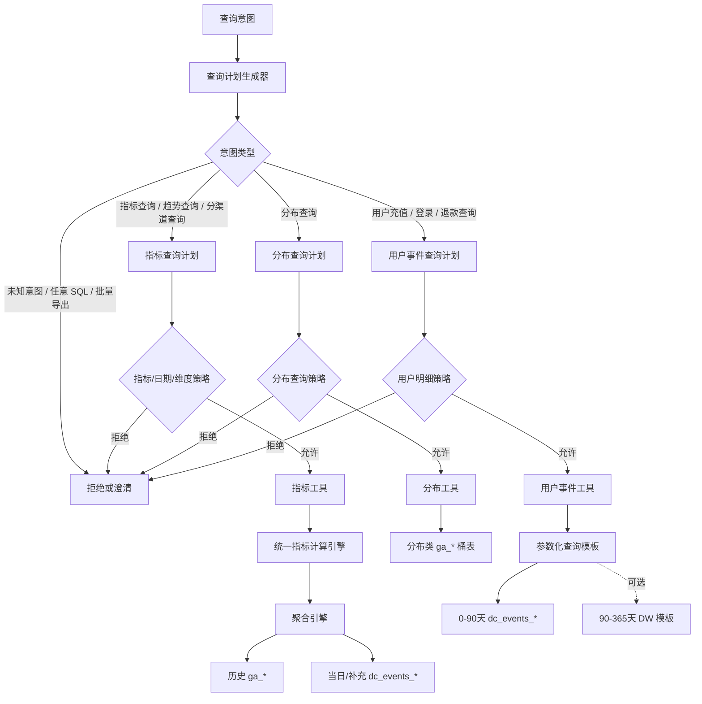
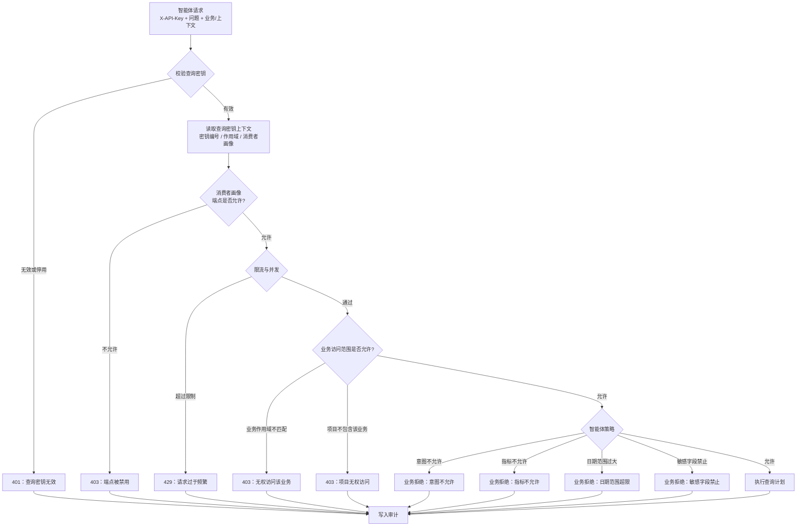

# 客服数据查询 Agent 设计文档

## 1. 目标

面向客服系统提供一个自然语言数据查询 Agent。客服人员不直接使用 `/aggregate`、`/free-query`、`/sql-query` 等开发接口，而是通过自然语言提出问题，由 Agent 转换为受控查询计划，调用数据中台内部查询能力，最后返回可读答案和结构化数据。

核心目标：

- 降低客服侧接入复杂度：客服系统只调用一个 Agent API。
- 保证指标口径一致：业务指标统一走现有 MetricComputeEngine / AggregateEngine。
- 保证权限安全：不同 `X-API-Key` 只能查询其 `game/project/dataset` scope 允许的数据。
- 避免自然语言直接转 SQL 风险：P0 不采用 Text-to-SQL 小模型，规则/词典只生成受控查询意图，不生成 SQL。
- 保留审计能力：记录原始问题、解析结果、执行计划、权限判断、查询结果摘要和操作人信息。

非目标：

- 不把 SQL Query 能力直接开放给客服。
- 不让任何模型、解析器或编排节点直接访问数据库、DW、Redis、Doris 或真实 API Key。
- 不在客服 Agent MVP 中支持任意自由分析、跨表 Join、批量导出。

## 2. 当前代码可复用能力

| 能力 | 当前实现 | 可复用结论 |
|---|---|---|
| Query API Key 鉴权 | `receiver/external/auth.py::verify_query_api_key` | 可直接复用，Agent API 也应使用 `X-API-Key`。 |
| Game/Project scope 校验 | `receiver/external/sql_execution.py::scope_allows_game` | 可直接复用，防止越权查询业务。 |
| Consumer Profile 限流/端点白名单 | `receiver/auth/consumer_profile.py`、`consumer_rate_limiter.py` | 可复用，但需要新增 Agent endpoint 到客服 profile 白名单。 |
| 指标目录 | `receiver/external/metric_registry.py`、`/aggregate/metrics` | 可作为 Agent 语义词典来源。 |
| 权威指标计算 | `receiver/unified_query_engine/metric_compute.py` -> `AggregateEngine` | Agent 查询指标时应优先直接调用这一层。 |
| Aggregate 响应质量元信息 | `AggregateMetricItem.source/freshness/quality/available/is_final/reason` | 可转成人话解释数据是否实时、最终、部分可用。 |
| Free Query metrics mode | `receiver/external/free_query_routes.py::_execute_metric_free_query` | 可作为兼容路径，但 Agent 内部更建议直接调 MetricComputeEngine。 |
| SQL Query virtual metrics table | `receiver/external/sql_query_routes.py::_execute_virtual_metrics_sql_query` | 可作为三接口一致性基础，但客服 Agent 不应暴露 SQL。 |
| Public game id 规则 | `receiver/external/game_identity.py` | 可复用，外部只允许 `game_a`，不允许 `game_a_h5`。 |
| Region 归一 | `receiver/external/region_identity.py` | 可复用，对外 `region_a` 的两种写法统一映射到 GA `region_a`。 |

## 3. 可行性评估

整体可行，建议以“受控语义查询 Agent”落地，而不是“自然语言转 SQL Agent”。当前路线明确抛弃 Text-to-SQL 小模型作为生产主链路，P0 只使用规则、词典、日期解析和后端确定性查询计划。

可立即支持的场景：

- 查询指定业务、区域、日期范围内的核心指标，例如 DAU、收入、付费人数、ARPU、留存等。
- 查询今日/昨日/近 7 天/近 30 天指标。
- 按渠道维度查询支持维度的指标。
- 对不可用、未成熟、部分实时的数据返回解释。

需要补齐后支持的场景：

- 查询单个用户的登录、充值、退款、货币、道具等明细。
- 查询订单详情、充值流水、登录轨迹和用户最近行为轨迹。
- 查询客服工单关联用户的简要画像。

不建议支持或需高级审批的场景：

- “导出所有付费用户”、“查询某渠道所有用户账号”等批量明细。
- 跨业务、跨项目比较，除非 key scope 为 project 且策略允许。
- 任意 SQL 或用户指定表名查询。
- 返回未脱敏的 `device_id`、`client_ip`、完整账号标识等敏感字段。

## 4. 推荐总体架构

### 4.1 总体架构图

```text
客服系统
  |
  | POST /api/v1/agent/customer-service/query
  | X-API-Key + 操作人 + 工单号 + 自然语言问题
  v
智能体接口路由
  |
  +--> 鉴权与范围守卫
  |      - 查询密钥校验
  |      - 业务范围校验
  |      - 消费者画像 / 限流
  |
  +--> 智能体策略引擎
  |      - 意图白名单
  |      - 指标白名单
  |      - 日期范围限制
  |      - 字段敏感级别策略
  |      - 返回行数限制
  |
  +--> 自然语言意图解析器
  |      - 规则/词典结构化解析
  |      - 不接触数据库
  |      - 输出查询意图
  |
  +--> 实体归一器
  |      - 业务/区域/日期归一
  |      - 指标别名映射
  |      - 用户标识校验
  |
  +--> 查询计划生成器
  |      - 查询意图 -> 查询计划
  |      - 选择工具：指标工具 / 用户事件工具 / 分布工具
  |
  +--> 确定性工具执行器
  |      - 指标工具 -> 统一指标计算引擎
  |      - 分布工具 -> GA 分布查询
  |      - 用户事件工具 -> 仅参数化模板
  |
  +--> 答案组装器
  |      - 汇总结果
  |      - 附加质量/时效/最终态
  |      - 敏感字段脱敏
  |
  +--> 审计记录器
         - 原始问题
         - 解析后的意图
         - 查询计划
         - 密钥编号/作用域/操作人/工单
         - 结果摘要
```

Mermaid 版本：



设计重点：

- P0 的语义规划层由规则、词典和实体归一器组成，只输出 `QueryIntent`，不生成 SQL。
- V2 如引入 LangGraph 或大模型，只能用于多轮澄清、流程编排和受控意图补全，仍不能生成或执行 SQL。
- Tool 层全部是确定性工具，必须接收后端生成并通过策略校验的 `QueryPlan`。
- 指标类查询默认走 `MetricTool -> MetricComputeEngine -> AggregateEngine`，保证和 `/aggregate` 口径一致。
- 用户明细类查询必须走 `PlayerEventTool` 的参数化模板，禁止模型生成 SQL。

### 4.2 查询执行时序图



### 4.3 澄清与拒绝时序图



## 5. Agent API 设计

### 5.1 Endpoint

建议新增：

```text
POST /api/v1/agent/customer-service/query
```

认证方式沿用：

```text
X-API-Key: {query key}
```

建议请求体：

```json
{
  "question": "帮我查一下 game_a 今天的充值金额和付费人数",
  "operator_id": "cs_10086",
  "ticket_id": "TICKET-20260603-001",
  "game_id": "game_a",
  "region": "region_a",
  "context": {
    "account_id": "",
    "role_id": "",
    "locale": "zh-CN"
  },
  "dry_run": false
}
```

响应体：

```json
{
  "answer": "game_a/region_a 今天当前收入为 453222.66，付费人数为 2681。该数据来自事件实时层，质量为 partial，最终值以后续 GA 物化为准。",
  "intent": {
    "type": "metric_query",
    "confidence": 0.93
  },
  "query_plan": {
    "tool": "metric",
    "game_id": "game_a",
    "region": "region_a",
    "metrics": ["revenue", "pay_users"],
    "start_date": "2026-06-03",
    "end_date": "2026-06-03",
    "dimensions": []
  },
  "data": [
    {
      "metric": "revenue",
      "value": 453222.66,
      "source": "events",
      "freshness": "near-realtime",
      "quality": "partial",
      "available": true,
      "is_final": false,
      "reason": "same_day_event_layer"
    }
  ],
  "permission": {
    "scope_type": "game",
    "scope_ref": "game_a",
    "allowed": true
  },
  "audit_id": "agent_audit_01HX..."
}
```

### 5.2 多轮澄清

当自然语言缺少必要参数时，不应猜测高风险条件，应返回澄清：

```json
{
  "status": "need_clarification",
  "answer": "你想查询哪个业务和日期范围？",
  "missing_slots": ["game_id", "date_range"]
}
```

可以默认推断的低风险条件：

- 未给 region：使用 key scope 或业务默认 region；无法确定时默认 `region_a` 但在 response 中标注。
- “今天”：使用项目现有 business today 逻辑，不能直接用服务器 UTC 日期。
- “最近 7 天”：解释为包含今天的 7 个自然业务日，除非策略改为闭区间历史 7 天。

## 6. Intent 体系

### 6.1 MVP Intent

| Intent | 示例问题 | 执行工具 | MVP 建议 |
|---|---|---|---|
| `metric_query` | 今天收入多少？昨日 DAU？近 7 天付费率？ | MetricTool | P0 支持 |
| `metric_trend` | 最近 7 天 DAU 趋势 | MetricTool, granularity=day | P0 支持 |
| `metric_by_channel` | 昨天各渠道收入 | MetricTool, dimensions=["channel"] | P0 支持 |
| `distribution_query` | 付费金额分布 | DistributionTool | P1 支持 |
| `player_payment_query` | 查用户 A 最近充值 | PlayerEventTool | P1 支持 |
| `player_login_query` | 查用户 A 最近登录 | PlayerEventTool | P1 支持 |
| `player_currency_query` | 查用户 A 钻石变动 | PlayerEventTool | P2 支持 |
| `player_item_query` | 查用户 A 道具变动 | PlayerEventTool | P2 支持 |

### 6.2 不支持 Intent

| 问题 | 处理 |
|---|---|
| 生成任意 SQL | 拒绝，提示可查询范围 |
| 批量导出用户明细 | 拒绝或要求走审批导出流程 |
| 查询其他业务但 key 无权限 | 403 风格拒绝，不进入执行链路 |
| 查询敏感字段原文 | 返回脱敏值或拒绝 |
| 查询超过 365 天 | 拒绝，说明当前层仅保留 365 天 |

## 7. 查询计划协议

解析器只能输出结构化 QueryIntent，不能输出 SQL。

```json
{
  "intent_type": "metric_query",
  "game_id": "game_a",
  "region": "region_a",
  "date_range": {
    "start_date": "2026-06-03",
    "end_date": "2026-06-03",
    "relative": "today"
  },
  "metrics": ["revenue", "pay_users"],
  "dimensions": [],
  "player_filters": {},
  "confidence": 0.93,
  "needs_clarification": false,
  "clarification_questions": []
}
```

后端再把 QueryIntent 编译成 QueryPlan：

```json
{
  "tool": "metric",
  "game_id": "game_a",
  "region": "region_a",
  "metrics": ["revenue", "pay_users"],
  "start_date": "2026-06-03",
  "end_date": "2026-06-03",
  "dimensions": [],
  "max_rows": 100,
  "sensitivity": "low"
}
```

QueryPlan 必须通过 Policy Engine 才能执行。

## 8. 工具层设计

### 8.0 工具路由图



这张路由图的核心含义是：Agent 并不存在“自然语言直接查询数据库”的路径。所有可执行路径都必须先被编译为 `QueryPlan`，再通过对应 policy，最后进入确定性工具。

### 8.1 MetricTool

用途：查询业务指标。

执行方式：

- 内部构造 `ComputeRequest`。
- 调用 `get_metric_compute_engine().compute(request)`。
- 不走 HTTP，减少重复鉴权和序列化损耗。

适用问题：

- DAU、收入、付费人数、ARPU、留存、回流、分布类标量汇总等。

安全边界：

- metric 必须存在于 `METRIC_REGISTRY`。
- 单次最多 20 个指标，沿用 Aggregate 限制。
- 日期范围最多 365 天。
- 维度仅允许现有支持项，客服 MVP 建议只开放 `channel`。

### 8.2 DistributionTool

用途：查询分布类多行结果，例如付费金额分布、小时分布、流失天数分布。

执行方式：

- 复用 `aggregate_routes.py` 中 distribution spec 的查询逻辑，建议后续抽出到 `receiver/external/distribution_engine.py`，避免 Agent 直接依赖 route 内部函数。

安全边界：

- 只允许 `_DISTRIBUTION_SPECS` 注册的指标。
- 默认 limit 100，最大 1000。
- 返回 bucket 级聚合，不返回用户标识。

### 8.3 PlayerEventTool

用途：查询单个用户或单个订单的明细。

执行方式：

- 不允许自然语言解析器或模型生成 SQL。
- 使用预定义参数化模板。
- 0-90 天优先查询 `dc_events_{game}_{region}`。
- 90-365 天如需要，走 DW 模板查询，但必须经过同样的字段策略和 row limit。

示例模板：

```text
player_payment_recent:
  required: account_id or role_id
  date_range_max_days: 30
  sql: SELECT record_date, event_name, amount, order_id, product_id, channel
       FROM dc_events_{game}_{region}
       WHERE record_date >= :start_ts
         AND record_date < :end_ts
         AND event_name = 'charge'
         AND (account_id = :account_id OR role_id = :role_id)
       ORDER BY record_date DESC
       LIMIT :limit
```

敏感字段默认不返回：

- `client_ip`
- `device_id`
- 原始 `data` 全量 JSON
- 未脱敏账号标识

如果业务确实需要，可配置字段级策略，例如 `customer_service_l2` 才能查看部分脱敏字段。

## 9. 权限模型

Agent 权限采用三层叠加，全部通过才允许执行。

### 9.0 权限裁决流程图



权限设计采用 fail-closed：任一层无法确认允许，就拒绝执行；拒绝也写审计，便于后续追踪越权尝试和误拒情况。

### 9.1 API Key Scope

沿用 `dc_api_keys.scope_type/scope_ref`：

| scope_type | Agent 行为 |
|---|---|
| `game` | 只能查询该 game。 |
| `project` | 可查询该 project 下的 game。 |
| `dataset` | MVP 不建议支持 Agent；若支持，只能走绑定 dataset 的模板查询。 |

### 9.2 Consumer Profile

新增或调整客服 profile：

```json
{
  "profile_name": "customer_service_agent",
  "allowed_endpoints": [
    "/api/v1/agent/customer-service/query"
  ],
  "rate_limit_query_per_minute": 20,
  "max_concurrent_queries": 3
}
```

当前 `customer_service` profile 只预置了 `/api/v1/external/query` 和 `/api/v1/external/free-query`，需要补 Agent endpoint，否则会被 endpoint whitelist 拦截。

### 9.3 Agent Policy

建议新增策略表或配置：

```text
dc_agent_policy
  id
  policy_name
  consumer_profile_id
  allowed_intents
  allowed_metrics
  allowed_dimensions
  max_date_range_days
  max_rows
  allow_player_detail
  allow_distribution
  sensitivity_level
  is_active
```

字段策略：

```text
dc_agent_field_policy
  id
  policy_id
  field_name
  action        -- allow / mask / deny
  mask_rule     -- hash / partial / null
```

## 10. 审计模型

建议新增：

```text
dc_agent_query_audit
  id
  audit_id
  key_id
  key_hash_prefix
  scope_type
  scope_ref
  consumer_profile_id
  operator_id
  ticket_id
  game_id
  region
  raw_question
  parsed_intent_json
  query_plan_json
  decision          -- executed / denied / clarification / unsupported / failed
  denial_reason
  result_summary_json
  row_count
  elapsed_ms
  created_at
```

审计原则：

- 不记录完整 API Key。
- 不记录完整敏感明细结果，只记录摘要和行数。
- 可以记录脱敏后的自然语言问题。
- 每次拒绝也要记录，便于安全审计。

## 11. 解析器安全策略

P0 不引入 Text-to-SQL 小模型，也不依赖 LLM 生成执行逻辑。自然语言解析器只是“不可信输入归一器”，不能作为执行器。

必须遵守：

- 不把 `X-API-Key`、数据库凭证、DW 凭证发送给任何外部模型或编排节点。
- 不把完整用户明细发送给模型做二次总结；P0 的答案组装由后端模板完成。
- 解析器输出必须符合 JSON Schema。
- 解析器输出的 metric、game、region、date、intent 都要后端重新校验。
- 任何自然语言生成 SQL 的结果一律丢弃。
- 用户问题里的“忽略规则”、“查询所有用户”、“绕过权限”等 prompt injection 只作为普通文本处理。

推荐实现：

- 第一步：规则预解析常见日期、game、region、用户 ID。
- 第二步：词典和别名表完成意图分类和 metric alias 选择。
- 第三步：后端 deterministic planner 生成 QueryPlan。
- 第四步：Policy Engine 审批 QueryPlan。
- 第五步：Tool Executor 执行。

V2 如果引入 LangGraph 或大模型，也只允许增强澄清、审批和流程状态管理；权限、策略、QueryPlan 生成和工具执行仍由项目自有确定性代码负责。

## 12. Agent 返回解释规则

Agent 需要把机器字段翻译成人话：

| 字段 | 客服话术 |
|---|---|
| `available=false` | “该指标当前不可查询，原因是...” |
| `quality=exact` | “这是最终/准确值。” |
| `quality=partial` | “这是当前可用的部分实时值，最终值以后续物化为准。” |
| `quality=approx` | “这是近似值，仅供参考。” |
| `is_final=false` | “该数据还不是最终结算值。” |
| `source=events` | “来自实时事件层。” |
| `source=ga` | “来自历史物化指标表。” |
| `reason=metric_maturity_incomplete` | “该指标需要等待留存/回流观察窗口成熟。” |
| `reason=ga_materialization_incomplete` | “该日期的 GA 物化还未完成。” |

## 13. 推荐代码落点

建议新增模块：

```text
receiver/agent/
  __init__.py
  customer_service_routes.py
  models.py
  authz.py
  intent_parser.py
  entity_resolver.py
  policy_engine.py
  query_planner.py
  tools/
    metric_tool.py
    distribution_tool.py
    player_event_tool.py
  answer_composer.py
  audit.py
```

在 `receiver/app.py` 中挂载：

```python
from .agent.customer_service_routes import router as customer_service_agent_router
app.include_router(customer_service_agent_router)
```

## 14. MVP 开发计划

### 14.1 两阶段技术路线

当前确认采用“两阶段演进”：

| 版本 | 定位 | 技术路线 | 目标 |
|---|---|---|---|
| V1 / P0 | 快速上线的确定性客服查询 Agent | FastAPI 路由 + 规则/词典解析 + 查询计划 + 策略引擎 + 指标工具 | 先支持自然语言查指标，权限、安全、审计闭环优先；不采用 Text-to-SQL 小模型。 |
| V2 / P1-P2 | 可编排的多轮客服诊断 Agent | 在 V1 工具层和策略层不变的前提下，引入 LangGraph 做流程编排 | 支持多轮澄清、人工审批、用户明细诊断、长流程恢复。 |

核心原则：

- V1 不引入 LangGraph，也不引入 Text-to-SQL 小模型，避免首版被编排框架和模型不确定性拖慢。
- V1 先把“自然语言 -> 查询意图 -> 查询计划 -> 策略校验 -> 指标查询 -> 答案返回 -> 审计”的闭环跑通。
- V2 如果出现多轮澄清、审批、用户明细诊断、跨步骤查询、可恢复长流程，再引入 LangGraph。
- LangGraph 只能替换或增强“流程编排层”，不能绕过鉴权、策略和白名单工具。
- 权限、字段脱敏、指标白名单、日期范围、行数限制必须仍由项目自有确定性代码裁决。

V1 推荐链路：

```text
客服问题
 -> 智能体接口路由
 -> 鉴权与作用域校验
 -> 规则/词典意图解析
 -> 查询计划生成
 -> 策略引擎校验
 -> 指标工具执行
 -> 答案组装
 -> 审计记录
```

V2 推荐链路：

```text
客服问题
 -> LangGraph 状态机
    -> 鉴权节点
    -> 意图解析节点
    -> 缺参澄清节点
    -> 人工审批节点
    -> 查询计划节点
    -> 策略校验节点
    -> 工具执行节点
    -> 答案组装节点
    -> 审计节点
```

### 14.2 分阶段交付

| 阶段 | 目标 | 主要交付 |
|---|---|---|
| V1-P0 | 打通安全的指标问答 Agent | 新增 Agent API、鉴权/scope 复用、规则/词典解析、metric intent、MetricTool、审计表、基础话术。 |
| V1-P1 | 强化首版语义体验 | 补齐指标别名、日期解析、常见客服问法、异常解释、dry-run 查询计划预览。 |
| V2-P0 | 引入 LangGraph 编排复杂流程 | 在 V1 工具和策略层不变的基础上，增加多轮澄清、人工审批、状态恢复。 |
| V2-P1 | 支持客服常见用户明细诊断 | PlayerEventTool 模板：充值、登录、退款；字段脱敏；单用户/单订单强约束。 |
| V2-P2 | 支持分布、趋势和跨步骤诊断 | DistributionTool、按天趋势、按渠道维度、用户行为链路组合查询。 |
| P3 | 强化生产可观测性 | 成功率、拒绝率、意图解析失败率、平均耗时、慢查询、审计后台。 |
| P4 | 提升语义体验 | 业务别名词典、FAQ 示例学习、客服系统上下文注入、答案模板优化。 |

## 15. P0 详细任务

1. 新增 `receiver/agent/models.py`
   - `CustomerServiceAgentRequest`
   - `CustomerServiceAgentResponse`
   - `QueryIntent`
   - `QueryPlan`

2. 新增 `receiver/agent/customer_service_routes.py`
   - endpoint: `POST /api/v1/agent/customer-service/query`
   - 依赖 `verify_query_api_key`
   - 调用 consumer rate limiter
   - 调用 scope/policy/planner/tool/audit

3. 新增 `receiver/agent/intent_parser.py`
   - MVP 先用规则 + 词典
   - 后续只在 V2 按需接入 LangGraph 澄清编排，不接 Text-to-SQL 执行链路

4. 新增 `receiver/agent/policy_engine.py`
   - 校验 game/project scope
   - 校验 metric allowlist
   - 校验日期范围
   - 禁止 dataset scope 默认访问

5. 新增 `receiver/agent/tools/metric_tool.py`
   - 直接调用 `get_metric_compute_engine().compute()`

6. 新增 `receiver/agent/answer_composer.py`
   - 将 `AggregateResult` 转成客服话术

7. 新增审计 migration
   - `dc_agent_query_audit`
   - P0 可先不记录明细结果，只记录摘要

8. 测试
   - game scope 只能查本业务
   - project scope 可查项目下业务
   - dataset scope 默认拒绝
   - 不支持 metric 拒绝
   - 规则/词典解析失败返回 clarification
   - available/partial/unavailable 话术正确

## 16. 关键风险与修复建议

| 风险 | 当前状态 | 建议 |
|---|---|---|
| 自然语言生成 SQL 越权 | 当前项目有 SQL validator，但客服场景不应依赖它 | Agent 禁止生成 SQL，只允许 QueryPlan。 |
| 客服 key 权限过大 | 当前 key 支持 project scope，可能覆盖多业务 | 为客服单独创建 game scope 或受限 project scope key。 |
| 缺少操作人级审计 | 当前主要按 API key 记录 | Agent 请求必须携带 `operator_id` 和 `ticket_id`。 |
| 用户明细 PII 泄露 | 当前 raw 表有 `account_id/device_id/client_ip/data` | 增加字段策略和默认脱敏。 |
| 用户问题参数缺失 | 自然语言经常缺 game/date/player_id | 引入 slot filling 和 clarification。 |
| 数据质量解释困难 | Aggregate 已有 `quality/reason`，但原文偏机器化 | Answer Composer 统一翻译 reason。 |
| Prompt injection | 当前无 Agent 层 | 解析结果由后端重验，忽略指令型文本。 |

## 17. 发布建议

可以基于当前项目设计落地，但不建议直接把 `/sql-query` 或 `/free-query` 暴露给客服 Agent 做自由生成。

推荐发布路径：

1. V1-P0 不使用 LangGraph，先开放指标问答：低风险、复用现有 Metric Engine、最容易保证口径一致。
2. V1-P1 继续保持轻量确定性架构，补齐词典、日期解析、结果话术和 dry-run。
3. V2-P0 再根据真实客服使用情况评估是否引入 LangGraph；只有出现多轮澄清、人工审批、长流程恢复等需求时才引入。
4. V2-P1 再开放单用户明细模板：必须先完成字段脱敏、审计和敏感查询审批。
5. V2-P2 后再考虑分布类、复杂趋势和跨步骤诊断。
6. 全程保留 Agent dry-run 能力：返回计划但不执行，便于灰度评审。

最终形态应是：客服问自然语言，Agent 做受控语义解析，权限和策略层先裁决，执行层只走白名单工具，回答层输出可解释结果和数据质量说明。
