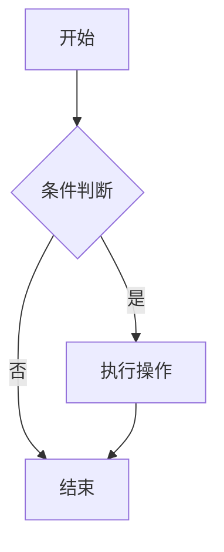

我来帮你搭建一个专业的 Docusaurus 技术文档站。让我先查看一下当前项目状态，然后提供完整的指导方案。
现在我将为你提供完整的 Docusaurus 搭建指南：

## 第一部分：整体架构说明

### 项目目录结构

```
hanphonejan.github.io/
├── .github/
│   └── workflows/
│       └── deploy.yml          # GitHub Actions 自动部署配置
├── blog/                       # 博客文章目录（可选）
│   └── *.md
├── docs/                       # 文档目录
│   ├── intro.md               # 首页/介绍
│   ├── category1/             # 分类目录
│   └── ...
├── src/
│   ├── components/            # 自定义 React 组件
│   ├── css/                   # 自定义样式
│   │   └── custom.css
│   └── pages/                 # 自定义页面（如首页）
├── static/                    # 静态资源（图片、favicon等）
├── docusaurus.config.js       # 主配置文件
├── sidebars.js               # 侧边栏导航配置
├── package.json
└── README.md
```

## 第二部分：从零开始安装步骤

### 1. 初始化项目

```bash
# 切换到项目目录
cd e:/hanphonejan/HanphoneJan.github.io

# 创建 Docusaurus 项目
npx create-docusaurus@latest . classic
```

安装过程中选择：

- ✅ TypeScript（推荐）
- ✅ 安装依赖

### 2. 安装必要插件

```bash
# 安装 Mermaid 图表支持
npm install @docusaurus/theme-mermaid

# 安装代码语法高亮（Docusaurus 已内置 Prism）
# 可选：安装更多语言支持
```

### 3. 配置文件设置

**docusaurus.config.js**（完整配置）：

```javascript
const lightCodeTheme = require('prism-react-renderer/themes/github');
const darkCodeTheme = require('prism-react-renderer/themes/dracula');

/** @type {import('@docusaurus/types').Config} */
module.exports = {
  title: 'HanphoneJan 技术文档',
  tagline: '技术文档与知识分享',
  favicon: 'img/favicon.ico',

  url: 'https://hanphonejan.github.io',
  baseUrl: '/',

  organizationName: 'hanphonejan',
  projectName: 'HanphoneJan.github.io',
  deploymentBranch: 'gh-pages',

  onBrokenLinks: 'throw',
  onBrokenMarkdownLinks: 'warn',
  onDuplicateRoutes: 'warn',

  i18n: {
    defaultLocale: 'zh-CN',
    locales: ['zh-CN'],
  },

  presets: [
    [
      'classic',
      /** @type {import('@docusaurus/preset-classic').Options} */
      ({
        docs: {
          sidebarPath: require.resolve('./sidebars.js'),
          editUrl: 'https://github.com/hanphonejan/HanphoneJan.github.io/tree/main/',
        },
        blog: {
          showReadingTime: true,
          editUrl: 'https://github.com/hanphonejan/HanphoneJan.github.io/tree/main/',
        },
        theme: {
          customCss: require.resolve('./src/css/custom.css'),
        },
      }),
    ],
  ],

  themes: [
    '@docusaurus/theme-mermaid',
  ],

  themeConfig:
    /** @type {import('@docusaurus/preset-classic').ThemeConfig} */
    ({
      image: 'img/docusaurus-social-card.jpg',
      navbar: {
        title: 'HanphoneJan',
        logo: {
          alt: 'My Site Logo',
          src: 'img/logo.svg',
        },
        items: [
          {
            type: 'docSidebar',
            sidebarId: 'tutorialSidebar',
            position: 'left',
            label: '文档',
          },
          {to: '/blog', label: '博客', position: 'left'},
          {
            href: 'https://github.com/hanphonejan',
            label: 'GitHub',
            position: 'right',
          },
        ],
      },
      footer: {
        style: 'dark',
        links: [
          {
            title: '文档',
            items: [
              {
                label: '教程',
                to: '/docs/intro',
              },
            ],
          },
          {
            title: '社区',
            items: [
              {
                label: 'GitHub',
                href: 'https://github.com/hanphonejan',
              },
            ],
          },
          {
            title: '更多',
            items: [
              {
                label: '博客',
                to: '/blog',
              },
            ],
          },
        ],
        copyright: `Copyright © ${new Date().getFullYear()} HanphoneJan. Built with Docusaurus.`,
      },
      prism: {
        theme: lightCodeTheme,
        darkTheme: darkCodeTheme,
        additionalLanguages: ['bash', 'python', 'java', 'typescript', 'javascript', 'go'],
      },
      mermaid: {
        theme: {light: 'default', dark: 'dark'},
      },
    }),
};
```

**sidebars.js**（侧边栏配置）：

```javascript
/** @type {import('@docusaurus/plugin-content-docs').SidebarsConfig} */
const sidebars = {
  tutorialSidebar: [
    {
      type: 'category',
      label: '快速开始',
      collapsed: false,
      link: {
        type: 'generated-index',
        title: '快速开始',
        description: '5分钟内了解如何使用本项目',
      },
      items: ['intro', 'getting-started'],
    },
    {
      type: 'category',
      label: '核心功能',
      items: ['feature1', 'feature2'],
    },
    {
      type: 'category',
      label: '开发指南',
      items: ['guide1', 'guide2'],
    },
  ],
};

module.exports = sidebars;
```

**src/css/custom.css**（样式优化）：

```css
:root {
  --ifm-color-primary: #25c2a0;
  --ifm-color-primary-dark: rgb(33, 175, 144);
  --ifm-color-primary-darker: rgb(31, 165, 136);
  --ifm-color-primary-darkest: rgb(26, 136, 112);
  --ifm-color-primary-light: rgb(70, 203, 174);
  --ifm-color-primary-lighter: rgb(92, 230, 203);
  --ifm-color-primary-lightest: rgb(145, 254, 234);
  --ifm-code-font-size: 95%;
}

/* 代码块样式优化 */
.theme-code-block {
  border-radius: 8px;
  box-shadow: 0 4px 6px rgba(0, 0, 0, 0.1);
}

/* 导航栏优化 */
.navbar {
  backdrop-filter: blur(10px);
}

/* 文档内容优化 */
.markdown {
  line-height: 1.8;
}

.markdown h1,
.markdown h2,
.markdown h3 {
  font-weight: 700;
  margin-top: 2em;
}

/* 目录（TOC）优化 */
.table-of-contents {
  border-left: 2px solid var(--ifm-color-primary);
  padding-left: 1rem;
}
```

### 4. 创建示例文档

**docs/intro.md**：

```markdown
---
sidebar_position: 1
slug: /
title: 欢迎使用 HanphoneJan 技术文档站
---

# 欢迎使用 HanphoneJan 技术文档站

这是你的个人技术文档站，基于 Docusaurus 搭建。

## 功能特性

- 📚 Markdown 文档系统
- 🎨 深色模式支持
- 💻 代码高亮显示
- 📊 Mermaid 图表支持
- 🔍 全文搜索
- 📱 响应式设计

## 快速开始

点击左侧导航栏开始探索文档内容。
```

**docs/getting-started.md**：

```markdown
---
sidebar_position: 2
title: 快速开始
---

# 快速开始

## 代码示例

```javascript
function hello() {
  console.log('Hello, Docusaurus!');
}
```

## Mermaid 图表示例



```

## 第三部分：GitHub Pages 自动部署配置

### 1. 创建 GitHub Actions 工作流

**.github/workflows/deploy.yml**：
```yaml
name: Deploy to GitHub Pages

on:
  push:
    branches: [main]
  workflow_dispatch:

permissions:
  contents: read
  pages: write
  id-token: write

concurrency:
  group: "pages"
  cancel-in-progress: false

jobs:
  build:
    runs-on: ubuntu-latest
    steps:
      - name: Checkout
        uses: actions/checkout@v4

      - name: Setup Node
        uses: actions/setup-node@v4
        with:
          node-version: 20
          cache: 'npm'

      - name: Install dependencies
        run: npm ci

      - name: Build website
        run: npm run build

      - name: Upload artifact
        uses: actions/upload-pages-artifact@v3
        with:
          path: './build'

  deploy:
    environment:
      name: github-pages
      url: ${{ steps.deployment.outputs.page_url }}
    runs-on: ubuntu-latest
    needs: build
    steps:
      - name: Deploy to GitHub Pages
        id: deployment
        uses: actions/deploy-pages@v4
```

### 2. 配置 GitHub Pages

在 GitHub 仓库设置中：

1. 进入 **Settings** > **Pages**
2. 在 **Build and deployment** > **Source** 选择 **GitHub Actions**
3. 确保 GitHub Actions 已启用

### 3. 测试部署

```bash
# 提交代码到 GitHub
git add .
git commit -m "Initial Docusaurus setup"
git push origin main
```

访问 `https://hanphonejan.github.io` 查看部署结果。

## 第四部分：主题与样式优化建议

### 1. 技术感强的主题配色

在 `src/css/custom.css` 中添加：

```css
/* 赛博朋克风格 */
:root {
  --ifm-color-primary: #00ff88;
  --ifm-color-primary-dark: #00cc6a;
  --ifm-background-color: #0a0a0f;
  --ifm-font-color: #e0e0e0;
}

/* 或科技蓝风格 */
:root {
  --ifm-color-primary: #00d4ff;
  --ifm-color-primary-dark: #00a8cc;
  --ifm-color-primary-light: #33e0ff;
}
```

### 2. 自定义首页组件

**src/pages/index.js**：

```javascript
import React from 'react';
import Layout from '@theme/Layout';
import useDocusaurusContext from '@docusaurus/useDocusaurusContext';
import styles from './index.module.css';

export default function Home() {
  const {siteConfig} = useDocusaurusContext();
  return (
    <Layout title={siteConfig.title} description="技术文档站">
      <main className={styles.hero}>
        <div className="container">
          <h1 className={styles.title}>{siteConfig.title}</h1>
          <p className={styles.subtitle}>{siteConfig.tagline}</p>
          <div className={styles.buttons}>
            <a href="/docs/intro" className="button button--primary">
              开始阅读
            </a>
          </div>
        </div>
      </main>
    </Layout>
  );
}
```

**src/pages/index.module.css**：

```css
.hero {
  padding: 8rem 0;
  text-align: center;
  background: linear-gradient(135deg, #667eea 0%, #764ba2 100%);
  color: white;
}

.title {
  font-size: 4rem;
  font-weight: 800;
  margin-bottom: 1.5rem;
}

.subtitle {
  font-size: 1.5rem;
  opacity: 0.9;
  margin-bottom: 3rem;
}

.buttons {
  display: flex;
  justify-content: center;
  gap: 1rem;
}
```

## 第五部分：常见坑与解决方案

### 1. Mermaid 图表不显示

**问题**：图表渲染失败或空白

**解决方案**：

```javascript
// docusaurus.config.js 中确保配置正确
themes: ['@docusaurus/theme-mermaid'],
themeConfig: {
  mermaid: {
    theme: {light: 'default', dark: 'dark'},
  },
}
```

### 2. GitHub Pages 部署失败

**问题**：Actions 报错

**解决方案**：

```bash
# 检查 package.json 中的 scripts
"scripts": {
  "build": "docusaurus build",
  "serve": "docusaurus serve"
}

# 确保本地构建成功
npm run build
```

### 3. 自定义域名配置

**解决方案**：

```bash
# 在项目根目录创建 CNAME 文件
echo "your-domain.com" > CNAME

# 或在 docusaurus.config.js 中配置
trailingSlash: false,
```

### 4. 图片路径问题

**解决方案**：

```markdown
<!-- 放置图片到 static/img/ 目录 -->

```

### 5. 深色模式样式不统一

**解决方案**：

```css
/* 使用 CSS 变量，自动适配主题 */
.my-component {
  background-color: var(--ifm-background-color);
  color: var(--ifm-font-color);
}
```

## 第六部分：后续可扩展方向建议

### 1. 博客模块（已内置配置）

```bash
# 创建博客文章
npm run new-blog-post
```

### 2. 项目展示页

**src/pages/projects.js**：

```javascript
import React from 'react';
import Layout from '@theme/Layout';

const projects = [
  {
    title: '项目 1',
    description: '项目描述',
    image: '/img/project1.png',
    link: 'https://github.com/user/project1',
  },
];

export default function Projects() {
  return (
    <Layout title="项目展示">
      <main>
        <div className="container">
          <h1>我的项目</h1>
          <div className="project-grid">
            {projects.map((project) => (
              <div key={project.title} className="project-card">
                
                <h2>{project.title}</h2>
                <p>{project.description}</p>
                <a href={project.link}>查看项目</a>
              </div>
            ))}
          </div>
        </div>
      </main>
    </Layout>
  );
}
```

### 3. 搜索优化（Algolia DocSearch）

```javascript
// docusaurus.config.js
themeConfig: {
  algolia: {
    appId: 'YOUR_APP_ID',
    apiKey: 'YOUR_SEARCH_API_KEY',
    indexName: 'YOUR_INDEX_NAME',
    contextualSearch: true,
  },
}
```

### 4. 评论系统（Giscus）

```javascript
// docusaurus.config.js
themes: [
  [
    require.resolve("@easyops-cn/docusaurus-search-local"),
    {
      hashed: true,
    }
  ],
]

// 安装 Giscus
npm install @giscus/react
```

### 5. 多语言支持

```bash
# 创建英文文档
mkdir -i18n/en/docusaurus-plugin-content-docs/current
```

---

现在你有了完整的搭建指南。建议按照步骤逐步实施，先完成基础功能，再逐步扩展。有任何问题随时问我！
